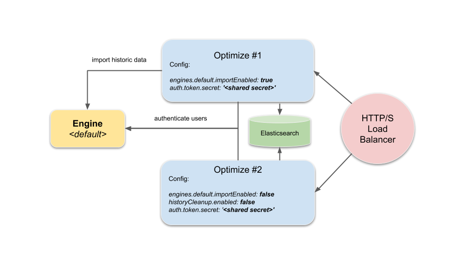

This document describes the set up of a Camunda Optimize cluster which is mainly useful in a failover scenario, but also provides means of load-balancing in terms of distributing import and user load.

## Distributed user sessions - configure shared secret token

If more than one Camunda Optimize instance are accessible by users for e.g. a failover scenario a shared secret token needs to be configured for all the instances.
This enables distributed sessions among all instances and users do not lose their session when being routed to another instance.

The relevant configuration property is [`auth.token.secret`](./system-configuration.md#security) which needs to be configured in the `environment-configuration.yaml` of each Camunda Optimize instance that is part of the cluster.

It is recommended to use a secret token with a length of at least 64 characters generated using a sufficiently good random number generator, for example the one provided by `/dev/urandom` on Linux systems.

The following example command would generate a 64-character random string:

```
< /dev/urandom tr -dc A-Za-z0-9 | head -c64; echo
```

The corresponding `environment-config.yaml` entry would look the **same for all instances of the cluster**:

```
auth:
  token:
    secret: '<your secret 64 character string>'
```

## Example setup

The tiniest cluster setup consisting of one importing instance from a given `default` engine and another instance where the import is disabled would look like the following:



The HTTP/S Load-Balancer would route user requests to either of the two instances, while Optimize #1 would also care about importing data from the engine to the shared
Elasticsearch instance/cluster and Optimize #2 only accesses the engine in order to authenticate and authorize users.
