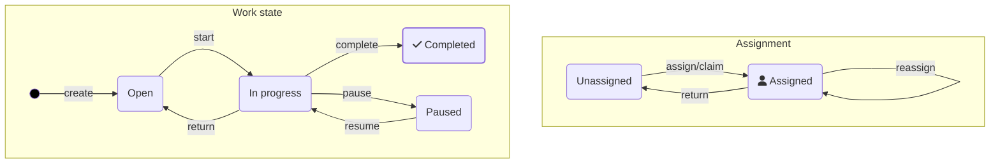

import TasklistProcessesImg from './img/tasklist-processes.png';
import TasklistDetailsImg from './img/tasklist-page-specifications-detailed.png';
import TaskAssignmentImg from './img/task-assignment.png';
import styles from "./styles.module.css";

Task applications are the interface between humans and Camunda processes to orchestrate human work. Learn key concepts of the architecture of task applications before you build your own.

## What are task applications?

Task applications are end-user applications that allow humans to perform work orchestrated with a process. A [user task](/components/modeler/bpmn/user-tasks/user-tasks.md#user-task-forms) (for [human task orchestration](/guides/getting-started-orchestrate-human-tasks.md)) represents a single **work item** to be performed by an individual or a group. The jobs of a task application include:

- Listing available tasks and allowing users to select a task to work on.
- Providing filter and search options for users so they can more easily find the right next task to work on.
- Presenting the selected task and an interface for completing the task, usually via a form.
- Providing an interface to create new tasks, e.g. by starting a new process.
- Provide insight into the progress of work tasks, including processes and cases.
- Aggregate information so users and their managers can assess the impact on process goals, such as KPIs and SLAs.
- Ensure tasks are visible only to authorized users.

Task applications play a key role in the orchestration of business processes. They enable the orchestration of processes that still contain manual work without automating each process step in advance. This unlocks the potential for continuous improvement and for identifying opportunities for process optimization and automation.

:::tip
Not sure if you should use Camunda Tasklist, build your custom task application, or use a third-party application? Read the [guide to understand human task management](/components/best-practices/architecture/understanding-human-tasks-management.md#deciding-about-your-task-list-frontend) first.
:::

## Tasklist layout

Camunda 8 comes with a ready-to-use Tasklist UI that implements all key concepts of a task application. The Tasklist UI is a generic task application; your custom task application should probably be tailored to your specific use case and also include external data sources and tools.

The Tasklist UI is split into two main pages: the [tasks page](#task-page) and the [processes page](#processes-page).

### Task page

The task page lists all tasks pending for a user or user group, and allows users to pick and claim a task from that queue to work on. On the same page, the details of a selected task are displayed including the form that the user must submit in order to execute and complete the task. The task page is optimized for efficient workflows, where the most important tasks should be worked on first.

The task page is divided into two main areas:

- Left side showing the tasks queue.
- Right side showing the details of the selected task.


#### Tasks queue

The **tasks queue side panel** lists all tasks pending for a user or user group. It comes with filter and sort options that allow users to identify the right task to work on next. The tasks can be sorted by the creation date, due date, or follow-up date.

Learn more how to work with the task queue in the [Tasklist user guide](/components/tasklist/userguide/using-tasklist.md).

#### Task details

Task details are shown when a task is selected from the queue. A [form](/guides/utilizing-forms.md) is displayed as the task content, which must be filled out to complete the task.

:::tip
Typically, a task application utilizes forms to capture information from the user, to make a decision, to collect the results from a real-world task, or to provide task instructions to the user.

However, a [user task](/components/modeler/bpmn/user-tasks/user-tasks.md#user-task-forms) is not limited to forms. A user task could also represent navigating to an external desktop or web application, where a task is to be performed, such as updating a record in a CRM. You can even use them to track physical work or actions using sensors, IoT devices, or any interface that can talk to the web, by using the [APIs](/apis-tools/tasklist-api-rest/tasklist-api-rest-overview.md) or registering a [job worker](/components/concepts/job-workers.md) to the job type `io.camunda.zeebe:userTask` (compatible with [job worker-based user tasks](/components/modeler/bpmn/user-tasks/user-tasks.md) only).

For these cases, utilize the flexible [custom form key](/components/modeler/web-modeler/advanced-modeling/form-linking.md#custom-form-key).
:::

On the top of the form, a header shows the title of the task to work on, and the current assignee. Depending on the status of the assignment, a button allows you to assign the task to yourself or release it to the queue.

At the bottom of the form there is a button with which you can complete the task.

To the right of the task, you find additional information about the task, such as the [due date](/components/modeler/bpmn/user-tasks/user-tasks.md#scheduling) of the task, or the [user groups that can work on this task](/self-managed/concepts/access-control/user-task-access-restrictions.md).

Potential extensions are dependent on your use case. You can consider adding more buttons to the bottom of the panel to indicate different task outcomes such as "approve" or "reject", or you could add a list of attachments to the right panel.

Learn more how to work with the task details panel in the [Tasklist user guide](/components/tasklist/userguide/using-tasklist.md).

### Processes page

The **Processes** page lists all processes available to the logged in user, and allows the user to start a process from there.


Potential extensions are dependent on your use case. You can consider grouping processes by apps, domains, or teams, showing a process history, or adding a list of open process instances or cases.

Learn more about the **Processes** page in the [Tasklist documentation](/components/tasklist/userguide/starting-processes.md).

:::tip Alternative layouts
There are many alternative layouts that you can choose for creating your task application. Design the layout based on the use case. For longer running processes and tasks with a lot of hierarchy between the tasks and the associated data, for example, tabular views together with multi-part detail views are more suitable.
:::

## Task lifecycle

Every task follows a task life cycle. In the typical task life cycle, a task can, for example:

- Be **created**, but not yet assigned
- Be **assigned** and ready to work
- Be **open** or **started**
- Be **paused** and marked with a follow-up date
- Be **delegated** to another user
- Be **completed** or **canceled**

Before you create your task application, you should be clear about [which task lifecycle is suitable for your use case](./02-user-task-lifecycle.md).



The lifecycle of human task orchestration is mostly a generic issue. There is no need to model common aspects into all your processes, as this often makes models unreadable. Use Camunda task management features or implement your requirements in a generic way.

Learn how to define and implement your task lifecycle on the [user task lifecycle](./02-user-task-lifecycle.md) page.

## Task assignment

Every task can be assigned to either a group of people, or a specific individual. An individual can **claim** a task, indicating that they are picking the task from the pool (to avoid multiple people working on the same task).


As a general rule, you should assign user tasks in your business process to groups of people instead of specific individuals. This avoids bottlenecks (such as high workloads on single individuals or employees being on sick leave) and can greatly improve your process performance.

In the [XML of a user task](/components/modeler/bpmn/user-tasks/user-tasks.md#xml-representations), this is represented as follows:

```xml
<bpmn:userTask id="task_review_loan">
  <bpmn:extensionElements>
    <zeebe:assignmentDefinition candidateGroups="Loan team" />
  </bpmn:extensionElements>
```

Then, require individual members of that group to explicitly claim tasks before working on them. This way, you avoid different people trying to work on the same task at the same time, which can cause a race condition.

## Additional elements and alternative use cases

Often, task applications support the collaborative work on tasks, generally done using **comments**. **Document management** is a common use case of task applications, allowing users to upload, manage, and review **attachments**. Task applications are also the right place to browse, reference, and manage **case management data**.

Task applications are not limited to web applications to be worked on desktops. Camunda has been used successfully for the the development of omnichannel customer-facing applications, such as **mobile banking apps**, often via a **backend-for-frontend** implementation.

## Next steps

You learned the basic concepts of a task application. Your possible next steps are:

- Learn how to [embed or customize Camunda Forms](/apis-tools/frontend-development/03-forms/01-introduction-to-forms.md) to render tailored forms that can be designed by business users.
- Learn how to utilize [Camunda 8 APIs](/apis-tools/tasklist-api-rest/tasklist-api-rest-overview.md) to query and execute tasks in your task application, and to enrich it with process execution data.

<!--
TODO Section to be added once pages are available

* Run through a comprehensive guide on how to build your own task application.
* Run throuh a guide on how to integrate with low-code tools to design your task application.
-->
