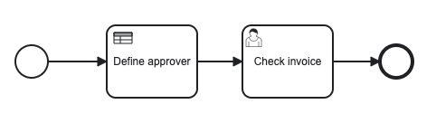
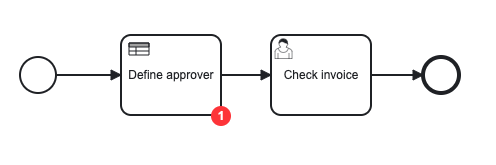
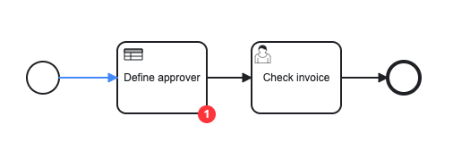

In this tutorial, we'll step through examples to highlight the capabilities of the Operate API, such as rendering a BPMN diagram.

## Getting started

- You need authentication to access the API endpoints. Find more information [here](/apis-tools/operate-api/overview.md#authentication).
- We will use the `bpmn-js` library to render the diagram and add overlays. Visit the documentation on [embedding the pre-packaged viewer](https://bpmn.io/toolkit/bpmn-js/walkthrough/#viewer-pre-packaged) for more details.

## Set up the demo project

1. Create a new folder using the following command:

```sh
mkdir operate-api-demo
cd operate-api-demo
```

2. Initialize the project using the following command:

```sh
npm init --y
```

3. Add a proxy server to bypass CORS errors. Create a `server.js` file inside the project folder with the following contents:

```js
const http = require("http");
const request = require("request");

const server = http.createServer((req, res) => {
  request.get(
    {
      // Replace http://localhost:8080 with your Operate API url if its running on different port.
      url: `http://localhost:8080${req.url}`,
      headers: {
        // Replace COOKIE_VALUE with your OPERATE-SESSION cookie value.
        Cookie: "OPERATE-SESSION=COOKIE_VALUE",
      },
    },
    (error, response, body) => {
      if (error) {
        console.error(error);
        res.statusCode = 500;
        res.setHeader("Access-Control-Allow-Origin", "*");
        res.setHeader("Content-Type", "application/json");
        res.end("Error: Could not get data from API");
      } else {
        res.setHeader("Content-Type", response.headers["content-type"]);
        res.setHeader("Access-Control-Allow-Origin", "*");

        res.end(body);
      }
    }
  );
});

server.listen(3030, () => {
  console.log("Proxy server listening on port 3030");
});
```

4. Install the necessary packages using the following command:

```sh
npm install request
```

5. Run the server using the following command:

```sh
node server.js
```

## Render a BPMN diagram

1. Create an `index.html` file and include the `bpmn-js` script:

```html
<!doctype html>
<html>
  <head>
    <script src="https://unpkg.com/bpmn-js/dist/bpmn-viewer.development.js"></script>
  </head>

  <body></body>
</html>
```

2. Create a `styles.css` file to maintain the styling:

```css
html,
body,
#canvas {
  height: 100%;
  padding: 0;
  margin: 0;
}

.flow-node-incident {
  width: 20px;
  height: 20px;
  display: flex;
  justify-content: center;
  align-items: center;
  background-color: #ff3d3d;
  color: White;
  border-radius: 10px;
  font-family: Arial;
  font-size: 12px;
  font-weight: bold;
  transform: translateX(-50%);
}
```

3. Create an `api.js` script file and write a function that fetches the process XML by definition:

```js
async function fetchDiagram() {
  return fetch(
    // Replace {PROCESS_DEFINITION_ID} with a process definition ID.
    // http://localhost:3030 is the URL of the Proxy server, which should stay the same.
    "http://localhost:3030/v1/process-definitions/{PROCESS_DEFINITION_ID}/xml",
    {
      method: "GET",
    }
  ).then((response) => response.text());
}
```

4. Fetch and render the diagram:

```html
<!doctype html>
<html>
  <head>
    <!-- replace CDN url with local bpmn-js path -->
    <script src="https://unpkg.com/bpmn-js/dist/bpmn-viewer.development.js"></script>
    <link rel="stylesheet" href="./styles.css" />
  </head>

  <body>
    <!-- BPMN diagram container -->
    <div id="canvas"></div>
    <!-- JS file that includes our API methods -->
    <script src="./api.js"></script>
    <script>
      // BpmnJS is the BPMN viewer instance
      const viewer = new BpmnJS({ container: "#canvas" });

      async function renderDiagram() {
        const diagram = await fetchDiagram();

        try {
          await viewer.importXML(diagram);

          const canvas = viewer.get("canvas");

          canvas.zoom("fit-viewport");
        } catch (err) {
          console.log("err", err);
        }
      }

      renderDiagram();
    </script>
  </body>
</html>
```

5. Open `index.html` in your browser to observe the rendered diagram.

   

## Show statistics on the diagram

1. Add a new function to the `api.js` file that fetches the flow node statistics for a specified process instance ID:

```js
async function fetchStatistics() {
  return fetch(
    // Replace {PROCESS_INSTANCE_ID} with a process instance ID.
    // http://localhost:3030 is the URL of the proxy server, which should stay the same.
    "http://localhost:3030/v1/process-instances/{PROCESS_INSTANCE_ID}/statistics",
    {
      method: "GET",
    }
  ).then((response) => response.json());
}
```

2. Add an overlay that displays the number of incidents on flow nodes:

```js
// ...
canvas.zoom("fit-viewport"); // insert following code below this line

const overlays = viewer.get("overlays");

fetchStatistics()
  .then((statistics) =>
    statistics.forEach(({ activityId, incidents }) => {
      if (incidents > 0) {
        overlays.add(activityId, "flowNodeState", {
          position: {
            bottom: 9,
            right: 0,
          },
          html: `<div class="flow-node-incident">${incidents}</div>`,
        });
      }
    })
  )
  .catch((err) => {
    console.error("An error occured when fetching statistics: ", err);
  });

// ...
```

3. Open `index.html` in your browser to observe the incident overlay displayed on the related flow node(s), if there are any.



## Highlight processed sequence flows on the diagram

1. Add a new function to the `api.js` file that fetches the processed sequence flows for a specified process instance ID:

```js
async function fetchSequenceFlows() {
  return fetch(
    // Replace {PROCESS_INSTANCE_ID} with a process instance ID.
    // http://localhost:3030 is the URL of the Proxy server, which should stay the same.
    "http://localhost:3030/v1/process-instances/{PROCESS_INSTANCE_ID}/sequence-flows",
    {
      method: "GET",
    }
  ).then((response) => response.json());
}
```

2. Color the processed sequence flows:

```js
// ...
const overlays = viewer.get("overlays"); // insert following code below this line

fetchSequenceFlows()
  .then((sequenceFlows) => {
    sequenceFlows.forEach((sequenceFlow) => {
      const elementRegistry = viewer.get("elementRegistry");
      const graphicsFactory = viewer.get("graphicsFactory");
      const element = elementRegistry?.get(sequenceFlow);
      if (element?.di !== undefined) {
        element.di.set("stroke", "#4d90ff");

        const gfx = elementRegistry?.getGraphics(element);
        if (gfx !== undefined) {
          graphicsFactory?.update("connection", element, gfx);
        }
      }
    });
  })
  .catch((err) => {
    console.error("An error occured when fetching sequence flows: ", err);
  });

// ...
```

3. Open `index.html` in your browser to observe the processed sequence flows highlighted.



## Full demo

For additional details, visit the [GitHub full working demo](https://github.com/camunda/operate-api-bpmn-demo).
