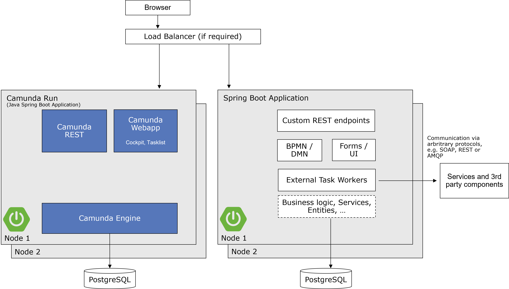

Camunda 7 is very flexible and can be hooked into the architecture of your choice, giving you a number of important decisions to make. If you don't have special architecture requirements, we recommend following the proposed greenfield stack. You can also check the decision criteria presented below to make more customized choices. Choosing the stack will have big influence on your overall architecture.

:::caution Camunda 7 only
This best practice targets Camunda 7.x only! If you look for Camunda 8, please refer to [Deciding about your Camunda 8 stack](../deciding-about-your-stack/).
:::

## The Java greenfield stack

The greenfield stack is pretty similar for various languages. This section described the currently a recommendation for Java developers. If you use different programming languages (like .NET or JavaScript), we recommend looking at Camunda 8, which supports polyglot environments better. The greenfield recommendation has recently changed. So if the recommendation below is surprising to you, you might want to check [this blog post](https://blog.bernd-ruecker.com/moving-from-embedded-to-remote-workflow-engines-8472992cc371).

Use the following stack:

1. Leverage the [Camunda Run](https://docs.camunda.org/manual/latest/installation/camunda-bpm-run/) distribution to run Camunda 7 using the [Enterprise Edition](https://camunda.com/download/enterprise/), preferably [via Docker](https://docs.camunda.org/manual/latest/user-guide/camunda-bpm-run/#starting-camunda-platform-run-using-docker).

1. Build your process solution project as a [Spring Boot](https://spring.io/projects/spring-boot) application, using the [Camunda 4 REST Client for Spring Boot](https://github.com/camunda-community-hub/camunda-engine-rest-client-java/).

1. Use [Maven](https://maven.apache.org/) as a build tool.

1. Use your favorite IDE, for example Visual Studio Code, IntelliJ or Eclipse.

1. Use [OpenJDK JDK 17](https://jdk.java.net/17/) as Java runtime.

1. Model the processes with the [Camunda Modeler](https://camunda.org/download/modeler/).

1. Add your process models and all Java code to the project.

1. The default distribution leverages an H2 file-based Java database. We recommend using this for development. We _strongly discourage_ multiple developers share the same database during development as this can lead to a multitude of problems.

To run the process application _in production_, extend the stack:

1. Use [PostgreSQL](http://www.postgresql.org/), or the database you already operate.

2. [Secure your installation](https://docs.camunda.org/manual/latest/user-guide/security/).

3. Run the process application by copying the `jar` file to the server and start it with `java -jar YourProcessApplication.jar`. This can also be done via Docker.

Refer to our [example application](https://github.com/berndruecker/camunda-platform-remote-spring-boot-example).

### Understanding the stack's architecture

The basic architecture with this stack is shown in the following diagram:



### Understanding our motivation for the stack

While we went through long and detailed discussions to come to this recommendation, it _doesn't_ mean that it is necessarily superior to alternative stacks. You can still feel confident if you go down another route (refer below for alternative options). But for our Best Practices, we wanted to give _exactly
one_ greenfield recommendation for all our customers who have no special requirements on the stack.

We decided on this stack for the following reasons:

- All components are open source and easily available.
- Camunda Run is the favorite distribution, as it focuses on external tasks, the more modern paradigm also present in Camunda 8.
- Spring Boot is currently the most adopted way of building Java applications.
- Spring Boot applications are easy to customize as well as easy to roll out into test and production environments, either on-premises or in the cloud.
- PostgreSQL has a great track-record for performance.

There are several _advantages using the greenfield stack_:

- _Fewer decisions:_ Depending on your experience with the Java cosmos, the decisions to choose a stack might not be easy to take. So if you don't have special requirements, follow a well-known path.
- _Proven:_ Many of our customers use this stack with great success.
- _More documentation & Best Practices:_ You don't have to write your own extensive documentation, just point to the Camunda docs.
- _Easier support:_ Asking for help gets much easier as you do not have to explain your setup in detail.

### Considering Camunda 8 instead

Camunda 8 is an alternative process automation offering that catches up on functionality quickly. For new projects, consider using Camunda 8 from the start. You can find [a quick comparison of concepts in the docs](/guides/migrating-from-camunda-7/conceptual-differences.md). Note that architecturally, the recommended greenfield stack in this best practice is close to what you do using Camunda 8.

### Getting started with the greenfield stack

Check the **prerequisites**:

- Install [OpenJDK JDK 17](https://jdk.java.net/17/).
- Install [Camunda Modeler](https://camunda.org/download/modeler/).
- Install an IDE like [Eclipse](https://eclipse.org/downloads/). We recommend the latest "Eclipse IDE for Java Developers".

  - Activate workspace file sync [refresh using built-in hooks or polling](http://stackoverflow.com/questions/4343735/avoiding-resource-is-out-of-sync-with-the-filesystem) to improve interaction of Eclipse and Camunda Modeler.
  - [Add Camunda Assert to your Eclipse content assist favorites](https://github.com/camunda/camunda-bpm-platform/blob/master/test-utils/assert/README.md).

- Check your network access to [Camunda Artifactory](https://artifacts.camunda.com/ui/) for downloading Maven Artifacts.
- As an Enterprise Customer, check that you have your company credentials at hand to log in and get enterprise versions.

Create your **development project**

1. Create a new Spring Boot project (e.g. using [Spring Initializr](https://start.spring.io/))
2. Add the dependency for the [Camunda Engine OpenAPI REST Client](https://github.com/camunda-community-hub/camunda-engine-rest-client-java/) community extension:

```
    <dependency>
        <groupId>org.camunda.community</groupId>
        <artifactId>camunda-engine-rest-client-complete-springboot-starter</artifactId>
        <version>7.16.0-alpha1</version>
    </dependency>
```

3. Model a process with Camunda Modeler and save it under `src/main/resources`.
4. Run the main Java application class via your IDE.
5. Play around with your process using the Camunda web apps (user `demo`, password `demo`):

- [Tasklist](http://localhost:8080/camunda/app/tasklist/)
- [Cockpit](http://localhost:8080/camunda/app/cockpit/)

6. Package your application with `mvn clean install`.
7. Bring the `jar` file to your test or production server and start it there.
8. You can set up or integrate it into an existing continuous delivery pipeline.

## Customize your stack

### Selecting the process engine mode

|                                                                                                                                                                                                        | Camunda Run (Remote engine)                                                                                             | Embedded Engine                                                                                            | Container-Managed Engine                                                                                                                                                           |
| ------------------------------------------------------------------------------------------------------------------------------------------------------------------------------------------------------ | ----------------------------------------------------------------------------------------------------------------------- | ---------------------------------------------------------------------------------------------------------- | ---------------------------------------------------------------------------------------------------------------------------------------------------------------------------------- |
|                                                                                                                                                                                                        | Run the engine as an isolated BPM server only, communicating with it via Web Services.                                  | Use the process engine as a simple library within your own application, typically started via Spring Boot. | Run the engine as a service preconfigured in your Java EE container.                                                                                                               |
| Engine Bootstrap / Lifecycle Management                                                                                                                                                                | Out-of-the-box                                                                                                          | Out-of-the-box for Spring Boot, otherwise do-it-yourself (note options below)                              | Out-of-the-box                                                                                                                                                                     |
| Camunda Webapps work in all use-cases                                                                                                                                                                  | &#10004;                                                                                                                | Observe limitations below                                                                                  | &#10004;                                                                                                                                                                           |
| Camunda REST API work in all use-cases                                                                                                                                                                 | &#10004;                                                                                                                | Observe options below                                                                                      | &#10004;                                                                                                                                                                           |
| [Multiple Process Applications can share a central engine](https://docs.camunda.org/manual/latest/user-guide/process-applications/)                                                                    | &#10004;                                                                                                                | Doable with a shared database, but requires custom development and has limitations                         | &#10004;                                                                                                                                                                           |
| [Multiple Engines can share resources (e.g. share the Job Executor)](https://docs.camunda.org/manual/latest/user-guide/process-engine/the-job-executor/#the-job-executor-and-multiple-process-engines) |                                                                                                                         |                                                                                                            | &#10004;                                                                                                                                                                           |
| One application WAR/EAR can include the process engine                                                                                                                                                 |                                                                                                                         | &#10004;                                                                                                   |                                                                                                                                                                                    |
| Supports untouched ("vanilla") containers                                                                                                                                                              | &#10004;                                                                                                                | &#10004;                                                                                                   |                                                                                                                                                                                    |
| Runs in every Java environment                                                                                                                                                                         | &#10004;                                                                                                                | &#10004;                                                                                                   | [On Supported Containers](https://docs.camunda.org/manual/latest/introduction/supported-environments/#container-application-server-for-runtime-components-excluding-camunda-cycle) |
| Responsibility for Engine Installation and Configuration                                                                                                                                               | Operations or Application Developer                                                                                     | Application Developer                                                                                      | Operations or Application Developer                                                                                                                                                |
| Application point of view on process engine                                                                                                                                                            | Remote Server                                                                                                           | Library                                                                                                    | Library                                                                                                                                                                            |
| Possible communication types with services                                                                                                                                                             | Remote                                                                                                                  | Java InVM, Remote                                                                                          | Java InVM, Remote                                                                                                                                                                  |
| Programming language                                                                                                                                                                                   | Polyglot (Java, Node.js, C#, ...)                                                                                       | Java                                                                                                       | Java                                                                                                                                                                               |
| Use when                                                                                                                                                                                               | **Default**, if there is no reason against it. Especially if your architecture or applications are not Java based.      | You want a single deployment including the engine.                                                         | You use a supported application server and prefer to separate engine installation from application development.                                                                    |
|                                                                                                                                                                                                        | [Learn More](https://docs.camunda.org/manual/latest/introduction/architecture/#standalone-remote-process-engine-server) | [Learn More](https://docs.camunda.org/manual/latest/introduction/architecture/#embedded-process-engine)    | [Learn More](https://docs.camunda.org/manual/latest/introduction/architecture/#shared-container-managed-process-engine)                                                            |

In essence, the general recommendation is:

- Use Camunda Run whenever possible.

- Do not use a container-managed engine. The container managed engine allows to separate installation and configuration of the engine from the application development. This is an advantage if you really separate these roles within your organization. However, we experienced that this causes trouble more often than it does help. Developers most often are still responsible to install the engine, but might not be able to access the application server itself. That also explains the rise of Spring Boot (often alongside with Docker) and many projects successfully moved to that approach instead. Unless you have good reasons, we would not recommend starting new projects using a container-managed engine.

- Use an embedded engine via Spring Boot if you need to provide one combined deployment artifact.

### Understanding embedded engine specifics

If you want to use an embedded engine (which is not the default recommendation; refer to the above,) the following information will help you use it correctly.

#### Using Spring Boot

The Camunda Spring Boot Starter is a clean way of controlling the embedded engine easily, so you don't have to think about the specifics mentioned below in this section. This makes Spring Boot a good choice for Camunda projects.

#### Bootstrapping the engine and managing its lifecycle

When running the engine in embedded mode, you have to control the _lifecycle_ of the engine yourself, basically _starting up_ and _shutting down_ the engine, and providing access to the API whenever a client needs it. You have several options to do that.

|                                 | Spring Boot                                                   | Spring Application Context                                                                  | `processes.xml`                                                                                              | Programmatic                                                                        |
| ------------------------------- | ------------------------------------------------------------- | ------------------------------------------------------------------------------------------- | ------------------------------------------------------------------------------------------------------------ | ----------------------------------------------------------------------------------- | --- |
|                                 | Configure, start, and stop the engine via Spring Boot Starter | Configure, start, and stop the engine via Spring Beans defined in your Application Context. | Configure, start, and stop the engine via Camunda’s processes.xml descriptor and a ProcessApplication class. | Configure, start, and stop the engine yourself programmatically by using Java code. |
| Use when                        | You target Spring Boot as runtime environment.                | You already use Spring.                                                                     | You do not want to introduce a Spring dependency just for Camunda.                                           | You need full control over the engine or want to do advanced customizations.        |
| Unlimited Configuration Options | &#10004;                                                      | &#10004;                                                                                    |                                                                                                              | &#10004;                                                                            |
| Development Effort              | Low                                                           | Medium                                                                                      | Low                                                                                                          | High                                                                                |     |

#### Providing a REST API

When running an embedded engine, it might be harder to deploy the pre-built REST API.

|                              | Use Spring Boot Starter for REST API                                                        | Embed Camunda’s REST API                                                       | Use Camunda’s Standalone Web App REST API                                                       |
| ---------------------------- | ------------------------------------------------------------------------------------------- | ------------------------------------------------------------------------------ | ----------------------------------------------------------------------------------------------- | --- |
|                              | The Spring Boot Starter allows to run the REST API as well as the Camunda web applications. | Provide Camunda’s REST API by embedding its JAX-RS code into your application. | Deploy Camunda’s "Standalone" Web Application (which runs its own engine) and use its REST API. |
| No Classloading Restrictions | &#10004;                                                                                    | &#10004;                                                                       |                                                                                                 |
| Development Effort           | Low                                                                                         | High                                                                           | Low                                                                                             |     |

#### Providing Camunda web applications (Tasklist, Cockpit)

When running an embedded engine, you may want to use a Camunda web application like Tasklist and Cockpit, but have to decide how exactly to run these web applications in your environment.

|                           | Use Spring Boot Starter for Camunda Web Applications                                                    | Camunda "Standalone" Web Application                                                                                                                                                                                                                                                                          | Embedded Camunda Web Applications                                                                          |
| ------------------------- | ------------------------------------------------------------------------------------------------------- | ------------------------------------------------------------------------------------------------------------------------------------------------------------------------------------------------------------------------------------------------------------------------------------------------------------- | ---------------------------------------------------------------------------------------------------------- |
|                           | The Spring Boot Starter allows you to run the REST API as well as the Camunda web applications.         | Deploy Camunda’s "Standalone" Web Application, which is a WAR running its own engine, and point it to your applications engine database.                                                                                                                                                                      | Embed the Camunda Web Applications into your own application, which is not a particularly easy task to do. |
| Classloading Restrictions | None                                                                                                    | For example, you can not submit a task in Tasklist when a following synchronously called service uses a class contained in your own application. However, you can solve this by adding additional [safe points](https://docs.camunda.org/manual/latest/user-guide/process-engine/transactions-in-processes/). | None                                                                                                       |
| Development Effort        | Low                                                                                                     | Low                                                                                                                                                                                                                                                                                                           | High (undocumented)                                                                                        |
|                           | [Spring Boot Starter](https://github.com/camunda/camunda-bpm-platform/tree/master/spring-boot-starter/) | [Download Standalone Web Application](http://camunda.org/download/)                                                                                                                                                                                                                                           | [Implement e.g. via Maven WAR Overlays](https://maven.apache.org/plugins/maven-war-plugin/overlays.html)   |

### Choosing a database

Camunda 7 requires a _relational database_ for persistence. Even if the persistence provider is in theory pluggable and can be exchanged by e.g. some _NoSQL_ persistence this is neither recommended nor supported. Therefore, if you have use cases for this, discuss them with Camunda beforehand!

|                                | PostgreSQL                                                       | Oracle                                                             | H2                                                                   | Other databases                                                                                                  |
| ------------------------------ | ---------------------------------------------------------------- | ------------------------------------------------------------------ | -------------------------------------------------------------------- | ---------------------------------------------------------------------------------------------------------------- |
|                                | PostgreSQL is an open source, object-relational database system. | Oracle Database is a commercial object-relational database system. | H2 is a Java SQL database with in-memory mode and a small footprint. |                                                                                                                  |
| Best Performance Observations  | &#10004;                                                         | &#10004;                                                           |                                                                      |                                                                                                                  |
| In-Memory Mode                 |                                                                  |                                                                    | &#10004;                                                             |                                                                                                                  |
| No installation required       |                                                                  |                                                                    | &#10004;                                                             |                                                                                                                  |
| Recommended for unit testing   |                                                                  |                                                                    | &#10004;                                                             |
| Recommended for production use | &#10004;                                                         | &#10004;                                                           |                                                                      | &#10004; ([if supported](https://docs.camunda.org/manual/latest/introduction/supported-environments/#databases)) |
|                                | [Learn More](http://www.postgresql.org/)                         | [Learn More](https://www.oracle.com/database)                      | [Learn More](http://www.h2database.com/)                             | [Supported Databases](https://docs.camunda.org/manual/latest/introduction/supported-environments/#databases)     |

Ideally, use the database your organization already operates and your team is experienced with!

### Modeling for executable processes

We distinguish two different roles modeling in BPM projects:

- _Process developers_ develop an executable process implementation. Process developers implementing solutions with Camunda must use Camunda Modeler to model executable processes, edit technical attributes, and manage and version (e.g. in Git or SVN) the resulting (XML) files as part of the development project.

- _Process analysts_ capture the operational know how about a process. For this part of the work, it is possible to use a different tool than Camunda Modeler.

|                                                               | Camunda Modeler                                                             | Third-Party Modeler (BPMN Standard Compliant)                                                                                                                               | Third-Party Modeler (Non-Compliant to Standard) |
| ------------------------------------------------------------- | --------------------------------------------------------------------------- | --------------------------------------------------------------------------------------------------------------------------------------------------------------------------- | ----------------------------------------------- |
| Roundtrip in between process analysts and developers possible | &#10004;                                                                    | &#10004; (Carefully check level of BPMN compliance - the [Model Interchange Working Group](http://bpmn-miwg.github.io/bpmn-miwg-tools/) can serve as a first starting point |                                                 |
| Use for process analysts                                      | &#10004;                                                                    | &#10004;                                                                                                                                                                    |                                                 |
| Use for process developers                                    | &#10004;                                                                    |                                                                                                                                                                             |                                                 |
| Use when                                                      | You do not have a BPMN standard compliant modeling tool already rolled out. | You already rolled out a BPMN tool with a standard compliancy sufficient for roundtrip.                                                                                     | Try to avoid                                    |
|                                                               | [Download](https://camunda.org/download/modeler/)                           |                                                                                                                                                                             |                                                 |
