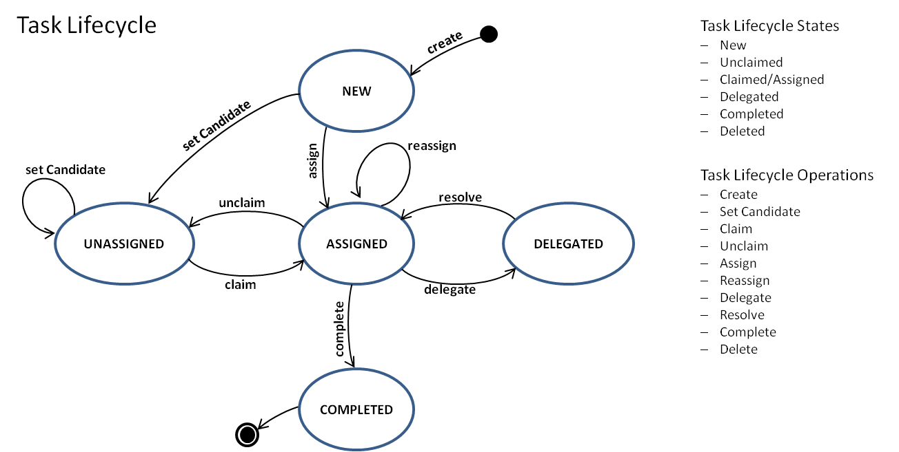
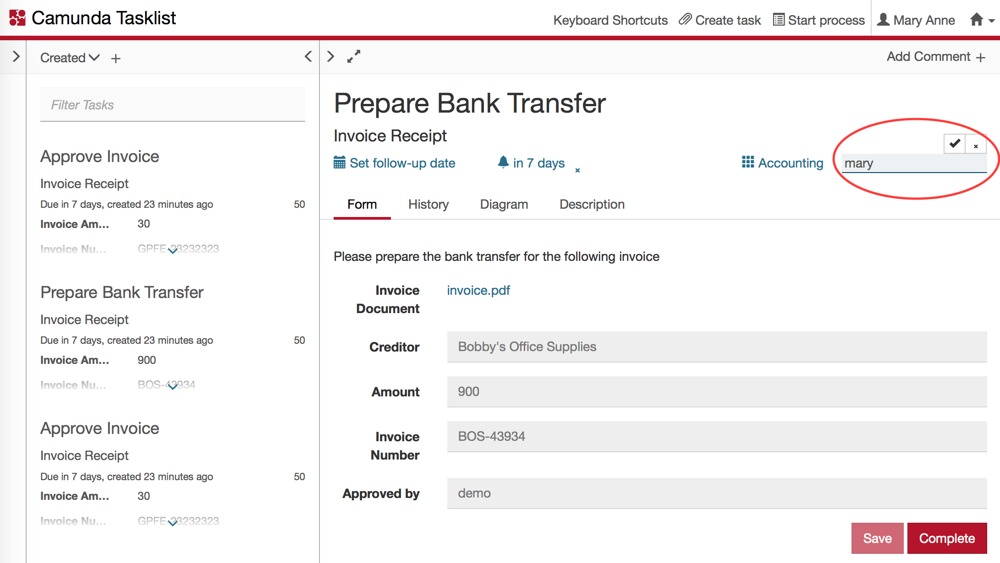
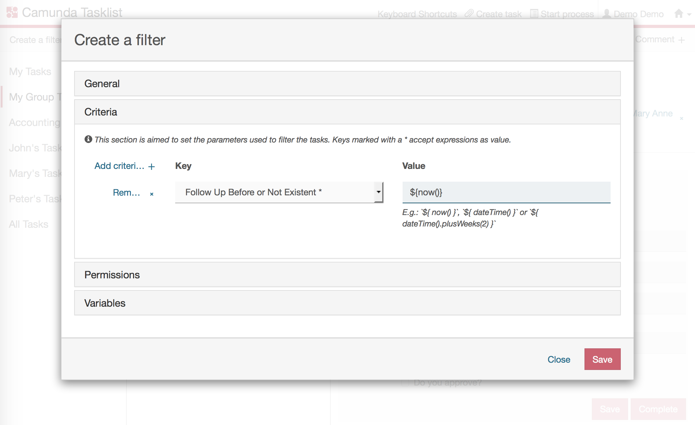
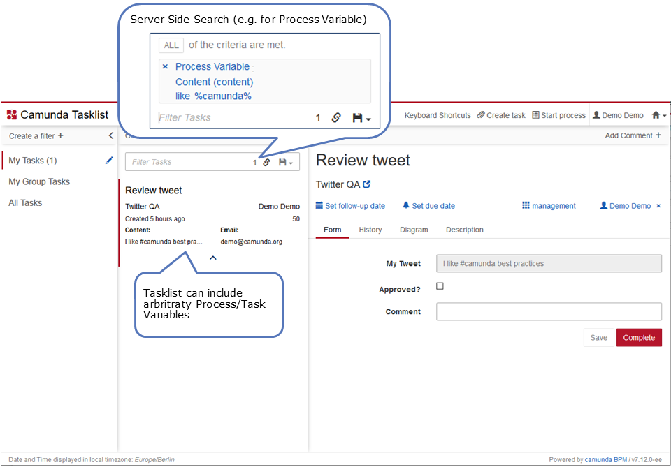
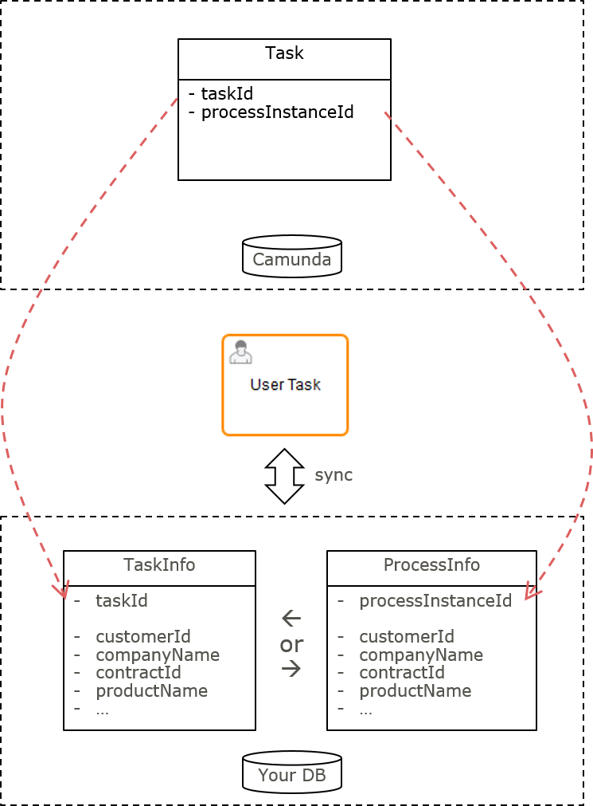

:::caution Camunda 7 only
This best practice targets Camunda 7.x only and is an appendum to [understanding human task management](../understanding-human-tasks-management/).
:::

## The Camunda 7 task lifecyle

Do not show the _lifecycle_ of user _tasks_ in the process model, they are generic and common to all processes and so can be controlled by using the [Camunda BPM task lifecycle](https://docs.camunda.org/manual/latest/webapps/tasklist/task-lifecycle/) features.



- Create: New tasks are normally created as part of _process execution_, but can be created by a _user action_, too (as standalone tasks). `taskService.newTask()`
- Set Candidate: Typically candidates are initially set to _groups_ of people as part of _process execution_, but can be requested by API, too. `taskService.addCandidateGroup(taskId, groupId)`
- Claim: Individual members of a candidate group _assign themselves_ to tasks when working on them.`taskService.claim(taskId, userId)`
- Unclaim: Individual assignees _unassign themselves_ and move a task back to the candidates.`taskService.claim(taskId, null)`
- Assign: Directly assign a specific individual either as part of _process execution_, or because explicitly requested by API. `taskService.setAssignee(taskId, userId)`
- Reassign: Individual assignees may want to _hand over_ a task to somebody else. `taskService.setAssignee(taskId, userId)`
- Delegate: Individual assignees may want to delegate (part of) the work: ask somebody else to _resolve (part of) the work_ in order to pass the task back subsequently. `taskService.delegateTask(String taskId, String userId)`
- Resolve: After having resolved the requested work individual assignees will want to _pass a delegated task back to the owner_: the original assignee. `taskService.resolveTask(String taskId)`
- Complete: This is how you would _close the work on a task_ and asking the process execution to move on `taskService.complete(String taskId, String userId)`

## Typical use cases

### Handing over tasks directly to other people

You can always hand over a task assigned to you simply by _changing the assignee_. This means that the new assignee is now responsible and supposed to carry out the task all by themselves.

```java
taskService.setAssignee(taskId, "kermit");
```

This can also be achieved via the Camunda tasklist:



### Delegating tasks to other people

Delegate a task assigned to you by using Camunda "delegateTask". This means that somebody else is supposed to resolve (some of) the work and then pass the task back to you by resolving it. The original assignee is remembered as the "owner" of the task. A typical example is decision support: Some other employees collect information in order to prepare a decision, but the original assignee has to take that decision.

Even if the engine does not enforce that a delegated task can be directly completed, we recommend that you not allow this if you use delegation. The task should always be resolved and then later completed by the owner. That's why there is no transition from "DELEGATED" to "COMPLETED" in the lifecycle shown.

```java
taskService.delegateTask(taskId, "gonzo");
// and later
taskService.resolveTask(taskId);
```

### Notifying people about their tasks

You might want to notify people about new tasks (e.g. via email). Do this by implementing a Camunda TaskListener, like shown in [this example](https://github.com/camunda/camunda-bpm-examples/tree/master/usertask/task-assignment-email).

When you want to have this functionality for every user task you can use a ParseListener which adds it _everywhere_, so you don't have to adjust the BPMN model. Refer to [BPMN Parse Listener](https://github.com/camunda/camunda-bpm-examples/tree/master/process-engine-plugin/bpmn-parse-listener) to observe how this can be done.

### Following up on tasks after some time

Follow up on tasks after some definable time by using Camunda's [Follow Up Date](https://docs.camunda.org/manual/latest/reference/bpmn20/tasks/user-task/#follow-up-date) field and use it in connection with filtering tasks.

You can set a calculated follow-up date by using a JUEL expression in your BPMN file

```xml
<bpmn:userTask id="Check payment" camunda:followUpDate="${paymentService.getFollowUpDate()}"/>
```

You can set a follow-up date, that may be requested by the user, using the Java API

```java
task.setFollowUpDate(myDate);
```

Now you can use a task _filter_ with criteria checking the follow-up date and if it is due. This can be leveraged via API or in the Camunda Tasklist.



### Enforcing deadlines for tasks

There are different ways of enforcing deadlines with human task orchestration. Typical actions for overdue tasks are:

- Sending reminder mails
- Changing the assignee/group
- Creating a standalone task for a manager

|                                                                    | Explicit modeling in BPMN                                                                      | Filtering due tasks                                                                        | Querying due tasks and take action                                                    | Timeout task event                                                       |
| ------------------------------------------------------------------ | ---------------------------------------------------------------------------------------------- | ------------------------------------------------------------------------------------------ | ------------------------------------------------------------------------------------- | ------------------------------------------------------------------------ |
|                                                                    | Showing an escalation process path in your BPMN model (observe the example below)              | Setting the Due Date field to easily filter for overdue tasks                              | Setting the Due Date field, querying it on a regular basis and take arbitrary actions | Implement a timeout event listener and configure it in the process model |
|                                                                    | Explicit                                                                                       | Implicit                                                                                   | Implicit                                                                              | Implicit                                                                 |
| Bulk actions possible (e.g. one mail with a list of all due tasks) |                                                                                                |                                                                                            | yes                                                                                   |                                                                          |
| No custom component required                                       | yes                                                                                            | yes                                                                                        | Querying has to be done by external trigger or BPMN process                           | yes                                                                      |
| Use when                                                           | The escalation is business relevant and has to be visible in the process model                 | Overdue tasks can be easily monitored via tasklist application, actions are taken manually | Sophisticated, automated actions should take place                                    | A timely escalation mechanism is desired                                 |
| Don’t use when…​                                                   | Each and every user task has a due date and explicit modeling would clutter your process model | You need an action to be executed automatically                                            | You do not want to run your own scheduling infrastructure                             | The escalation should be visible in the process model                    |

#### Modeling an escalation

The following example shows how to explicitly model an escalation:

<div bpmn="best-practices/extending-human-task-management-c7-assets/enforcing-deadlines.bpmn" callouts="user_task_remind_boss" />

<span className="callout">1</span>

The model shows an explicit escalation process path: if the tweet does not get reviewed within an hour, the boss needs to be reminded about the laws of the internet age.

#### Filtering by due date

This example shows how you can calculate and set the [Due Date](https://docs.camunda.org/manual/latest/reference/bpmn20/tasks/user-task/#due-date) field:

```xml
<bpmn:userTask id="Review tweet" camunda:dueDate="${dateTime().plusHours(1).toDate()}"/>
```

You can easily query for overdue tasks via API, e.g. all overdue tasks:

```java
processEngine.getTaskService().createTaskQuery().dueBefore(new Date()).list();
```

#### Model timeout task event

This example shows how to model a timeout event on a user task:

```xml
<bpmn:userTask id="Task_1qdlz4w" name="Do something">
  <bpmn:extensionElements>
    <camunda:taskListener delegateExpression="${sendEmailReminderListener}" event="timeout" id="reminder-listener">
      <bpmn:timerEventDefinition id="TimerEventDefinition_1an454y">
        <bpmn:timeCycle xsi:type="bpmn:tFormalExpression">R/PT1H</bpmn:timeCycle>
      </bpmn:timerEventDefinition>
    </camunda:taskListener>
  </bpmn:extensionElements>
</bpmn:userTask>
```

Every hour, the process engine will invoke the `sendEmailReminderListener` bean to send out an email. The bean can access all task and process attributes.

## Enhancing task lists with business data

Allow users to filter their tasks by relevant business data. Display this data right inside the task list and not just when selecting a task form. To achieve this with acceptable performance, select the implementation approach appropriate for your needs.

### Selecting an implementation approach

To enhance your tasklist with business data, select the implementation approach appropriate for your needs.

|                                                       | Camunda Process Variables                                                                            | Camunda Native Query API                                                                           | Custom MyBatis Mapping                                                                        | Custom Process or Task "InfoEntity"                                                   |
| ----------------------------------------------------- | ---------------------------------------------------------------------------------------------------- | -------------------------------------------------------------------------------------------------- | --------------------------------------------------------------------------------------------- | ------------------------------------------------------------------------------------- |
|                                                       | Use simple process or task variables to store business data with tasks, often as an additional copy. | Use a built-in query to enhance query performance when retrieving tasks filtered by business data. | Use a custom database mapping to speed up retrieval of task data combined with business data. | Use a custom database entity to store business data optimized for search and display. |
| Filter with Business Data as Simple Process Variables | yes                                                                                                  | yes                                                                                                | yes                                                                                           | yes                                                                                   |
| Filter with Business Data in Domain Database          |                                                                                                      | yes                                                                                                | yes                                                                                           | yes                                                                                   |
| Display Business Data from Domain Database            | (only via "copy as process variable")                                                                | (only via "copy as process variable")                                                              | yes                                                                                           | yes                                                                                   |
| Development Effort                                    | out-of-the-box                                                                                       | low                                                                                                | high                                                                                          | high                                                                                  |
| No Dependency on Camunda Internals                    | yes                                                                                                  | (take care not to use hard coded table names)                                                      | (take care not to use hard coded table names)                                                 | yes                                                                                   |
| Required Know-How                                     |                                                                                                      | SQL                                                                                                | SQL, Apache MyBatis, Advanced Camunda                                                         | Depends (e.g. JPA or JDBC)                                                            |
| Scaling / Performance                                 | Limited (~ 5-10 criteria)                                                                            | Medium (dep. on use case)                                                                          | Medium (dep. on use case)                                                                     | High (customized)                                                                     |
| Out-of-the-box usage with Camunda Tasklist            | yes                                                                                                  |                                                                                                    |                                                                                               |                                                                                       |

### Using Camunda process/task variables

Using plain and simple process or task variables to store business data has the big _advantage_ that
you can use the out-of-the-box mechanisms. Plain and simple means to only use primary data types (e.g. String, Long, ...). Especially when using _Camunda Tasklist_ you can easily use process/task variables to

- _Show_ custom business data right inside the list, or
- Use such variables for defining re-usable _filters_ which narrow down your Tasklist items to the ones matching:



#### Including derived or calculated values

In case you need _dynamically calculated values_ or specific _fields derived from complex datatypes/objects_, you can achieve this by

- using task variables as a kind of _caching_ mechanism,
- being filled by "calculating" the values using _expression language_
- e.g. by means of an _I/O Mapping_ of a user task:

```xml
<task id="..." name="Create new payment">
  <extensionElements>
    <camunda:inputOutput>
      <camunda:inputParameter name="paymentSum">${invoice.calculateSum()}</camunda:inputParameter> <!--1-->
      <camunda:inputParameter name="creditorId">${invoice.creditorId}</camunda:inputParameter> <!--2-->
    </camunda:inputOutput>
  </extensionElements>
</task>
```

<span className="callout">1</span>

The total sum of the payment is calculated by calling a method on an invoice object and cached for search and display purposes.

<span className="callout">3</span>

The creditorId is copied into an own variable, so it can be used in filters or shown in the tasklist.

The _disadvantage_ of using process or task variables is that this mechanism does _not_ scale very well, as the process variables are stored in the generic Camunda database schema. This requires one row in the variable table for each variable, and all of them must be joined with the process instance table. The real limit is determined by the amount of data and the database used - but typically you cannot use more than 10 variables.

#### Using a special search variable

If you need variables only to search for tasks (but not to display attributes in the tasklist) you can use a simple workaround: Introduce _one single process variable optimized for tasklist queries_. Extract the attributes you need to filter your tasklist with and combine them to a single search string prepared to work with a SQL 'LIKE' query:

| Variable      | Type     | Value                                                     |
| ------------- | -------- | --------------------------------------------------------- |
| customerId    | (Long)   | 4711                                                      |
| customerName  | (String) | camunda                                                   |
| customerPlace | (String) | Berlin                                                    |
| searchString  | (String) | customerId=4711#customerName=camunda#customerPlace=Berlin |

When defining your Camunda tasklist filter, use the searchString variable and search in it by means of a 'LIKE' query.

### Using the Camunda native query API

When you need to filter your tasks by business data stored in your own tables, leverage the possibility to create _native queries_ via the Camunda _Java API_. Native Queries are

- expressed in _SQL_ which is not limited to the Camunda Tables. However
- the result is still _mapped to the Camunda Task entity_, so you do not have to dive into Apache MyBatis (the persistence framework used within Camunda).

This means you _cannot_ load data from your domain objects by native queries, you simply can express arbitrary WHERE clauses. Example:

```java
List<Task> tasks = taskService.createNativeTaskQuery()
    .sql("SELECT * FROM #{taskTable} T"
        + "LEFT OUTER JOIN (select * from #{variablesTable} where NAME_= 'customerId') VAR_CUSTOMER"
        + "  ON VAR_CUSTOMER.EXECUTION_ID_ = T.EXECUTION_ID_"
        + "LEFT OUTER JOIN CUSTOMER " // <1>
        + "  ON CUSTOMER.ID_ = VAR_CUSTOMER.LONG_"
        + "WHERE CUSTOMER.COMPANY = #{companyName}")
    .parameter("companyName", "camunda")
    .parameter("taskTable", managementService.getTableName(Task.class)) // <2>
    .parameter("variablesTable", managementService.getTableName(VariableInstance.class))
    .list();
```

<span className="callout">1</span>

Using native queries allows you to directly join Camunda tables with custom Business Data Tables (held in the same database) while still retrieving `Task.class` typed result sets.

<span className="callout">2</span>

Make sure that you do not use hard coded table names to be less dependent on Camunda Internals. However, please note that the example still uses internal details, e.g. by using column names. Your queries or table/column name mappings would need to be adapted in case these internal details change.

### Implementing a custom mybatis mapping

In case you want to not just filter tasklists for business data, but also load custom data from domain objects in one query you can implement your own _MyBatis_ mapping and call it via _custom code_.

Even if this is a very powerful mechanism, we normally do not recommend it, as you need to understand quite a bit about MyBatis. It will be hard to completely avoid dependencies on the Camunda database schema. The database schema is considered internal, hence this also might impose additional maintenance effort in your project for new Camunda versions.

### Implementing a custom _process/task info entity_

For maximal flexibility (and best performance possibilities), create a custom ProcessInstanceEntity and/or TaskEntity designed to filter tasklists and display business data.

Prefer a ProcessInstanceEntity over a TaskEntity as long as the business data you need is quite similar in between the different user tasks of a process definition. This way you avoid unnecessary database operations. If this is not the case you need to go for the TaskEntity as shown in the following example.



In this entity, combine the Camunda `task.id` with all your business attributes as separate columns. This allows to query for and display tasks without or with a minimum of SQL JOINs. Consider to use your entity now as a single source for displaying tasklists to your users - hence circumventing the Camunda TaskService Query API for that purpose completely.

Using this approach requires to synchronize your entity with the Camunda state.

If you target a _TaskInfoEntity_:

- Create it via a _TaskListener_
- Delete it via a Tasklistener

If you target a _ProcessInstanceInfoEntity_:

- Create a new instance by an _ExecutionListener_ on the process instance start event. The process instance ID might not yet be known at this time. So either you create your own ID and set it as a process variable (to SQL "join" on this later), or you can add a safe point before the listener triggers to make sure the process instance was committed to the database.

- Decide when you have to update information in the entity, this depends on various factors (like amount of data, frequency of changes, way of changing data, ...).
