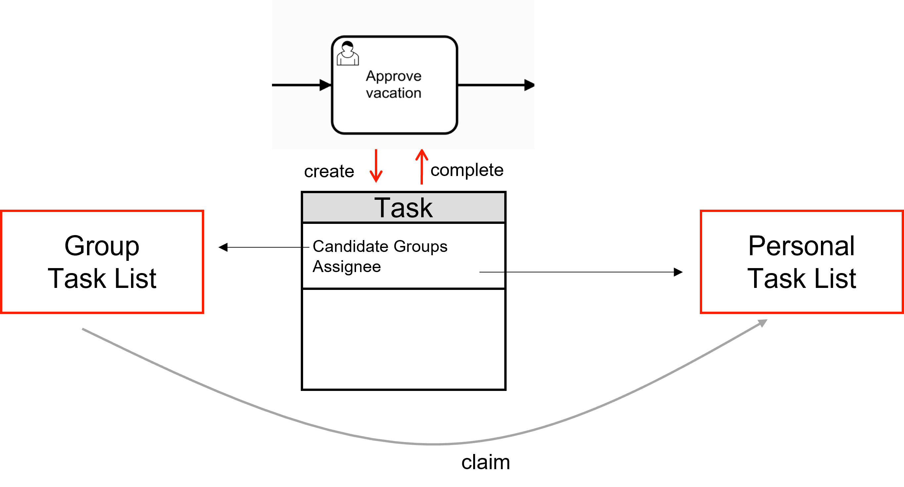
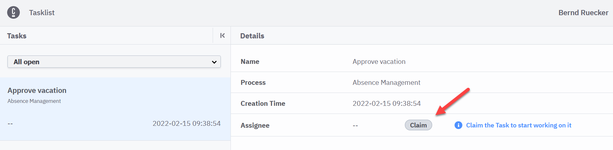

## Using task assignment features

The lifecycle of human task orchestration (like assigning, delegating, and completing tasks) is mostly a generic issue. There is no need to model common aspects into all your processes, if often makes models unreadable. Use Camunda task management features or implement your requirements in a generic way.



So every task can be assigned to either a group of people, or a specific individual. An individual can 'claim' a task, indicating that they are picking the task from the pool (to avoid multiple people working on the same task).

As a general rule, you should assign human tasks, like [user tasks](/components/modeler/bpmn/user-tasks/user-tasks.md) or [manual tasks](/components/modeler/bpmn/manual-tasks/manual-tasks.md), in your business process to _groups of people_ instead of specific individuals.

```xml
<bpmn:userTask id="task_approve_vacation">
  <bpmn:extensionElements>
    <zeebe:assignmentDefinition candidateGroups="manager" />
  </bpmn:extensionElements>
```

Then, require individual members of that group to explicitly _claim tasks_ before working on them. This way, you avoid different people working on the same task at the same time. Refer to [`claimTask`](../../../apis-tools/tasklist-api/mutations/claim-task.mdx).

```graphql
claimTask(
  taskId: String!
  assignee: String
): Task!
```

You can also directly claim tasks in Camunda Tasklist with the click of a button.



While assigning users to groups is advised, it's not the only option. You could always assign a task to a _single person_ who is supposed to complete the task (e.g. the individual 'customer' of your process or a coworker having specific knowledge for the case). You will need to have access to the specific person relevant for your process instance, e.g. via a process variable:

```xml
<bpmn:userTask id="task_approve_vacation">
  <bpmn:extensionElements>
    <zeebe:assignmentDefinition assignee="=assistant_username" />
  </bpmn:extensionElements>
```

## Deciding about your task list frontend

If you are orchestrating human tasks in your process, you must make up your mind on how exactly you want to let your users work on their tasks and interact with the workflow engine. You have basically three options:

- [Camunda Tasklist](/components/tasklist/introduction-to-tasklist.md): The Tasklist application shipped with Camunda. This works out-of-the-box and has a low development effort. However, it is limited in terms of customizability and how much you can influence the user experience.

- Custom task list application: You can develop a custom task list and adapt this to your needs without compromises. User tasks are shown inside your custom application, following your style guide and usability concept. You will use the [Camunda Tasklist API](/apis-tools/tasklist-api-rest/tasklist-api-rest-overview.md) in the background. This is very flexible, but requires additional development work.

- Third party tasklist: If our organization already has a task list application rolled out to the field, you might want to use this for tasks created by Camunda. You will need to develop some synchronization mechanism. The upside of this approach is that your end users might not even notice that you introduce a new workflow engine.

### Considerations for developing custom task lists

When building a custom tasklist/application, you must plan for the following aspects. You will need to

- _Query_ for user tasks and _generate lists_ of those tasks.
- _Filter the list_ along specific attributes like current assignee, candidate groups, etc.
- _Select_ and _display_ the right forms for starting processes and completing tasks.
- Use _custom/business value_ data in order to _filter_ with those values and _display_ them correlated with the task list and within forms.
- _Authorize_ users to access those lists, filters, and forms.

### Considerations for using third party task lists

When integrating a third party tasklist, you must plan for the following aspects. You will need to take care of:

- _Creating_ tasks in the third party tasklist based on the user tasks created by Camunda.
- _Completing_ tasks in Camunda and move on process execution based on user action in the third party tasklist.
- _Cancelling_ tasks, triggered by Camunda or triggered by the user in the third-party tasklist.
- Transferring _business data_ to be edited in the third-party tasklist back and forth.

Your third party tasklist application also needs to allow for some programmatic control of the lifecycle of its tasks. The third-party application _must have_ the ability:

- To programmatically _create_ a new task.
- To _hook in code_ which programmatically informs other systems that the user is about to change a task's state.
- To _manage custom attributes_ connected to a task and programmatically access them.

Additionally, it _should have_ the ability

- To programmatically _delete_ a task which was cancelled in Camunda. Without this possibility such tasks remain in the users tasklist and would need to be removed manually. Depending on the way you integrate the task completion mechanism, when the user tries to complete such tasks, they would immediately observe an error or the action would just not matter anymore and serve as a removal from the list.

Transfer just the minimal amount of business data in between Camunda and your third-party tasklist application.

For creating tasks, transfer just the taskId and important business data references/ids to your domain objects. As much as possible should be retrieved later, and just when needed (e.g. when displaying task forms to the user) by requesting data from the process engine or by requesting data directly from other systems.

For completing tasks, transfer just the business data which originated from Camunda and was changed by the user. This means, in case you just maintain references, nothing needs to be transferred back. All other business data changed by the user will be directly transferred to the affected systems.

### Task lists may not look like task lists

There are situations where you might want to show a user interface that does not look like a task list, even if it is fed by tasks. The following _example_ shows such a situation in the document _input management_ process of a company. Every document is handled by a separate process instance, but users typically look at complete mailings consisting of several such documents. In a customer scenario, there were people in charge of assessing the scanned mailing and distributing the individual documents to the responsible departments. It was important to do that in one step, as sometimes documents referred to each other.

So you have several user tasks which are heavily _interdependent_ from a business point of view and should therefore be completed _in one step_ by the same person.

The solution to this was a custom user interface that basically queries for human tasks, but show them grouped by mailings:


<span className="callout">1</span>

The custom tasklist shows each mailing as one "distribution task", even though they consist of several human tasks fetched from the workflow instance.

<span className="callout">2</span>

The custom user interface allows you to work on all four human tasks at once. By dragging and dropping a document within the tree, the user can choose to which department the document is delivered to.

<span className="callout">3</span>

In case the user detects a scanning problem, they can request a new scan of the mailing. But as soon
as all documents are quality assured, the button **Distribute Mailing** gets enabled. By clicking on it, the system completes all four human tasks - one for each document - which moves forward the four process instances associated with the documents.
