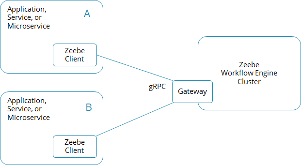
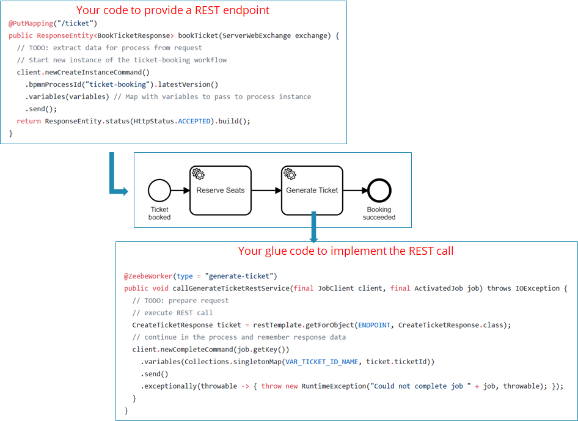
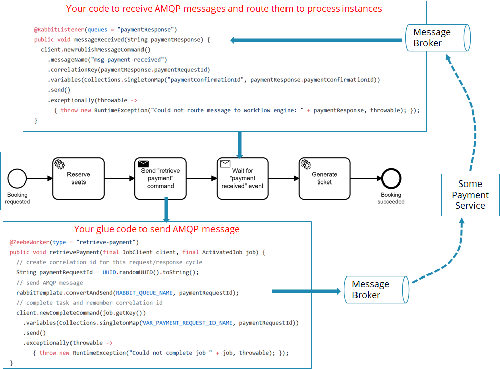
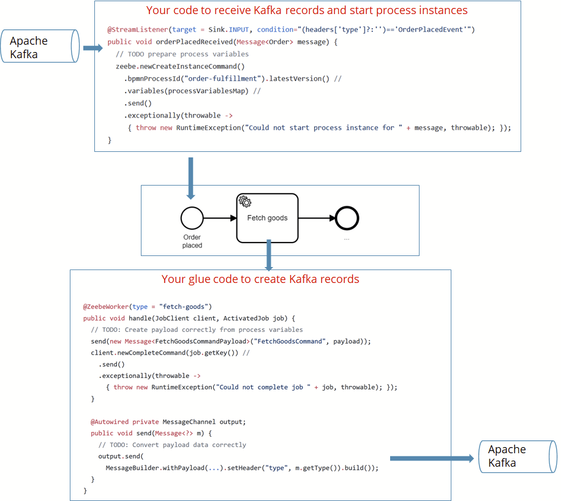
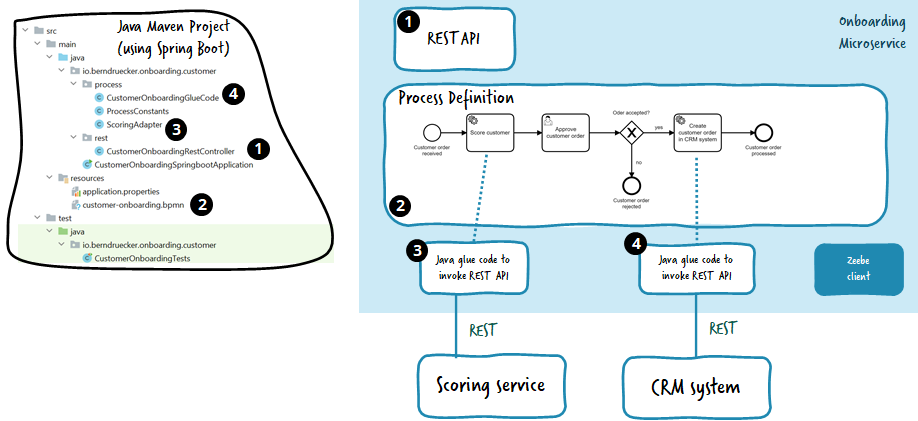
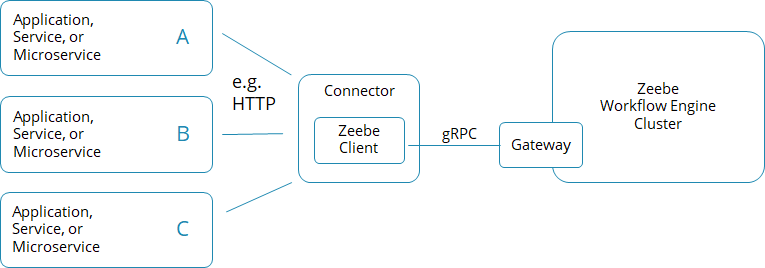
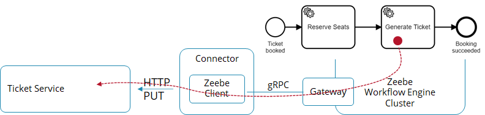
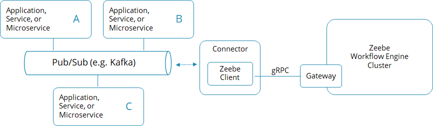
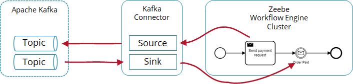

One of your first tasks to build a process solution is to sketch the basic architecture of your solution. To do so, you need to answer the question of how to connect the workflow engine (Zeebe) with your application or with remote systems.

The workflow engine is a remote system for your applications, just like a database. Your application connects with Zeebe via remote protocols (like [gRPC](https://grpc.io/) or REST), which is typically hidden from you, like when using a database driver based on ODBC or JDBC.

With Camunda 8 and the Zeebe workflow engine, there are two basic options:

1. Write some **programming code** that typically leverages the client library for the programming language of your choice.
2. Use some **existing Connector** which just needs a configuration.

The trade-offs will be discussed later; let’s look at the two options first.

## Programming glue code

To write code that connects to Zeebe, you typically embed [the Zeebe client library](../../../apis-tools/working-with-apis-tools.md) into your application. An application can of course also be a service or microservice.

If you have multiple applications that connect to Zeebe, all of them will require the client library. If you want to use a programming language where no such client library exists, you can [generate a gRPC client yourself](https://camunda.com/blog/2018/11/grpc-generating-a-zeebe-python-client/).



Your application can basically do two things with the client:

1. **Actively call Zeebe**, for example, to start process instances, correlate messages, or deploy process definitions.
2. **Subscribe to tasks** created in the workflow engine in the context of BPMN service tasks.

### Calling Zeebe

Using the Zeebe client’s API, you can communicate with the workflow engine. The two most important API calls are to start new process instances and to correlate messages to a process instance.

**Start process instances using the** [**Java Client**](../../../apis-tools/java-client/index.md)**:**

```java
processInstance = zeebeClient.newCreateInstanceCommand()
  .bpmnProcessId("someProcess").latestVersion()
  .variables( someProcessVariablesAsMap )
  .send()
  .exceptionally( throwable -> { throw new RuntimeException("Could not create new instance", throwable); });
```

<!-- **Start process instances using the** **Node.js client****:**

```js
const processInstance = await zbc.createWorkflowInstance({
  bpmnProcessId: "someProcess",
  version: 5,
  variables: {
    testData: "something",
  },
});
``` -->

**Correlate messages to process instances using the Java Client**:

```java
zeebeClient.newPublishMessageCommand() //
  .messageName("messageA")
  .messageId(uniqueMessageIdForDeduplication)
  .correlationKey(message.getCorrelationid())
  .variables(singletonMap("paymentInfo", "YeahWeCouldAddSomething"))
  .send()
  .exceptionally( throwable -> { throw new RuntimeException("Could not publish message " + message, throwable); });
```

**Correlate messages to process instances using the Node.js client**:

```js
zbc.publishMessage({
  name: "messageA",
  messageId: messageId,
  correlationKey: correlationId,
  variables: {
    valueToAddToWorkflowVariables: "here",
    status: "PROCESSED",
  },
  timeToLive: Duration.seconds.of(10),
});
```

This allows you to connect Zeebe with any external system by writing some custom glue code. We will look at common technology examples to illustrate this in a minute.

### Subscribing to tasks using a job worker

To implement service tasks of a process model, you can write code that subscribes to the workflow engine. In essence, you will write some glue code that is called whenever a service task is reached (which internally creates a job, hence the name).

**Glue code in Java:**

```java
class ExampleJobHandler implements JobHandler {
  public void handle(final JobClient client, final ActivatedJob job) {
    // here: business logic that is executed with every job
    client.newCompleteCommand(job.getKey()).send()
      .exceptionally( throwable -> { throw new RuntimeException("Could not complete job " + job, throwable); });;
  }
}
```

**Glue code in Node.js:**

```js
function handler(job, complete, worker) {
  // here: business logic that is executed with every job
  complete.success();
}
```

Now, this handler needs to be connected to Zeebe, which is generally done by subscriptions, which internally use long polling to retrieve jobs.

**Open subscription via the Zeebe Java client:**

```java
zeebeClient
  .newWorker()
  .jobType("serviceA")
  .handler(new ExampleJobHandler())
  .timeout(Duration.ofSeconds(10))
  .open()) {waitUntilSystemInput("exit");}
```

**Open subscription via the Zeebe Node.js client:**

```js
zbc.createWorker({
  taskType: "serviceA",
  taskHandler: handler,
});
```

You can also use integrations in certain programming frameworks, like the [Spring Zeebe SDK](../../../apis-tools/spring-zeebe-sdk/getting-started.md) in the Java world, which starts the job worker and implements the subscription automatically in the background for your glue code.

**A subscription for your glue code is opened automatically by the Spring integration:**

```java
@JobWorker(type = "serviceA")
public void handleJobFoo(final JobClient client, final ActivatedJob job) {
  // here: business logic that is executed with every job
  // you do not need to call "complete" on the job, as autoComplete is turned on above
}
```

There is also documentation on [how to write a good job worker](../writing-good-workers/).

## Technology examples

Most projects want to connect to specific technologies. Currently, most people ask for REST, messaging, or Kafka.

### REST

You could build a piece of code that provides a REST endpoint in the language of choice and then starts a process instance.

The [Ticket Booking Example](https://github.com/berndruecker/ticket-booking-camunda-cloud) contains an example using Java and Spring Boot for the [REST endpoint](https://github.com/berndruecker/ticket-booking-camunda-cloud/blob/master/booking-service-java/src/main/java/io/berndruecker/ticketbooking/rest/TicketBookingRestController.java#L35).

Similarly, you can leverage the [Spring Boot extension](https://github.com/zeebe-io/spring-zeebe/) to startup job workers that will [execute outgoing REST calls](https://github.com/berndruecker/ticket-booking-camunda-cloud/blob/master/booking-service-java/src/main/java/io/berndruecker/ticketbooking/adapter/GenerateTicketAdapter.java#L29).



You can find [Node.js sample code for the REST endpoint](https://github.com/berndruecker/flowing-retail/blob/master/zeebe/nodejs/nestjs-zeebe/checkout/src/app.controller.ts) in the [Flowing Retail example](https://github.com/berndruecker/flowing-retail).

### Messaging

You can do the same for messages, which is often [AMQP](https://en.wikipedia.org/wiki/Advanced_Message_Queuing_Protocol) nowadays.

The [Ticket Booking Example](https://github.com/berndruecker/ticket-booking-camunda-cloud) contains an example for RabbitMQ, Java, and Spring Boot. It provides a message listener to correlate incoming messages with waiting process instances, and [glue code to send outgoing messages onto the message broker](https://github.com/berndruecker/ticket-booking-camunda-cloud/blob/master/booking-service-java/src/main/java/io/berndruecker/ticketbooking/adapter/RetrievePaymentAdapter.java).



[Service integration patterns](../service-integration-patterns/) goes into details of if you want to use a send and receive task here, or prefer simply one service task (spoiler alert: send and receive tasks are used here because the payment service might be long-running; think about expired credit cards that need to be updated or wire transfers that need to happen).

<!-- The same concept will apply to other programming languages. For example, you could use the [Node.js client for RabbitMQ](https://www.rabbitmq.com/tutorials/tutorial-one-javascript.html) and the [Node.js client for Zeebe](https://github.com/camunda-community-hub/zeebe-client-node-js) to create the same type of glue code as shown above. -->

### Apache Kafka

You can do the same trick with Kafka topics. The [Flowing Retail example](https://github.com/berndruecker/flowing-retail) shows this using Java, Spring Boot, and Spring Cloud Streams. There is [code to subscribe to a Kafka topic and start new process instances for new records](https://github.com/berndruecker/flowing-retail/blob/master/kafka/java/order-zeebe/src/main/java/io/flowing/retail/kafka/order/messages/MessageListener.java#L39), and there is some glue code to create new records when a process instance executes a service task. Of course, you could also use other frameworks to achieve the same result.



## Designing process solutions containing all glue code

Typical applications will include multiple pieces of glue code in one codebase.



For example, the onboarding microservice shown in the figure above includes:

- A REST endpoint that starts a process instance (1)
- The process definition itself (2), probably auto-deployed to the workflow engine during the startup of the application.
- Glue code subscribing to the two service tasks that shall call a remote REST API (3) and (4).

A job worker will be started automatically as part of the application to handle the subscriptions. In this example, the application is written in Java, but again, it could be [any supported programming language](/apis-tools/working-with-apis-tools.md).

As discussed in [writing good workers](../writing-good-workers/), you typically will bundle all workers within one process solution, but there are exceptions where it makes sense to have single workers as separate application.

## Connectors

The glue code is relatively simple, but you need to write code. You might prefer using an out-of-the-box component, connecting Zeebe with the technology you need just by configuration. This component is called a **Connector**.

A Connector can be uni or bidirectional and is typically one dedicated application that implements the connection that translates in one or both directions of communication. Such a Connector might also be helpful in case integrations are not that simple anymore.



For example, the [HTTP Connector](https://github.com/camunda-community-hub/zeebe-http-worker) is a one-way Connector that contains a job worker that can process service tasks doing HTTP calls as visualized in the example in the following figure:



Another example is the [Kafka Connector](https://github.com/camunda-community-hub/kafka-connect-zeebe), as illustrated below.



This is a bidirectional Connector which contains a Kafka listener for forwarding Kafka records to Zeebe and also a job worker which creates Kafka records every time a service task is executed. This is illustrated by the following example:



### Out-of-the-box Connectors

As well as Camunda-maintained Connectors, additional Connectors are maintained by the community (made up of consultants, partners, customers, and enthusiastic individuals). You can find a list of Connectors in the [Camunda Marketplace](https://marketplace.camunda.com/).

### Reusing your own integration logic by extracting Connectors

If you need to integrate with certain infrastructure regularly, for example your CRM system, you might also want to create your own CRM Connector, run it centralized, and reuse it in various applications.

In general, we recommend not to start such Connectors too early. Don’t forget that such a Connector gets hard to adjust once in production and reused across multiple applications. Also, it is often much harder to extract all configuration parameters correctly and fill them from within the process, than it would be to have bespoke glue code in the programming language of your choice.

Therefore, only extract a full-blown Connector if you understand exactly what you need.

Don’t forget about the possibility to extract common glue code in a simple library that is then used at different places.

:::note
Updating a library that is used in various other applications can be harder than updating one central Connector. In this case, the best approach depends on your scenario.
:::

Whenever you have such glue code running and really understand the implications of making it a Connector, as well as the value it will bring, it can make a lot of sense.

## Recommendation

As a general rule of thumb, prefer custom glue code whenever you don’t have a good reason to go with an existing Connector.

A good reason to use Connectors is if you need to solve complex integrations where little customization is needed, such as the [Camunda RPA bridge](https://docs.camunda.org/manual/latest/user-guide/camunda-bpm-rpa-bridge/) to connect RPA bots (soon to be available for Camunda 8).

Good use of Connectors are also scenarios where you don’t need custom glue code. For example, when orchestrating serverless functions on AWS with the [AWS Lambda Connector](https://github.com/camunda-community-hub/zeebe-lambda-worker). This Connector can be operated once and used in different processes.

Some use cases also allow you to create a **resuable generic adapter**; for example, to send status events to your business intelligence system.

But there are also common downsides with Connectors. First, the possibilities are limited to what the creator of the Connector has foreseen. In reality, you might have slightly different requirements and hit a limitation of a Connector.

Second, the Connector requires you to operate this Connector in addition to your own application. The complexity associated with this depends on your environment.

Third, testing your glue code gets harder, as you can’t easily hook in mocks into such a Connector as you could in your own glue code.
