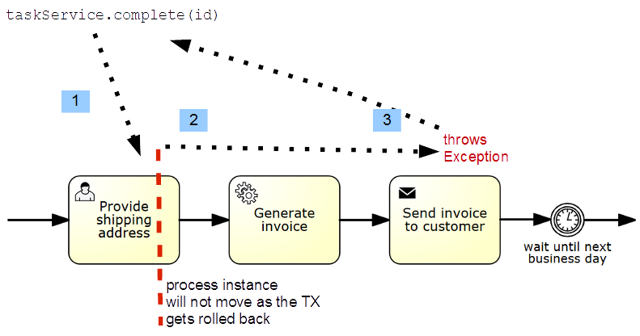

:::caution Camunda 7 only
This best practice targets Camunda 7.x only! Zeebe, the workflow engine used in Camunda 8, as a very different transactional behavior, please visit [dealing with problems and exceptions](../dealing-with-problems-and-exceptions/).
:::

Try to carefully study and fully understand the concepts of wait states (save points) acting as _transaction boundaries_ for technical (ACID) transactions. In case of technical failures, they are by default rolled back and need to be retried either by the user or the background job executor.

## Understanding technical (ACID) transactions in Camunda 7

Every time we use the Camunda 7 API to ask the workflow engine to do something (like e.g. starting a process, completing a task, signaling an execution), the engine will advance in the process until it reaches _wait states_ on each active path of execution, which can be:

<div bpmn="best-practices/understanding-transaction-handling-c7-assets/wait-states.bpmn" callouts="receive_task,intermediate_catching_event_timer,event_based_gateway,business_rule_task,end_event_message" />

<span className="callout">1</span>

_User tasks_ and _receive tasks_

<span className="callout">2</span>

All _intermediate catching events_

<span className="callout">3</span>

The _event based gateway_, which offers the possibility of reacting to one of multiple intermediate catching events

<span className="callout">4</span>

Several further task types (_service_, _send_, _business rule_ tasks)

<span className="callout">5</span>

[External Tasks](https://docs.camunda.org/manual/latest/user-guide/process-engine/external-tasks/) are wait states, too. In this case, the _throwing message events_ might be implemented as external task.

At a wait state, any further process execution must wait for some trigger. Wait states will therefore always be persisted to the database. The design of the workflow engine is, that within a _single database transaction_, the process engine will cover the distance from one persisted wait states to the next. However, you have fine grained control over these transaction boundaries by introducing additional _save points_ using the [`async before` and `async after` attributes](https://docs.camunda.org/manual/latest/user-guide/process-engine/transactions-in-processes/#configure-asynchronous-continuations). A background job executor will then make sure that the process _continues asynchronously_.

Learn more about [transactions in processes](https://docs.camunda.org/manual/latest/user-guide/process-engine/transactions-in-processes/) in general and [asynchronous continuations](https://docs.camunda.org/manual/latest/user-guide/process-engine/transactions-in-processes/#why-asynchronous-continuations) in the user guide.

:::note Technical vs. business transactions
Sometimes when we refer to "transactions" in processes, we refer to a very different concept, which must be clearly distinguished from technical database transactions. A _business transaction_ marks a section in a process for which 'all or nothing' semantics apply, but from a pure business perspective. This is described in [dealing with problems and exceptions](../dealing-with-problems-and-exceptions/).
:::

## Controlling transaction boundaries

### Using additional save points

You have fine grained control over transaction boundaries by introducing _save points_ additionally to [wait states](https://docs.camunda.org/manual/latest/user-guide/process-engine/transactions-in-processes/#wait-states), that are always a save point. Use the `asyncBefore='true'` and `asyncAfter='true'` attributes in your process definition BPMN XML. The process state will then be persisted at these points and a background job executor will make sure that it is continued asynchronously.

<div bpmn="best-practices/understanding-transaction-handling-c7-assets/additional-save-points.bpmn" callouts="user_task_write_tweet, service_task_check_explicit_language,service_task_publish_tweet" />

<span className="callout">1</span>

A user task is an _obligatory wait state_ for the process engine. After the creation of the user task, the process state will be persisted and committed to the database. The engine will wait for user interaction.

<span className="callout">2</span>

This service task is executed _"synchronously"_ (by default), in other words within the same thread and the same database transaction with which a user attempts to complete the "Write tweet" user task. When we assume that this service fails in cases in which the language used is deemed to be too explicit, the database transaction rolls back and the user task will therefore remain uncompleted. The user must re-attempt, e.g. by correcting the tweet.

<span className="callout">3</span>

This service task is executed _"asynchronously"_. By setting the `asyncBefore='true'` attribute we introduce an additional save point at which the process state will be persisted and committed to the database. A separate job executor thread will continue the process asynchronously by using a separate database transaction. In case this transaction fails the service task will be retried and eventually marked as failed - in order to be dealt with by a human operator.

Pay special attention to the consequence of these save points with regards to retrying. A retry for a job may be required if there are _any failures_ during the transaction which follows the save point represented by the job. Depending on your subsequent transaction boundaries this may very well be much more than just the service task which you configured to be `asyncBefore='true'`! The process instance will always roll back to its last known save point, as discussed later.

### Marking every service task as asynchronous

A typical _rule of thumb_, especially when doing a lot of service orchestration, is to _mark every service task_ being _asynchronous_.

<div bpmn="best-practices/understanding-transaction-handling-c7-assets/service-tasks-async.bpmn" />

The downside is that the jobs slightly increase the overall resource consumption. But this is often worth it, as it has a couple of advantages for operations:

- The process stops at the service task causing the specific error.
- You can configure a meaningful retry strategy for every service task.
- You can leverage the suspension features for service tasks.

While it is not directly configurable to change Camunda 7's _default_ "async" behavior for all service tasks at once, you can achieve that by implementing a custom [ProcessEnginePlugin](https://docs.camunda.org/manual/latest/user-guide/process-engine/process-engine-plugins/) introducing a [BpmnParseListener](https://docs.camunda.org/manual/latest/reference/javadoc/?org/camunda/bpm/engine/impl/bpmn/parser/BpmnParseListener.html) which adds async flags on-the-fly (eventually combined with custom [BPMN extension attributes](https://docs.camunda.org/manual/latest/user-guide/model-api/bpmn-model-api/extension-elements/) to control this behavior). You can find a [code example](https://github.com/camunda/camunda-bpm-examples/tree/master/process-engine-plugin/bpmn-parse-listener) for a similar scenario on GitHub.

### Knowing typical do's and don'ts for save points

Aside a general strategy to mark service tasks as being save points you will often want to _configure typical save points_.

**Do** configure a savepoint **after**

- _User tasks_ : This savepoint allows users to complete their tasks without waiting for expensive subsequent steps and without seeing an unexpected rollback of their user transaction to the waitstate before the user task. Sometimes, e.g. when validating user input by means of a subsequent step, you want exactly that: rolling back the user transaction to the user task waitstate. In that case you might want to introduce a savepoint right after the validation step.

- Service Tasks (or other steps) causing _Non-idempotent Side Effects_     : This savepoint makes sure that a side effect which must not happen more often than once is not accidentally repeated because any subsequent steps might roll back the transaction to a savepoint well before the affected step. End Events should be included if the process can be called from other processes.

- Service tasks (or other steps) executing _expensive Ccmputations_     : This savepoint makes sure that a computationally expensive step does not have to be repeated just because any subsequent steps might roll back the transaction to a savepoint well before the affected step. End Events should be included if the process can be called from other processes.

- Receive tasks (or other steps) catching _external events_, possibly with payload    : This savepoint makes sure that a external event like a message is persisted as soon as possible. It cannot get lost just because any subsequent steps might roll back the transaction to a savepoint well before the affected step. This applies also to External Service Tasks.

**Do** configure a savepoint **before**

- _Start events_    : This savepoint allows to immediately return a process instance object to the user thread creating it - well before anything happens in the process instance.

- Service tasks (or other steps) invoking _remote systems_     : This savepoint makes sure that you always transactionally separate the potentially more often failing remote calls from anything that happens before such a step. If a service call fails you will observe the process instance waiting in the corresponding service task in cockpit.

- _Parallel joins_   : Parallel joins synchronize separate process pathes, which is why one of two path executions arriving at a parallel join at the same time will be rolled back with an optimistic locking exception and must be retryed later on. Therefore such a savepoint makes sure that the path synchronisation will be taken care of by Camunda's internal job executor. Note that for multi instance activities, there exists a dedicated "multi instance asynchronous after" flag which saves every single instance of those multiple instances directly after their execution, hence still "before" their technical synchronization.

The Camunda JobExecutor works (by default) with [exclusive jobs](https://docs.camunda.org/manual/latest/user-guide/process-engine/the-job-executor/#exclusive-jobs), meaning that just one exclusive job per process instance may be executed at once. Hence, job executor threads will by default not cause optimistic locking exceptions at parallel joins "just by themselves", but other threads using the Camunda API might cause them - either for themselves or also for the job executor.

**Don't** configure save points **before**

- User tasks and other _wait states_       including steps configured as _external tasks_     : Such savepoints just introduce overhead as [wait-states](https://docs.camunda.org/manual/latest/user-guide/process-engine/transactions-in-processes/#wait-states) on itself finish the transaction and wait for external intervention anyway.

- _All forking_ and _exclusively joining gateways_   : There should just be no need to do that, unless execution listeners are configured at such points, which could fail and might need to be transactionally separated from other parts of the execution.

### Adding save points automatically to every model

If you agree on certain save points to be important in all your process definitions, you can _add required BPMN XML attributes automatically_ by a [Process Engine Plugin](https://docs.camunda.org/manual/latest/user-guide/process-engine/process-engine-plugins/) during deployment. Then you don't have to add this configuration to each and every process definition yourself.

As a weaker alternative the plugin could check for existance of correct configuration and _log warnings or errors if save points are missing_.

Take a look at [this example](https://github.com/camunda/camunda-consulting/tree/master/snippets/engine-plugin-add-save-points) for details.

## Thinking about operations during modeling

Make sure you also understand how to [operate Camunda 7](../../operations/operating-camunda-c7) - in particular by understanding _retry behavior_ and _incident management_ for service tasks.

## Rolling back a transaction on unhandled errors

It is important to understand that every _non-handled, propagated exception_ happening during process execution rolls back the current technical transaction. Therefore the process instance will find its last known _wait state_ (or save point). The following image visualizes that default behavior.



<span className="callout">1</span>

When we ask the Camunda engine to complete a task ...

<span className="callout">2</span>

... it tries to advance the process within the borders of a technical transaction until it reaches wait states (or save points) again.

<span className="callout">3</span>

However, in cases where a non-handled exception occurs on the way, this transaction is rolled back and we find the user task we tried to complete to be still uncompleted.

From the perspective of a user trying to complete the task, it appears _impossible_ to complete the task, because a subsequent service throws an exception. This can be unfortunate, and so you very well may want to introduce additional save points, e.g. here before the send task.

```xml
<sendTask id="send" name="Send invoice to customer" camunda:asyncBefore="true" camunda:class="my.SendDelegate" />
```

But hindering the user to complete the user task can also be just what you want. Consider e.g. the possibility to _validate task form input_ via a subsequent service:

<div bpmn="best-practices/understanding-transaction-handling-c7-assets/validating-data.bpmn" callouts="user_task_provide_data,service_task_validate_data" />

<span className="callout">1</span>

A user needs to provide data with a _user task_ form. When trying to complete the form ...

<span className="callout">2</span>

... the subsequent synchronously executed _service task_ finds a validation problem and throws an exception which rolls back the transaction and leaves the user task uncompleted.

Learn more about [rollback on exceptions](https://docs.camunda.org/manual/latest/user-guide/process-engine/transactions-in-processes/#rollback-on-exception) and the reasoning for this design in the User Guide.

## Handling exceptions via the process

As an alternative to rolling back transactions, you can also handle those exceptions within the process, refer to [dealing with problems and exceptions](./dealing-with-problems-and-exceptions.md#handling-errors-on-the-process-level) for details.

Just be aware of the following technical constraint: in case your transaction manager marks the current transaction _for rollback_ (as possible in Java transaction managers), handling the exception by a processis not possible as the workflow engine cannot commit its work in this transaction.
