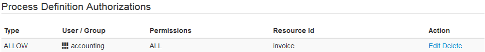
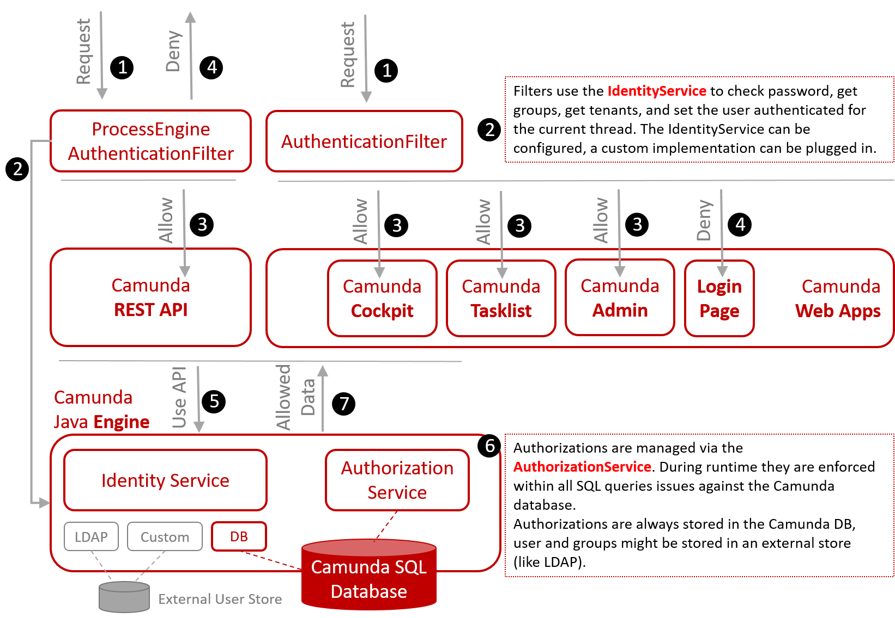

Disallow unauthorized access by securing the Camunda 7.x before going live with your process applications. Understand Camunda user management essentials, enforce authorization for the REST API, define access rights for Camunda specific resources such as process definitions, and consider integrating with your Single-Sign-On (SSO).

:::caution Camunda 7 only
This best practice targets Camunda 7.x only! For Camunda 8, visit [Zeebe Security](/self-managed/zeebe-deployment/security/security.md).
:::

## Understanding user management essentials

We suggest taking a look at the [security](https://docs.camunda.org/manual/latest/user-guide/security/) section of the documentation.

### Understanding users, groups and tenants

A **user** refers to a human individual, and a **group** is any custom defined "bundle" of users sharing some usage relevant attributes (like e.g. working on specific business functions). Set up **groups** corresponding to your workflow roles or create new logical roles for that purpose.

Both **groups** and **users** can be added to one or more **tenants** to ensure a certain degree of data isolation between different logical entities (for more information, refer to [multi-tenancy](https://docs.camunda.org/manual/latest/user-guide/security/)).

The core of the Camunda engine treats **users**, **groups**, and **tenants** as simple **text strings**. Therefore, you can do things like assign a user task to a group of people by directly referencing the group in your BPMN file, for example:

```xml
<bpmn:userTask id="Invoice customer" camunda:candidateGroups="finance"/>
```

Or, claim that user task for a specific user via the Java API by referencing the user with a text string-based user ID:

```java
taskService.claim(taskId, "fozzie");
```

No further concepts exist like logical workflow roles or special mappings.

Camunda ships with an [IdentityService](https://docs.camunda.org/manual/latest/user-guide/process-engine/identity-service/) which allows you to either manage real users and groups _directly within the Camunda database_, or access the users and group information managed in a directory service database which supports **LDAP** (Lightweight Directory Access Protocol), like Microsoft's "Active Directory" and many others. One can also provide a custom **IdentityService** implementation to satisfy each and every requirement apart from the default identity service options shipped with Camunda. This is particularly helpful if you plan to integrate with a third party identity management system. Using the **IdentityService** is not mandatory - it is _possible_ to reference users and groups within Camunda that are not known by the engine's **IdentityService** at all. This could be useful for testing purposes or when integrating with third party identity management solutions.

The Camunda LDAP Identity Service doesn’t support tenants. That means tenant-related access restrictions do not work by default when using the LDAP plugin.

To illustrate, Camunda needs access to (text string based) _users and groups_ in order to:

- Allow _logging into_ the web applications shipping with it (Camunda Tasklist, Cockpit, etc.)
- Allow Tasklist to, for example, present _open tasks_ available for the groups of the logged in user
- Allow Cockpit to, for example, present just the process definitions related to the _tenant(s)_ the logged in user is associated with.

Keep in mind that your custom directory service is decoupled from Camunda. While it is possible to delete users and groups or change memberships in your directory service without harming Camunda's runtime, the text strings already known to Camunda won't change without manual intervention.

### Understanding memberships

Camunda's [IdentityService](https://docs.camunda.org/manual/latest/user-guide/process-engine/identity-service/) allows you to add users to groups; we call this a **group membership**. Accordingly, adding a user or group to a tenant creates a **tenant membership**.

### Understanding authentication

The procedure of _authentication_ makes sure that the user is known to the Camunda engine. When directly using Camunda's Java API, this must be done _for each thread_ by issuing, for example:

```java
identityService.setAuthenticatedUserId("fozzie");
```

If you use the Java API and do not set the authenticated user, Camunda will not check any authorizations. This is because the engine simply does not know who is logged in. When using the REST API, whether an authentication is set or not depends on the configuration as described below.

### Understanding authorizations

Permissions and restrictions for specific **users** or **groups** to access **resources** within Camunda (e.g. process definitions, tenants, process instances) are called **authorizations**. Because they relate users and groups to Camunda-specific resources, they must always be managed in a Camunda-specific way and be contained in the Camunda database.

Camunda comes with an [AuthorizationService](https://docs.camunda.org/manual/latest/user-guide/process-engine/authorization-service/) API (Java or REST), allowing to manage such authorizations and also ships with a dedicated [admin application](https://docs.camunda.org/manual/latest/webapps/admin/authorization-management) to manage them through a web interface. For example, you might want to give the group "accounting" all rights to access a specific process definition called "invoice":



While some permissions are requirement specific and should be created during deployment, others are created automatically (e.g. for assigned tasks).

## Securing Camunda with authentication and authorizations

To better understand the consequences and needs when being faced with the task to secure a Camunda installation, it is good to understand the big picture.



<span className="callout">1</span>

A _request_ is either asking for a REST API endpoint or one of the web applications functionalities.

<span className="callout">2</span>

The `ProcessEngineAuthenticationFilter` (for REST) or the `AuthenticationFilter` (for the web applications) check the user's authentication credentials via the _IdentityService_. The filters retrieve groups and tenant memberships and set the authenticated user for the current thread in the engine.

<span className="callout">3</span>

The request is _allowed_.

<span className="callout">4</span>

The request might also be _denied_, in case the authentication fails (e.g. because the username is unknown or the password does not match). For the web applications, a denied request is redirected to the login page.

<span className="callout">5</span>

All applications use Camunda's Java API internally.

<span className="callout">6</span>

Under the hood, the engine enforces authorizations by instrumenting SQL queries. That means you can never get any data from a query the current user is not authorized for.

<span className="callout">7</span>

As a consequence, only allowed and _accessible data_ will be presented to the user.

### Securing the Camunda core engine

You can enable or disable authorization checks for the engine itself. Authorizations will only be checked if you [enable authorization checks](https://docs.camunda.org/manual/latest/user-guide/process-engine/authorization-service/#enable-authorization-checks) and _tell the engine who is logged in_ with the _current thread_:

```java
identityService.setAuthenticatedUserId("fozzie");
```

If you directly use the API and do not tell the process engine who is logged in with the current thread, it will provide full access to all data.

Authorization is enabled per default in the Camunda distributions, but if you configure and run your own engine (e.g. via Spring), it is disabled by default.

For the authorization checks (to access specific resources), the engine does not question whether the authenticated user is known to the used IdentityService. As mentioned above, the engine treats users, groups and tenants as strings and grants access if those strings match with the defined authorization rules.

In case you _do not require authorizations_, make sure that [authorization checks are disabled](https://docs.camunda.org/manual/latest/user-guide/process-engine/authorization-service/#enable-authorization-checks), since they do have a performance impact. You might not need authorizations if you build your own custom web application handling authentication and authorization itself that just uses Camunda in the background, for example.

If you have authorization checks enabled, you might or might not want to perform these checks when you execute Java code as part of your workflow. One example could be loading the number of running process instances to be used for some decision. For this reason, you can [enable or disable authorization checks for custom user code](https://docs.camunda.org/manual/latest/user-guide/process-engine/authorization-service/#enable-authorization-checks-for-user-code) separately.

### Securing Camunda's REST API

Internally, the REST API is just another client for the Java API which needs to inform the engine about the authenticated user. This only works if you turn on authentication for the REST API. Otherwise, no user is logged in and you have _unrestricted access_.

Authentication and hence authorization checks are by default disabled for the REST API to allow for a quick getting started experience.

For real life usage, enable at least **Basic Authentication** for the **REST API** by adjusting the `web.xml` as described in the [User Guide](https://docs.camunda.org/manual/latest/reference/rest/overview/authentication/). The REST API's default `ProcessEngineAuthenticationFilter` authenticates the user with HTTP Basic Auth. It makes use of the `IdentityService` to check the user's password and to load **group** and **tenant** memberships for that user. If that was successful, it sets the user as authenticated for the current thread via the Java API.

If you require an authentication mechanism other than HTTP Basic Auth, you need to implement your own `AuthenticationFilter`. For more details, refer to the SSO section below.

If you do not need the REST API in production, consider undeploying the REST API web application.

### Securing Camunda's web applications

The Camunda web applications (Tasklist, Cockpit, Admin) have by default a form based _authentication turned on_. There is no further need for changing any configuration when going into production, apart from the more general consideration to enable a custom identity service provider (refer below).
However, ensure that you do not deploy artifacts like the _h2 console_ and the _example applications_ in your production environments. They are solely shipped for development purposes and a smooth experience when getting started with Camunda.

Internally, Camunda Web Apps use an `AuthenticationFilter` very similar to the REST API `ProcessEngineAuthenticationFilter` described above; it just redirects an unknown user to the login page.

### Configuring the identity service

By default, Camunda will manage users and groups directly within the Camunda database. As an alternative to that, you can also enable read-only access to an LDAP-based user/group repository. The [LDAP identity service](https://docs.camunda.org/manual/latest/user-guide/process-engine/identity-service/#the-ldap-identity-service) is implemented as a Process Engine Plugin and can be added to the process engine configuration in order to replace the default database identity service.

As an alternative to those two possibilities, [implement a custom IdentityProvider](https://docs.camunda.org/manual/latest/user-guide/process-engine/identity-service/) to satisfy each and every other requirement. You can provide _read-only_ or even _writable_ access to your user repository.

Note that as the LDAP Identity Service doesn’t support tenants (multi-tenancy). For multi-tenancy configured via LDAP, you would therefore need a custom identity service allowing you to retrieve tenant IDs from your LDAP.

The identity service ships with a [security feature that throttles log in attempts](https://docs.camunda.org/manual/latest/user-guide/process-engine/identity-service/#throttle-login-attempts). That means that a user will not be able to log in for a specific amount of time after an unsuccessful login attempt. Carefully review the default values for this feature's configuration and change them to your requirements if needed.

### Securing custom code

The process engine offers numerous extension points for customization of process behavior by using Java code, expression language, scripts, and templates. While these extension points allow for great flexibility in process implementation, they open up the possibility to perform malicious actions when in the wrong hands. It is therefore advisable to restrict access to APIs that allows custom code submission to trusted parties only. You can find more information on that topic in the [User Guide](https://docs.camunda.org/manual/latest/user-guide/process-engine/securing-custom-code/).

### Securing Camunda Run

The Camunda Run distributions aim for easy configuration and thus provides a very easy way for common security problems, refer to this [blog post](https://camunda.com/blog/2021/05/what-you-should-know-about-using-camunda-platform-run-in-production/).

### Securing your web application container

Make sure to secure your web application container (e.g. Wildfly or Tomcat) by checking and securing default settings, e.g. by removing any default predefined users allowed to access your container's administration console.

### Supporting single sign-on (SSO)

The difficulty with **Single sign-on** (SSO) is that it always works a bit differently depending on your exact environment and SSO framework used.

Therefore, Camunda only provides the hooks for plugging in the exact mechanism that fits your needs. The key part that you need to touch concerns the authentication filters of Camunda's web applications and the REST API (refer to the illustration above). The idea is to exchange or modify the [AuthenticationFilter](https://docs.camunda.org/manual/latest/reference/javadoc/?org/camunda/bpm/webapp/impl/security/auth/AuthenticationFilter.html) defined inside the `WEB-INF/web.xml` file of Camunda's web applications (or the REST API) and hook in your custom SSO provider. That means that your filter implementation circumvents the redirect to Camunda's login page by telling Camunda directly who is currently logged in.

From Camunda 7.9 on, it is much easier to implement SSO by making use of the [ContainerBasedAuthenticationFilter](https://docs.camunda.org/manual/latest/reference/javadoc/?org/camunda/bpm/webapp/impl/security/auth/ContainerBasedAuthenticationFilter.html). This means that you do not need to replace the existing **AuthenticationFilter** by a custom one anymore, but you only need to add the **ContainerBasedAuthenticationFilter** that ships with the product and implement a custom **AuthenticationProvider** if required.

You can get started by looking at some examples showing how this can be achieved for different authentication frameworks:

- [Very basic authentication filter](https://github.com/camunda-consulting/camunda-webapp-plugins/tree/master/camunda-webapp-plugin-sso-autologin) for the Camunda web apps that reads the user from a provided URL parameter.
- Many _application servers_ support single sign-on out of the box (or through plugins) and can provide the user ID to the application. Have a look at the [Single Sign-On Community Extension](https://github.com/camunda/camunda-sso-jboss/).
- It is quite easy to [integrate Camunda with Spring Security](https://github.com/camunda-consulting/code/tree/master/snippets/springboot-security-sso) so that the framework handles authentication and passes the authenticated user on to Camunda.
