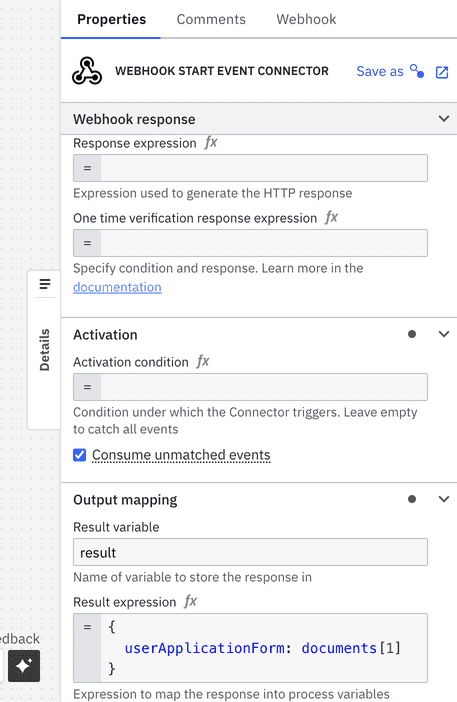
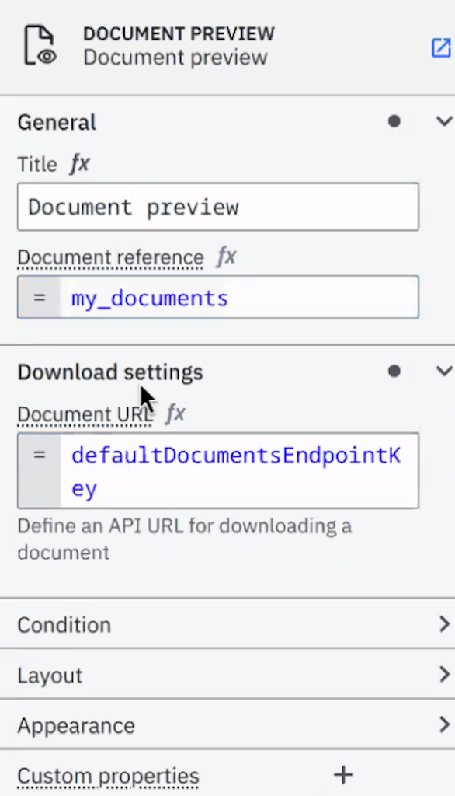

Offering a more comprehensive approach to document handling, Camunda now provides efficient storage and retrieval of documents across both development and production environments.

Whether you are working across Connectors, Modeler, or Tasklist, document handling may be beneficial for users who want the following:

- Use the default cloud storage to support, track, and manage documents.
- [AWS S3](https://aws.amazon.com/s3/) storage and bucket creation per cluster to securely store and retrieve documents in an external, scalable storage solution, and to ensure storage is properly isolated and managed for each environment.
- Support for the local file system as a storage option for development and testing purposes to set up and manage documents in local environments.

## Modeler

A [form](/components/modeler/forms/camunda-forms-reference.md) can display documents with the [document preview component](/components/modeler/forms/form-element-library/forms-element-library-document-preview.md):

With the [filepicker form element](/components/modeler/forms/form-element-library/forms-element-library-filepicker.md), you may also [upload multiple files at once](/components/modeler/forms/form-element-library/forms-element-library-filepicker.md#configurable-properties). This can be dynamically set using an [expression](/components/modeler/feel/language-guide/feel-expressions-introduction.md).

## Connectors

### Inbound (webhook) Connectors

[Access created documents](/components/connectors/protocol/http-webhook.md) in both the response expression and the result expression, where the `documents` object contains the references for created documents.

### Outbound Connectors

For the following outbound Connectors, you may include a **Request body** under **Payload** in the properties panel on the right side of the screen to send with your request:

- [REST](/components/connectors/protocol/rest.md) - Supports storing the response as a document.
- [Email](/components/connectors/out-of-the-box-connectors/email.md) - Supports sending Camunda documents as attachments, or storing incoming attachments as Camunda documents.
- [Amazon Textract](/components/connectors/out-of-the-box-connectors/amazon-textract.md) - Can read the input document directly from the Camunda document store.
- [Amazon Bedrock](/components/connectors/out-of-the-box-connectors/amazon-bedrock.md) - Supports consuming documents as inputs for conversations.
- [Amazon S3](/components/connectors/out-of-the-box-connectors/amazon-s3.md) - Supports uploading documents from (or downloading documents to) the Camunda document store.
- [Box](/components/connectors/out-of-the-box-connectors/box.md) - Supports uploading documents from (or downloading documents to) the Camunda document store.

## Tasklist

Tasklist users may view and download files displayed in the task's form.

:::note
If you change the **Document URL** under **Download settings**, this feature will not work for public start forms because there is no valid session.
:::

## Document limitations

Document handling maintains the following guidelines:

- **Maximum file size**: 10 MB per file.
- **File expiration time/time-to-live (TTL) policy**: 30 days by default. Clients for Connectors and Forms may specify a custom expiration date when uploading documents.
