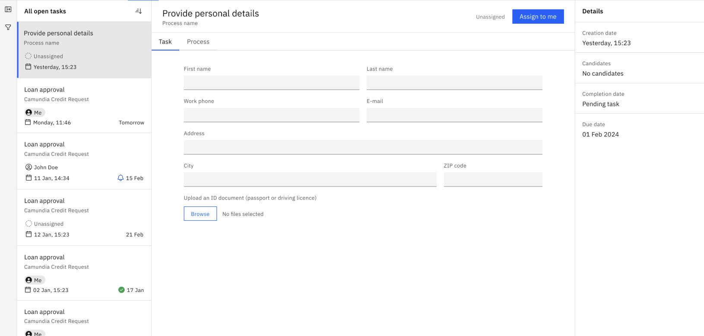

import Tabs from "@theme/Tabs";
import TabItem from "@theme/TabItem";

Store, track, and manage documents in Camunda 8 using the [Camunda 8 API](/apis-tools/camunda-api-rest/specifications/create-documents.api.mdx), Connectors, Forms, and Tasklist.

Offering more robust document handling capabilities within Camunda SaaS and Self-Managed, users can now efficiently manage large volumes of binary data such as PDFs and images across both development and production environments.

## Storage integration and configuration

There are several storage options:

- A [**Google Cloud Platform**](https://cloud.google.com/storage) bucket storage integration is configured for SaaS and handled by Camunda.
- Use [**AWS S3**](https://aws.amazon.com/s3/) storage and bucket creation per cluster to securely store and retrieve documents in an external, scalable storage solution for Self-Managed, and to ensure storage is properly isolated and managed for each environment.
- Documents can be stored in **local folders**, but this is not supported for production environments.
- Documents can be stored **in memory**. If the application is stopped, the document will be lost. This is not supported for production environments.

:::note
GCP and AWS work with SaaS, and are supported for Self-Managed in production. Camunda does not provide local or in-memory for SaaS, but Self-Managed users may configure in-memory and local storage using [Camunda 8 Run](/self-managed/setup/deploy/local/c8run.md).
:::

:::note
If no configuration is provided, the default document storage is **in-memory**. To change this to a different storage method, use the environment variables in the section below for **every** component using document handling. No additional configuration is required for in-memory storage.
:::

To set what storage should be used, accepted values for `DOCUMENT_DEFAULT_STORE_ID` are aws, in-memory, gcp (for Google Cloud Platform), and local-storage.

<Tabs groupId="storage" defaultValue="aws" queryString values={
[
{label: 'AWS', value: 'aws' },
{label: 'GCP', value: 'gcp' },
{label: 'Local', value: 'local' },
{label: 'In-memory', value: 'in-memory' },
]}>

<TabItem value='aws'>

| Credentials variable    | Required | Description                                                                                           |
| ----------------------- | -------- | ----------------------------------------------------------------------------------------------------- |
| `AWS_ACCESS_KEY_ID`     | Yes      | Access key ID used to interact with AWS S3 buckets.                                                   |
| `AWS_REGION`            | Yes      | Region where the bucket is.                                                                           |
| `AWS_SECRET_ACCESS_KEY` | Yes      | The AWS secret access key associated with the `AWS_ACCESS_KEY_ID`. This will be used to authenticate. |

| Store variable                   | Required | Description                                                                                                                                                                                                                                               |
| -------------------------------- | -------- | --------------------------------------------------------------------------------------------------------------------------------------------------------------------------------------------------------------------------------------------------------- |
| `DOCUMENT_STORE_AWS_BUCKET`      | Yes      | Specifies the name of the AWS S3 bucket where documents are stored.                                                                                                                                                                                       |
| `DOCUMENT_STORE_AWS_BUCKET_PATH` | No       | Defines the folder-like path within the S3 bucket where documents are stored. This helps organize files within the bucket. For example, `documents/invoices`. If not provided, the application logic assumes a default value of `""`.                     |
| `DOCUMENT_STORE_AWS_BUCKET_TTL`  | No       | Represents the time-to-live (TTL) for documents stored in the S3 bucket. This could be used to set an expiration policy, meaning documents will be deleted automatically after a specified duration. If not provided, the application logic ignores this. |
| `DOCUMENT_STORE_AWS_CLASS`       | Yes      | io.camunda.document.store.aws.AwsDocumentStoreProvider                                                                                                                                                                                                    |

**Example:**

```
AWS_ACCESS_KEY_ID=AWSACCESSKEYID
AWS_REGION=eu-north-1
AWS_SECRET_ACCESS_KEY=AWSSECRETACCESSKEYGOESHERE
DOCUMENT_STORE_AWS_BUCKET=test-bucket
DOCUMENT_STORE_AWS_BUCKET_PATH=test/path
DOCUMENT_STORE_AWS_BUCKET_TTL=5
DOCUMENT_STORE_AWS_CLASS=io.camunda.document.store.aws.AwsDocumentStoreProvider
DOCUMENT_DEFAULT_STORE_ID=aws
```

### AWS API client permission requirements

To ensure seamless integration and functionality of document handling with AWS services, the API client utilized must be configured with the appropriate permissions. The following AWS Identity and Access Management (IAM) permissions are necessary for the execution of operations related to document handling:

| Permission        | Description                                                                                                                                                                                                                     |
| ----------------- | ------------------------------------------------------------------------------------------------------------------------------------------------------------------------------------------------------------------------------- |
| `s3:ListBucket`   | This permission allows the application to verify it has access to the specified S3 bucket. Lack of this permission does not prevent the application from starting, but it logs a warning on application start-up.               |
| `s3:GetObject`    | This permission is required to retrieve contents and metadata of objects from Amazon S3. The API client will utilize this permission to download or access the contents of the documents that have been uploaded to the bucket. |
| `s3:PutObject`    | To upload documents to an Amazon S3 bucket, the API client must have this permission.                                                                                                                                           |
| `s3:DeleteObject` | This permission authorizes the API client to remove objects from the specified S3 bucket.                                                                                                                                       |

</TabItem>

<TabItem value='gcp'>

| Credentials variable             | Required | Description                                                                                                             |
| -------------------------------- | -------- | ----------------------------------------------------------------------------------------------------------------------- |
| `GOOGLE_APPLICATION_CREDENTIALS` | Yes      | Specifies the file path to a JSON key file that contains authentication credentials for a Google Cloud service account. |

| Store variable              | Required | Description                                                                     |
| --------------------------- | -------- | ------------------------------------------------------------------------------- |
| `DOCUMENT_STORE_GCP_BUCKET` | Yes      | Defines the name of the Google Cloud Storage bucket where documents are stored. |
| `DOCUMENT_STORE_GCP_CLASS`  | Yes      | io.camunda.document.store.gcp.GcpDocumentStoreProvider                          |

**Example:**

```
DOCUMENT_STORE_GCP_CLASS=io.camunda.document.store.gcp.GcpDocumentStoreProvider
DOCUMENT_STORE_GCP_BUCKET=test-bucket
DOCUMENT_DEFAULT_STORE_ID=gcp
GOOGLE_APPLICATION_CREDENTIALS=/path/to/service-account.json
```

### GCP API client permission requirements

To ensure seamless integration and functionality of document handling with GCP services, the API client utilized must be configured with the appropriate permissions. The following permissions are necessary for the execution of operations related to document handling:

| Permission                     | Description                                                                                                                                                                                                    |
| ------------------------------ | -------------------------------------------------------------------------------------------------------------------------------------------------------------------------------------------------------------- |
| `storage.buckets.get`          | This permission allows the application to verify it has access to the specified bucket. Lack of this permission does not prevent the application from starting, but it logs a warning on application start-up. |
| `storage.objects.get`          | This permission allows the API client to retrieve objects from Google Cloud Storage. It is vital for downloading or accessing the contents of stored objects.                                                  |
| `storage.objects.create`       | With this permission, the API client can upload new objects to a bucket. It is essential for adding new documents to the storage.                                                                              |
| `storage.objects.update`       | This permission enables the API client to update contents and metadata of existing objects within a bucket.                                                                                                    |
| `storage.objects.delete`       | This permission grants the API client the ability to delete objects from a bucket.                                                                                                                             |
| `iam.serviceAccounts.signBlob` | This permission allows the service account to sign data as part of the process to create secure, signed URLs for accessing uploaded documents.                                                                 |

</TabItem>

<TabItem value='local'>

:::note
Local storage is not usable in production, and is not supported for Self-Managed installations via Helm charts.
:::

| Store variable               | Required | Description                                                                                                                                 |
| ---------------------------- | -------- | ------------------------------------------------------------------------------------------------------------------------------------------- |
| `DOCUMENT_STORE_LOCAL_PATH`  | Yes      | The path to the directory which will host the uploaded files.                                                                               |
| `DOCUMENT_STORE_LOCAL_CLASS` | Yes      | The class for instantiating the local store. This must always be `io.camunda.document.store.localstorage.LocalStorageDocumentStoreProvider` |

**Example:**

```
DOCUMENT_STORE_LOCAL_CLASS=io.camunda.document.store.localstorage.LocalStorageDocumentStoreProvider
DOCUMENT_STORE_LOCAL_PATH=/usr/local/camunda
DOCUMENT_DEFAULT_STORE_ID=local
```

</TabItem>

<TabItem value='in-memory'>

:::note
In-memory storage is not usable in production.
:::

If no configuration is provided and no `DOCUMENT_DEFAULT_STORE_ID` is set, in-memory is used as the default storage type.

If configurations are provided for at least one storage type (`DOCUMENT_STORE_AWS_BUCKET`, `DOCUMENT_STORE_AWS_BUCKET_PATH`, etc.) ensure `DOCUMENT_DEFAULT_STORE_ID=in-memory` is set for in-memory storage.

| Store variable                  | Required | Description                                                                                                                                                                                                                                                                                                                                                                                                                                                                                                                                                                                                    |
| ------------------------------- | -------- | -------------------------------------------------------------------------------------------------------------------------------------------------------------------------------------------------------------------------------------------------------------------------------------------------------------------------------------------------------------------------------------------------------------------------------------------------------------------------------------------------------------------------------------------------------------------------------------------------------------- |
| `DOCUMENT_STORE_INMEMORY_CLASS` | Yes      | The class for instantiating the in-memory store. This must always be `io.camunda.document.store.inmemory.InMemoryDocumentStoreProvider`. You can specify the environment variables for multiple stores (AWS, GCP, local), but only one store can be used at a time. To use the in-memory store, explicitly specify the variables for other stores, and set `DOCUMENT_STORE_INMEMORY_CLASS=io.camunda.document.store.inmemory.InMemoryDocumentStoreProvider` and `DOCUMENT_DEFAULT_STORE_ID=inmemory`. If you do not explicitly specify variables for any store, our application will use in-memory by default. |

**Example:**

```
DOCUMENT_STORE_INMEMORY_CLASS=io.camunda.document.store.inmemory.InMemoryDocumentStoreProvider
DOCUMENT_DEFAULT_STORE_ID=inmemory
```

</TabItem>

</Tabs>

### Limitations

- One bucket per cluster is permitted with SaaS.
- This storage integration is handled and configured by Camunda. While this is not dynamically configurable by the cluster, it is provided as environment configuration.
- **Maximum upload size for one or multiple files**: 10 MB
- **File expiration time/time-to-live (TTL) policy**: 30 days by default. Clients for Connectors and Forms may specify a custom expiration date when uploading documents.

## Use cases and capabilities

Document handling may be beneficial for several use cases. For example:

- [Upload a document via the inbound webhook Connector](#upload-a-document-via-inbound-webhook-connector), and later retrieve the document content in another Connector invocation to store it in a third-party system.
- [Upload a document via a form](#upload-a-document-via-form), including start forms and user task forms.
- [Reference a document in an outbound connector](#reference-a-document-in-an-outbound-connector), such as Amazon Bedrock, REST, Slack, and more.
- [Display a document in a user task](#display-a-document-in-a-user-task)

### Upload a document via inbound webhook Connector

[Access created documents](/components/connectors/protocol/http-webhook.md) in both the response expression and the result expression, where the `documents` object contains the references for created documents. Below, review an example of a webhook configuration:


The document reference received as an output of one Connector should be stored in process variables by using the result expression or result variable.

To call the webhook sending a file, for example:

```curl
curl --location 'https://lpp-1.connectors.dev.ultrawombat.com/e424e404-39d2-4dcf-9937-a1ebde177d7c/inbound/uploadDocument' \
--form 'file=@"/path-to-file/file.pdf"'
```

The result variable will have the following structure:

```
{
 "request": {
   "body": {},
   "headers": {
     "host": "lpp-1.connectors.camunda.io",
     "x-request-id": "335843238a709273200e2055f89147ad",
     "x-real-ip": "109.78.172.42",
     "x-forwarded-host": "lpp-1.connectors.camunda.io",
     "x-forwarded-port": "443",
     "x-forwarded-proto": "https",
     "x-forwarded-scheme": "https",
     "x-scheme": "https",
     "content-length": "70484",
     "user-agent": "PostmanRuntime/7.43.0",
     "accept": "*/*",
     "cache-control": "no-cache",
     "postman-token": "b9d78973-b33f-43a4-8d55-c5ac8b2de656",
     "accept-encoding": "gzip, deflate, br",
     "content-type": "multipart/form-data; boundary=--------------------------300742796701946745140414"
   },
   "params": {}
 },
 "connectorData": {},
 "documents": [
   {
     "storeId": "gcp",
     "documentId": "130ad52a-f90a-4e07-9cfa-0d9abb0b6a68",
     "contentHash": "e3b0c44298fc1c149afbf4c8996fb92427ae41e4649b934ca495991b7852b855",
     "metadata": {
       "contentType": "application/pdf",
       "size": 70266,
       "fileName": "file.pdf"
     },
     "camunda.document.type": "camunda"
   }
 ]
}
```

Here, we use the configuration of the image on the initial steps and assign the portion containing the documents to `userApplicationForms`. This can be later used by the process to retrieve documents. For example, we could use the variable `userApplicationForms` to display the uploaded document in a user task using the document preview component.

Another Connector can also use this variable as an input. The format of inputs will depend on the Connector, as each Connector has a different input structure. Review the list of [outbound Connectors](#outbound-connectors) below which currently support retrieving the document content to store in a third-party system.

### Upload a document via form

A [form](/components/modeler/forms/camunda-forms-reference.md) can display documents with the [document preview component](/components/modeler/forms/form-element-library/forms-element-library-document-preview.md):


With the [filepicker form element](/components/modeler/forms/form-element-library/forms-element-library-filepicker.md), you may also [upload multiple files at once](/components/modeler/forms/form-element-library/forms-element-library-filepicker.md#configurable-properties). This can be dynamically set using an [expression](/components/modeler/feel/language-guide/feel-expressions-introduction.md):


For additional guidance on supported file formats, refer to the [MDN Web Docs](https://developer.mozilla.org/en-US/docs/Web/HTML/Element/input/file#unique_file_type_specifiers).

With Tasklist, users may then view and download files displayed in the task's form.

:::note
This feature will not work for public processes started by forms.
:::



#### Start forms

Insert text.

### User task forms

Insert text.

### Reference a document in an outbound connector

The [Connector SDK](/components/connectors/custom-built-connectors/connector-sdk.md) is enhanced to provide document support in property/variable bindings.

In most cases for the following outbound Connectors, you can include a **Request body** under **Payload** in the properties panel to send with your request:


| Connector                                                                               | Document handling support                                                                                                                                                                                                      |
| --------------------------------------------------------------------------------------- | ------------------------------------------------------------------------------------------------------------------------------------------------------------------------------------------------------------------------------ |
| [Amazon Bedrock](/components/connectors/out-of-the-box-connectors/amazon-bedrock.md)    | Supports consuming documents as inputs for conversations. Review the **Document** field in the properties panel where the document reference can be provided.                                                                  |
| [Amazon S3](/components/connectors/out-of-the-box-connectors/amazon-s3.md)              | Supports uploading documents from (or downloading documents to) the Camunda document store. Review the **Document** field in the properties panel where the document reference can be provided.                                |
| [Amazon Textract](/components/connectors/out-of-the-box-connectors/amazon-textract.md)  | Can read the input document directly from the Camunda document store. Review the **Document** field in the properties panel where the document reference can be provided.                                                      |
| [Box](/components/connectors/out-of-the-box-connectors/box.md)                          | Supports uploading documents from (or downloading documents to) the Camunda document store. Review the **Document** field in the properties panel where the document reference can be provided.                                |
| [Email](/components/connectors/out-of-the-box-connectors/email.md#response-structure-1) | Supports sending Camunda documents as attachments, or storing incoming attachments as Camunda documents. These documents are automatically stored in the Camunda document store and available to map in the result expression. |
| [Google Drive](/components/connectors/out-of-the-box-connectors/googledrive.md)         | Supports document upload and download.                                                                                                                                                                                         |
| [Microsoft Teams](/components/connectors/out-of-the-box-connectors/microsoft-teams.md)  | Supports sending documents to channels.                                                                                                                                                                                        |
| [REST](/components/connectors/protocol/rest.md)                                         | Supports storing the response as a document.                                                                                                                                                                                   |
| [SendGrid](/components/connectors/out-of-the-box-connectors/sendgrid.md)                | Provides attachment support.                                                                                                                                                                                                   |
| [Slack](/components/connectors/out-of-the-box-connectors/slack.md)                      | Supports adding attachments and increasing template versions.                                                                                                                                                                  |

### Display a document in a user task

Insert text.
