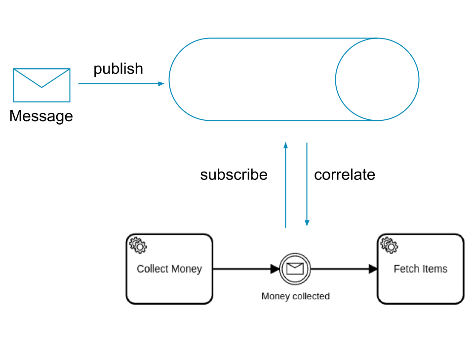
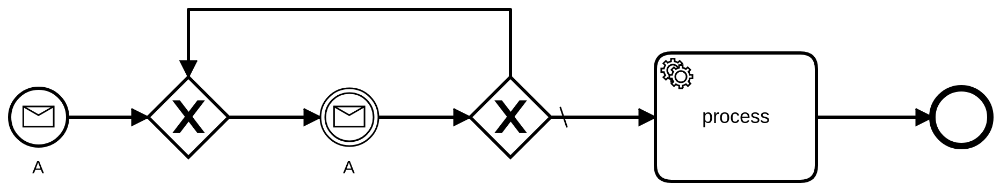
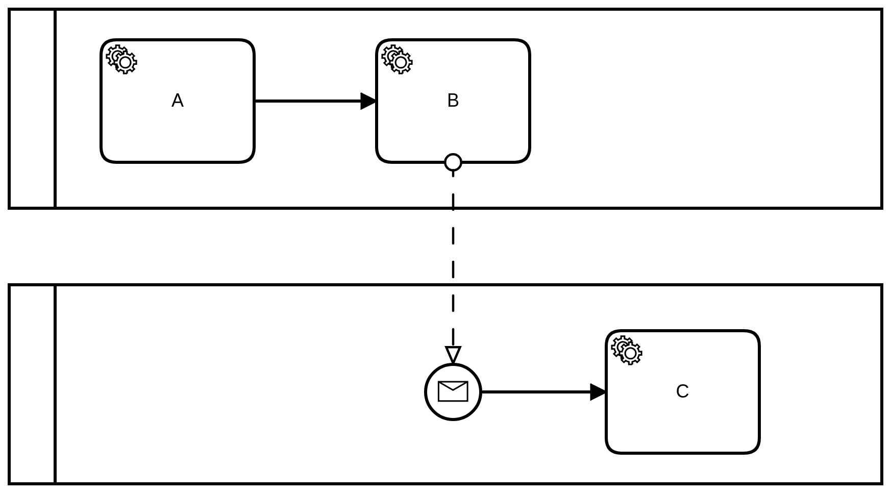

Process instances can respond to incoming messages. Published messages must be mapped onto a process instance. This step is called [message correlation](/components/modeler/bpmn/message-events/message-events.md#message-correlation).

## Message subscriptions

A message is not sent to a process instance directly. Instead, the message correlation is based on subscriptions that contain the `message name` and the `correlation key` (also known as the correlation value).



A subscription is opened when a process instance awaits a message; for example, when entering a message catch event. The message name is defined either statically in the process (e.g. `Money collected`) or dynamically as an expression. The correlation key is defined dynamically as an expression (for example, `= orderId`). The expressions are evaluated on activating the message catch event. The results of the evaluations are used as message name and as correlation key of the subscription (e.g. `"order-123"`).

When a message is published and the message name and correlation key match to a subscription, the message is correlated to the corresponding process instance. If no proper subscription is opened, the message is discarded.

A subscription is closed when the corresponding element (e.g. the message catch event), or its scope is left. After a subscription is opened, it is not updated (for example, when the referenced process instance variable is changed.)

<details>
   <summary>Publish message via zbctl</summary>
   <p>

```
zbctl publish message "Money collected" --correlationKey "order-123"
```

   </p>
 </details>

## Message buffering

Messages can be buffered for a given time. Buffering can be useful in a situation when it's not guaranteed the subscription is opened before the message is published.

A message has a **time-to-live (TTL)** which specifies for how long it's buffered. Within this time, the message can be correlated to a process instance.

When a subscription is opened, it polls the buffer for a proper message. If a proper message exists, it is correlated to the corresponding process instance. In case multiple messages match to the subscription, the first published message is correlated (like a FIFO queue).

The buffering of a message is disabled when its TTL is set to zero. If no proper subscription is open, the message is discarded.

<details>
   <summary>Publish message with TTL via zbctl</summary>
   <p>

```
zbctl publish message "Money collected" --correlationKey "order-123" --ttl 1h
```

   </p>
 </details>

## Message cardinality

A message is correlated only _once_ to a process (based on the BPMN process ID), across all versions of this process. If multiple subscriptions for the same process are opened (by multiple process instances or within one instance), the message is correlated only to one of the subscriptions.

When subscriptions are opened for different processes, the message is correlated to _all_ the subscriptions.

A message is _not_ correlated to a message start event subscription if an instance of the process is active and was created by a message with the same correlation key. If the message is buffered, it can be correlated after the active instance is ended. Otherwise, it is discarded.

## Message uniqueness

A message can have an optional message ID — a unique ID to ensure the message is published and processed only once (i.e. idempotency). The ID can be any string; for example, a request ID, a tracking number, or the offset/position in a message queue.

A message is rejected and not correlated if a message with the same name, the same correlation key, and the same ID is already buffered. After the message is discarded from the buffer, a message with the same name, correlation key, and ID can be published again.

The uniqueness check is disabled when no message ID is set.

<details>
   <summary>Publish message with ID via zbctl</summary>
   <p>

```
zbctl publish message "Money collected" --correlationKey "order-123" --messageId "tracking-12345"
```

   </p>
 </details>

## Message correlation overview

By combining the principles of message correlation, message uniqueness, and message buffering, very different behaviors can be achieved. Please note that a message name is mandatory, so it is omitted from the table.

| Correlation key | Message ID | Time to live | Receiver type      | Behavior                                                                                                                                                                                        |
| --------------- | ---------- | ------------ | ------------------ | ----------------------------------------------------------------------------------------------------------------------------------------------------------------------------------------------- |
| set             | not set    | set to 0     | Start event        | A new instance is started if no instance with the correlation key set at start is active, see [single instance](./#single-instance).                                                            |
| set             | not set    | set to 0     | Intermediate event | The message is correlated if a matching subscription is active.                                                                                                                                 |
| set             | not set    | set > 0      | Start event        | A new instance is started if no instance with the correlation key set at start is active during the lifetime of the message; new [equal messages](#message-uniqueness) are buffered.            |
| set             | not set    | set > 0      | Intermediate event | The message is correlated during the lifetime of the message if a matching subscription is active; new [equal messages](#message-uniqueness) are buffered.                                      |
| set             | set        | set to 0     | Start event        | A new instance is started if no instance with the correlation key set at start is active and there is no [equal message](#message-uniqueness) in the buffer.                                    |
| set             | set        | set to 0     | Intermediate event | The message is correlated if a matching subscription is active and there is no [equal message](#message-uniqueness) in the buffer.                                                              |
| set             | set        | set > 0      | Start event        | A new instance is started if no instance with the correlation key set at start is active during the lifetime of the message and there is no [equal message](#message-uniqueness) in the buffer. |
| set             | set        | set > 0      | Intermediate event | The message is correlated during the lifetime of the message if a matching subscription is active and there is no [equal message](#message-uniqueness) in the buffer.                           |
| empty string    | not set    | set to 0     | Start event        | A new instance is started.                                                                                                                                                                      |
| empty string    | not set    | set to 0     | Intermediate event | The message is correlated if a matching subscription to the empty string is active.                                                                                                             |
| empty string    | not set    | set > 0      | Start event        | A new instance is started.                                                                                                                                                                      |
| empty string    | not set    | set > 0      | Intermediate event | The message is correlated during the lifetime of the message if a matching subscription to the empty string is active; new [equal messages](#message-uniqueness) are buffered.                  |
| empty string    | set        | set to 0     | Start event        | A new instance is started if there is no [equal message](#message-uniqueness) in the buffer.                                                                                                    |
| empty string    | set        | set to 0     | Intermediate event | The message is correlated if a matching subscription to the empty string is active and there is no [equal message](#message-uniqueness) in the buffer.                                          |
| empty string    | set        | set > 0      | Start event        | A new instance is started if there is no [equal message](#message-uniqueness) in the buffer.                                                                                                    |
| empty string    | set        | set > 0      | Intermediate event | The message is correlated during the lifetime of the message if a matching subscription to the empty string is active and there is no [equal message](#message-uniqueness) in the buffer.       |

## Message patterns

The following patterns describe solutions for common problems that can be solved using message correlation.

### Message aggregator

**Problem**: Aggregate/collect multiple messages, map-reduce, batching

**Solution**:



The messages are published with a `TTL > 0` and a correlation key that groups the messages per entity.

The first message creates a new process instance. The following messages are correlated to the same process instance if they have the same correlation key.

When the instance ends and messages with the same correlation key are not correlated yet, a new process instance is created.

:::note
You may also use TTL to wait for messages that may arrive earlier when combining [start events and intermediate catch events](/docs/components/modeler/bpmn/events.md).
:::

### Single instance

**Problem**: Create exactly one instance of a process

**Solution**:



The message is published with a `TTL = 0` and a correlation key that identifies the entity.

The first message creates a new process instance. The following messages are discarded and do not create a new instance if they have the same correlation key and the created process instance is still active.

## Message response

Publishing a message is a fire-and-forget action. As a user, you do not know if the correlation is a success.

To know if a published message was correlated (and to which process instance), use the [message correlation endpoint](../../apis-tools/camunda-api-rest/specifications/correlate-a-message.api.mdx).

The message correlation endpoint works similarly to the message publish endpoint. However, the message correlation endpoint does not support [message buffering](#message-buffering). Any message published using this endpoint is either immediately correlated, or not correlated at all. This is due to the synchronous nature of requiring a response.

If a message correlated successfully, it returns a process instance key of an instance the message correlated with. This is only one key. It is possible that the message correlated to other process instances. These keys are not part of the response.

The response will always prioritize the creation of a new process instance ([message start event](../modeler/bpmn/message-events/message-events.md#message-start-events)) over correlation with an existing process instance ([message catch event](../modeler/bpmn/message-events/message-events.md#intermediate-message-catch-events) or [receive task](../modeler/bpmn/receive-tasks/receive-tasks.md)).
