Process instance migration fits a running process instance to a different process definition.
This can be useful when the process definition of a running process instance needs changes due to bugs or updated requirements.
While doing so, we aim to interfere as little as possible with the process instance state during the migration.
For example, a migrated active user task remains assigned to the same user.
This principle applies to all parts of the process instance.

:::tip
To repair a broken process instance without making changes to the process definition, use [process instance modification](./process-instance-modification.md) instead.
:::

Use the migration command [RPC](/apis-tools/zeebe-api/gateway-service.md#migrateprocessinstance-rpc) or [REST](/apis-tools/camunda-api-rest/specifications/migrate-process-instance.api.mdx) to change the process model of a running process instance.

:::note
You can also migrate your process instances using Operate's UI by following [the user guide](../operate/userguide/process-instance-migration.md).

:::

## Changing the process instance flow for inactive parts

Process instance migration allows you to adjust the process model of your process instance to fit to new requirements.

Let's consider an example.

The process instance below contains a completed start event, an active service task `A`, and an end event.
Once you complete the service task `A`, the process will reach the end event.

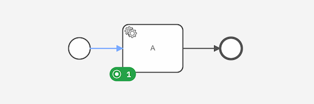

However, the requirements of our process have changed.

Instead of completing the process, we want to add a user task `B` after the service task `A` and before the end event.

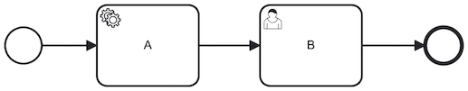

We can create new process instances according to this new process model after deploying it, but we also want our active process instances to receive the update and reach user task `B` when service task `A` is completed.

<!--
I'm using process, process model, and process definition interchangeably, because I don't know what's best.
Using it interchangeably might help users pick up an understanding of what we mean (some may know it as a model, others as a process).
But, it's also inconsistent.
Should we use all terms or should we select a specific one.
The API refers to it as the "process instance's process definition" and the "target process definition".
-->

To achieve this, we can migrate our process instance from its current process to the newly deployed one. You must provide a migration plan with mapping instructions to the target process definition to clarify your intentions.

In our example, we'll provide a mapping instruction from source element ID `A` to target element ID `A`. This means we expect any active element instances of element with ID `A` to be migrated to the element with ID `A` in the target process.
Therefore, our process instance will continue to be active at service task `A`.

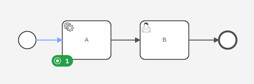

After migrating our process instance, we can now complete the service task `A` to reach user task `B`.

Process instance migration allows you to change the inactive parts of the process instance. In our example, we placed a user task `B` between the active service task `A` and the inactive end event. We did not change the active service task `A`, just the steps that follow.

## Changing the active elements

Sometimes your requirements change so much that the currently active element no longer exists in the new process version.

Consider the following example: the process contains a completed exclusive gateway, taking the sequence flow to the service task `A` which is currently active.
It did not take the sequence flow to service task `B`, so it is inactive.

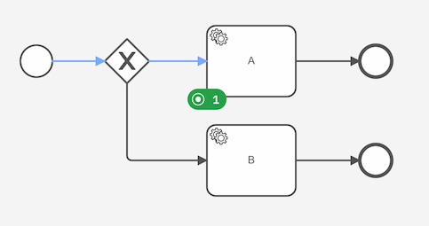

Due to changed requirements, our process model no longer contains the exclusive gateway, nor the service tasks `A` and `B`.
Instead, it only contains a new service task `C`.

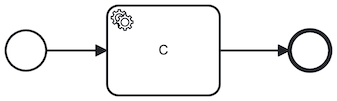

We can migrate the active service task `A` to this new service task `C` by providing a mapping instruction from source element ID `A` to target element ID `C`.

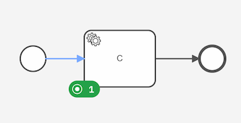

:::note
You cannot map an element to an element of a different type.
An active service task of a process instance can only be mapped to a service task in the target process.
It cannot be mapped to a user task as this changes the element type.

Also note that the [jobs, expressions, and input mappings](#jobs-expressions-and-input-mappings) are not recreated.
So, while service task `C` is active in the target process, the associated job still has the job type from when it was associated to service task `A`.
:::

:::tip
If you need to adjust the job type to its new element, you can use [process instance modification](./process-instance-modification.md) to recreate the service task.
Simply cancel the service task instance, and add a new instance of the service task.

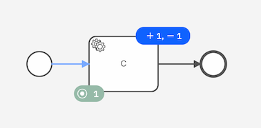
:::

## Correcting mistakes in a process instance

Process instance migration can also be used to correct mistakes that led to an [incident](/components/concepts/incidents.md) in a process instance.

Let's consider an example.

A user deployed a process with a user task `A`. The instance of that process always receives two variables (one boolean and one string).
By accident, the string is used in the condition. To fix the problem, the process model should be updated to use the boolean variable instead.
A process instance gets stuck at this user task, and an incident is created to inform the user of this problem.

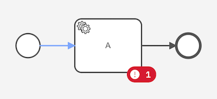

To correct the problem in the process instance, the user can take the following steps:

1. Correct the mistake in Modeler by creating a new version of the process definition.
2. Deploy the new process version where the boolean variable is used in the condition.
3. Migrate the process instance to the new process version.
4. Resolve the incident.

Afterward, the process instance will continue as expected:


## Migrating active elements inside subprocesses

Active elements located inside subprocesses can be migrated as part of a process instance migration.

Let's consider an example where we want to migrate an active element that is located in a subprocess.

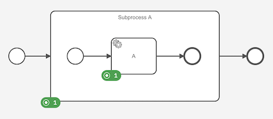

After migrating active element `A` to `B` and `Subprocess A` to `Subprocess B`, the process instance will look like this:

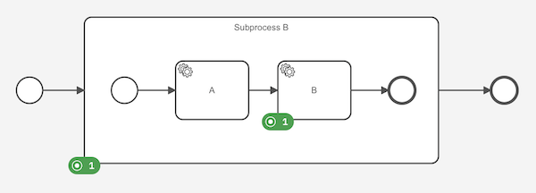

:::note
A mapping instruction must be provided from the process instance's subprocess ID to the target subprocess ID to migrate subprocesses.
:::

:::note
You cannot migrate an active embedded subprocess to an event subprocess.
Additionally, changing the scope of a subprocesses during migration is not possible.
:::

### Call activities and called process instances

Active call activities can be migrated like any other element.
The called process instance is not changed when migrating the call activity.

You can migrate a called process instance in the same way as a regular process instance.

## Dealing with catch events

An exception to changing the process instance state is specific to catch events.
This is necessary to ensure that the process instance can be executed according to the new process definition.
It allows you to add or remove catch events from an active element.
At the same time, you can leave an existing catch event unchanged.
This section explains how to deal with catch events when migrating a process instance.

You decide what happens to the associated event subscription through the mapping instructions for the catch events:

- Migrate catch events: if a catch event is mapped, the associated subscription is migrated.
- Remove catch events: if a catch event in the source process is not mapped, then the associated subscription is closed during migration.
- Add catch events: if a catch event of the target process is not the target of a mapping instruction, then a new subscription is opened during migration.

### Migrate catch events

Catch events can be migrated by providing a mapping instruction between the source and the target catch event.
Providing a mapping between catch events ensures that the event subscription in the source process is preserved after the migration.
In the following section we will discuss situations where mapping a catch event may or may not be useful.
Let's explain both mapping and non-mapping scenarios with examples.

#### A mapping instruction is provided between the catch events

An active user task has been waiting for a timer boundary event.
The timer boundary event is defined as a duration of one week.
The user task has not been completed and has already spent five days waiting for the timer.

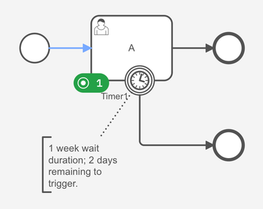

Now we want to [change an inactive part of the process](#changing-the-process-instance-flow-for-inactive-parts) by adding a user task after the timer boundary event.
Instead of waiting for the full time defined by the target process' timer boundary event, we only want to wait for the remaining two days.
To achieve this for the example above, the mapping between active user tasks `A` -> `A` and timer boundary events `Timer1` -> `Timer2` must be provided.
This ensures the timer is migrated (_the associated subscription is migrated_) and the duration is preserved.
Assuming that the timer boundary event is defined as 2 weeks duration in the target process, the process instance will look as follows after the migration:

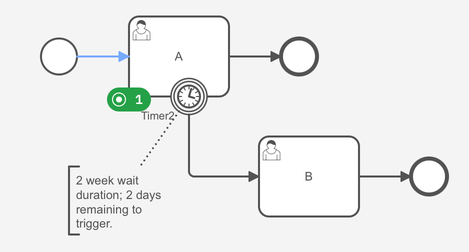

Mapping catch events applies to other event types as well.
For example, if you want to keep the message name the same for a message event subprocess, you should map the start event of the event subprocess when migrating the process instance.
Another example would be to preserve a signal name for an intermediate signal catch event attached to an event-based gateway. In this case, you should map the signal catch event to the one in the target while migrating the process instance.

#### No mapping instruction is provided between the catch events

Before moving forward with the example, there are two important scenarios to consider because they affect the output after the migration:

- The catch event in the source process is identical to the catch event in the target process.
- There are changes between these catch events, for example, the message name is different in the target.

Let's consider again the same example above:

An active user task has been waiting for a timer boundary event.
The timer boundary event is defined as a duration of one week.
The user task has not been completed and has already spent five days waiting for the timer.


In the first scenario, the catch event in the source process is identical to the catch event in the target process:

This time we want to reset the timer and wait for the full week again.
To achieve this for the example above, only a mapping between active user tasks `A` -> `A` must be provided.
This will cancel the timer (_associated subscription is closed_) and create a new one (_a new subscription is opened_).
After the migration the process instance will look like following:

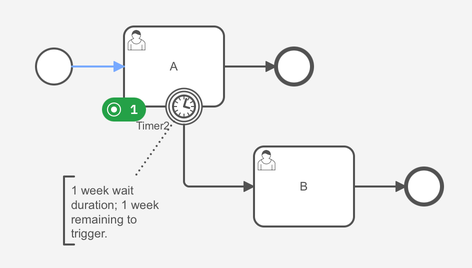

In the second scenario, there are changes between these catch events:

Now, we want to reset the timer and wait for two weeks as in the target process definition.
To achieve this for the example above, only a mapping between active user tasks `A` -> `A` must be provided.
This will cancel the timer (_associated subscription is closed_) and create a new one (_a new subscription is opened_).
After the migration the process instance will look as follows:

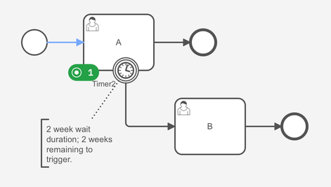

Same as above, omitting the mapping instruction for catch events applies to other event types as well.
For example, if you want to change the message name for a message event subprocess start event, you must omit mapping the message start event when migrating the process instance.
Another example would be to update a signal name for an intermediate signal catch event, you must omit mapping the signal catch event when to the one in the target while migrating the process instance.

### Add or remove catch events

You can also add or remove catch events.

Let's consider a process instance awaiting at a service task `A`.

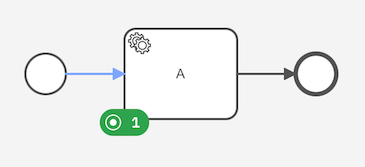

You can migrate it to a process definition where a message event subprocess with message start event `M` is added to the process.
To do so, you only have to map element `A` to element `A` in the target process.
After migrating active element `A`, the process instance is newly subscribed to the message boundary event `M` (_a new subscription is opened_).

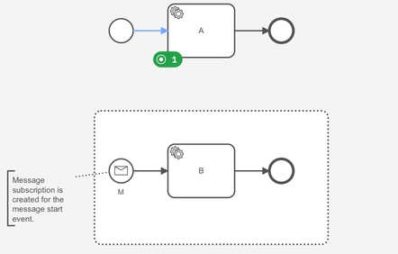

Likewise, you can migrate the process instance back to the previous process definition where no message event subprocess is defined.
To do so, you only have to map element `A` to element `A` again.
After migrating active element `A`, the process instance is no longer subscribed to the message start event `M` (_associated subscription is closed_).


Likewise, adding and removing catch events applies to all other supported catch event types as well.
For instance, an intermediate signal catch event can be added or removed in the same way as the message event subprocess in the example above.

:::tip
Currently, a mapping instruction must be provided between catch events to migrate message catch events if the target catch event has the same message name.
Therefore, it is not possible to re-create message catch events with the same message name in the target process definition.
While we're working on resolving this, you can migrate this case by providing a mapping between the boundary events.
:::

## Process definitions and versions

So far, we've only discussed migrating a process instance to a new version of its process definition.

You are free to migrate your process instance:

- From an older version to a newer version of the same process definition.
- From a newer version to an older version of the same process definition.
- To a different process definition altogether.

:::note
You do not have to provide a mapping instruction from the process instance's process ID to the target process ID.
:::

## Jobs, expressions, and input mappings

We do not recreate jobs, reevaluate expressions, and reapply input mappings of the active elements.
We also don't adjust any static values if they differ between the two process definitions.
Any existing variables, user tasks, and jobs continue to exist with the same values as previously assigned.

Let's consider an active service task that created a job when it was activated with type `send_mail`.
In the target process definition, the job type expression is changed as follows:

```feel
= order.next_step
```

However, on migrating the process instance this new job type expression is not evaluated.
Instead, the job keeps all properties it had before the migration, including the job type.

:::tip
You can use [process instance modification](./process-instance-modification.md) to terminate and activate the service task if you want to create the job according to the new service task's definitions.
This results in new keys for the service task as well as the job.
:::

## Internal Execution

In the following example, we will explain the internal execution steps of process instance migration.
It is recommended that you read these steps to fully understand the power of process instance migration.

Migration of a process instance consists of the following steps:

- Validation
- Migration of process instance, and global variables
- Migration of each active element (including associated jobs, incidents, local variables, and event subscriptions)

If any of the steps fail, the migration is rejected and a rejection message that explains the reason is returned.
For example, if a mapping is not provided for an active element, the migration is rejected with an error message indicating that the mapping is missing.
As a result, the process instance will not be migrated and remains in its current state.
The migration runs in a **transactional** manner, meaning that it is migrating all active elements or nothing.

### Validation

The migration plan is validated before the migration is executed.
The validation starts with validating the mapping instructions provided in the migration plan.
For example, the validation checks if the source element ID refers to an existing element in the process instance's process definition.
Later, while attempting to migrate each active element, each limitation mentioned in the [limitations section](#limitations) is validated.
For example, the flow scope of an active element is validated to ensure that it is not changed during migration.

### Migration of process instance, and global variables

After all validations are successful, the migration of the outermost active element which is the process instance itself is started.
At this point, the process instance's `processDefinitionKey`, `bpmnProcessId`, and `version` properties are updated to the target process definition.
The global variables are also migrated to the target process definition.

### Migration of each active element

The execution of the migration is done in a breadth-first manner.
The first active child instance of the process instance is migrated followed by the migration of the next active child instance.
Later, the migration of the active child instances of each active child instance is executed.
In this stage, jobs, incidents, local variables, and event subscriptions contained in each active element is also migrated.

While traversing each active element, the migration plan is used to determine the target element for each active element.
For each active element, `processDefinitionKey`, `bpmnProcessId`, `elementId`, `version` properties are updated to the target process definition.

#### Migration of catch event subscriptions

The following operations are performed in respective order for each active element as the execution continues to migrate each active element:

- If a catch event exists in the source process instance and is not part of the migration plan, the subscription to the catch event is removed.
- If a catch event exists in the target process definition and is not part of the migration plan, a new subscription is created for the catch event.
- If a catch event in the source process is mapped to a catch event in the target process, the subscription is migrated.

While migrating each catch event subscriptions, the catch event's `processDefinitionKey`, `bpmnProcessId`, `elementId` properties are updated to the target process definition.
:::note
It is **possible** to change the interrupting status during catch event subscription migration.
:::

## Limitations

Not all process instances can be migrated to another process definition.
In the following cases, the process instance can't apply the migration plan and rejects the migration command.

- Process instance migration can only migrate active process instances, i.e. existing process instances that have not yet been completed, terminated, or banned.
- All active elements require a mapping.
- The number of active elements cannot be changed. You can use [process instance modification](./process-instance-modification.md) to achieve this instead.
- The target process definition must exist in Zeebe, i.e. it must be deployed and not yet deleted.
- The migration plan can only map each `sourceElementId` once.
- A mapping instruction's `sourceElementId` must refer to an element existing in the process instance's process definition.
- A mapping instruction's `targetElementId` must refer to an element existing in the target process definition.
- Catch event limitations:
  - A mapping instruction cannot detach a catch event from an active element.
    For example, a service task `A` has timer boundary event `T1` and will be migrated to the service task `B` has timer boundary event `T2`.
    If a mapping instruction between `A` -> `B` is provided, a mapping instruction for `T1` can only refer to `T2`.
  - Each catch event can only be the target of a mapping instruction once.
  - Two catch events in the source cannot be mapped to the same catch event in the target.
  - A catch event in the source cannot be mapped to a different type of catch event in the target.
  - The message subscription for the message catch event in the source process instance needs to be fully distributed before the migration.
- Multi-instance body limitations:
  - Each child instance of a multi-instance body should be migrated separately because they belong to another process instance.
  - It is not possible to migrate a parallel multi-instance body to a sequential multi-instance body and vice versa.

The following limitations exist that may be supported in future versions:

- Only [supported BPMN elements](#supported-bpmn-elements) can be migrated.
- The following scenarios cannot be migrated:
  - An element that becomes nested in a newly added subprocess
  - An element that was nested in a subprocess is no longer nested in that subprocess
- Mapping instructions cannot change the element type
- Mapping instructions cannot change the task implementation, for example, from a job worker user task to a Camunda user task.
- The process instance must be in a wait state, i.e. waiting for an event or external input like job completion. It may not be taking a sequence flow or triggering an event while migrating the instance.

A full overview of error codes can be found in the migration command [RPC](/apis-tools/zeebe-api/gateway-service.md#migrateprocessinstance-rpc) or [REST](/apis-tools/camunda-api-rest/specifications/migrate-process-instance.api.mdx).

:::tip
If your specific case is not (yet) supported by process instance migration, you can use [cancel process instance](../../apis-tools/zeebe-api/gateway-service.md#cancelprocessinstance-rpc) and [create and start at a user-defined element](./process-instance-creation.md#create-and-start-at-a-user-defined-element) to recreate your process instance in the other process definition.
Note that this results in new keys for the process instance and its associated variables, element instances, and other entities.
:::

### Supported BPMN elements

The following BPMN elements are supported by the migration tool.

#### Subprocesses

import EmbeddedSubprocessSvg from '../modeler/bpmn/assets/bpmn-symbols/embedded-subprocess.svg';
import CallActivitySvg from '../modeler/bpmn/assets/bpmn-symbols/call-activity.svg';
import EventSubprocessSvg from '../modeler/bpmn/assets/bpmn-symbols/event-subprocess.svg'

<div className="bpmn-symbol-container">
    <a href="../../modeler/bpmn/embedded-subprocesses/">
        <EmbeddedSubprocessSvg className="implemented" />
    </a>
    <a href="../../modeler/bpmn/call-activities/">
        <CallActivitySvg className="implemented" />
    </a>
    <a href="../../modeler/bpmn/event-subprocesses/">
        <EventSubprocessSvg className="implemented" />
    </a>
</div>

#### Tasks

import ServiceTaskSvg from '../modeler/bpmn/assets/bpmn-symbols/service-task.svg'
import UserTaskSvg from '../modeler/bpmn/assets/bpmn-symbols/user-task.svg'
import ReceiveTaskSvg from '../modeler/bpmn/assets/bpmn-symbols/receive-task.svg'
import SendTaskSvg from '../modeler/bpmn/assets/bpmn-symbols/send-task.svg'
import BusinessRuleTaskSvg from '../modeler/bpmn/assets/bpmn-symbols/business-rule-task.svg'
import ScriptTaskSvg from '../modeler/bpmn/assets/bpmn-symbols/script-task.svg'

<div className="bpmn-symbol-container">
    <a href="../../modeler/bpmn/service-tasks/">
        <ServiceTaskSvg className="implemented" />
    </a>
    <a href="../../modeler/bpmn/user-tasks/">
        <UserTaskSvg className="implemented" />
    </a>
    <a href="../../modeler/bpmn/receive-tasks/">
        <ReceiveTaskSvg className="implemented" />
    </a>
    <a href="../../modeler/bpmn/send-tasks/">
        <SendTaskSvg className="implemented" />
    </a>
    <a href="../../modeler/bpmn/business-rule-tasks/">
        <BusinessRuleTaskSvg className="implemented" />
    </a>
    <a href="../../modeler/bpmn/script-tasks/">
        <ScriptTaskSvg className="implemented" />
    </a>
</div>

#### Gateways

import ExclusiveGatewaySvg from '../modeler/bpmn/assets/bpmn-symbols/exclusive-gateway.svg'
import EventBasedGatewaySvg from '../modeler/bpmn/assets/bpmn-symbols/event-based-gateway.svg'

<div className="bpmn-symbol-container">
    <a href="../../modeler/bpmn/exclusive-gateways/">
        <ExclusiveGatewaySvg className="implemented" />
    </a>
    <a href="../../modeler/bpmn/event-based-gateways/">
        <EventBasedGatewaySvg className="implemented" />
    </a>
</div>

#### Markers

import MultiInstanceParallelSvg from '../modeler/bpmn/assets/bpmn-symbols/multi-instance-parallel.svg'
import MultiInstanceSequentialSvg from '../modeler/bpmn/assets/bpmn-symbols/multi-instance-sequential.svg'

<div className="bpmn-symbol-container">
    <a href="../../modeler/bpmn/multi-instance/">
        <MultiInstanceParallelSvg className="implemented" />
    </a>
    <a href="../../modeler/bpmn/multi-instance/">
        <MultiInstanceSequentialSvg className="implemented" />
    </a>
</div>

#### Events

import MessageStartEventSvg from '../modeler/bpmn/assets/bpmn-symbols/message-start-event.svg'
import MessageEventSubprocessSvg from '../modeler/bpmn/assets/bpmn-symbols/message-event-subprocess.svg'
import MessageEventSubprocessNonInterruptingSvg from '../modeler/bpmn/assets/bpmn-symbols/message-event-subprocess-non-interrupting.svg'
import MessageCatchEventSvg from '../modeler/bpmn/assets/bpmn-symbols/message-catch-event.svg'
import MessageBoundaryEventSvg from '../modeler/bpmn/assets/bpmn-symbols/message-boundary-event.svg'
import MessageBoundaryEventNonInterruptingSvg from '../modeler/bpmn/assets/bpmn-symbols/message-boundary-event-non-interrupting.svg'

import TimerEventSubprocessSvg from '../modeler/bpmn/assets/bpmn-symbols/timer-event-subprocess.svg'
import TimerEventSubprocessNonInterruptingSvg from '../modeler/bpmn/assets/bpmn-symbols/timer-event-subprocess-non-interrupting.svg'
import TimerCatchEventSvg from '../modeler/bpmn/assets/bpmn-symbols/timer-catch-event.svg'
import TimerBoundaryEventSvg from '../modeler/bpmn/assets/bpmn-symbols/timer-boundary-event.svg'
import TimerBoundaryEventNonInterruptingSvg from '../modeler/bpmn/assets/bpmn-symbols/timer-boundary-event-non-interrupting.svg'

import ErrorEventSubprocessSvg from '../modeler/bpmn/assets/bpmn-symbols/error-event-subprocess.svg'
import ErrorBoundaryEventSvg from '../modeler/bpmn/assets/bpmn-symbols/error-boundary-event.svg'
import ErrorEndEventSvg from '../modeler/bpmn/assets/bpmn-symbols/error-end-event.svg'

import SignalEventSubprocessSvg from '../modeler/bpmn/assets/bpmn-symbols/signal-event-subprocess.svg'
import SignalEventSubprocessNonInterruptingSvg from '../modeler/bpmn/assets/bpmn-symbols/signal-event-subprocess-non-interrupting.svg'
import SignalCatchEventSvg from '../modeler/bpmn/assets/bpmn-symbols/signal-catch-event.svg'
import SignalBoundaryEventSvg from '../modeler/bpmn/assets/bpmn-symbols/signal-boundary-event.svg'
import SignalBoundaryEventNonInterruptingSvg from '../modeler/bpmn/assets/bpmn-symbols/signal-boundary-event-non-interrupting.svg'

<table className="bpmn-coverage-event-table">
  <thead>
      <tr>
        <th>Type</th>
        <th colspan="2">Start</th>
        <th colspan="4">Intermediate</th>
      </tr>
      <tr>
        <th></th>
        <th>Event Subprocess</th>
        <th>Event Subprocess non-interrupting</th>
        <th>Catch</th>
        <th>Boundary</th>
        <th>Boundary non-interrupting</th>
      </tr>
  </thead>
  <tbody>
    <tr>
        <td>
            <a href="../../modeler/bpmn/message-events/">Message</a>
        </td>
        <td>
            <a href="../../modeler/bpmn/message-events/">
                <MessageEventSubprocessSvg className="implemented" />
            </a>
        </td>
        <td>
            <a href="../../modeler/bpmn/message-events/">
                <MessageEventSubprocessNonInterruptingSvg className="implemented" />
            </a>
        </td>
        <td>
            <a href="../../modeler/bpmn/message-events/">
                <MessageCatchEventSvg className="implemented" />
            </a>
        </td>
        <td>
            <a href="../../modeler/bpmn/message-events/">
                <MessageBoundaryEventSvg className="implemented" />
            </a>
        </td>
        <td>
            <a href="../../modeler/bpmn/message-events/">
                <MessageBoundaryEventNonInterruptingSvg className="implemented" />
            </a>
        </td>
    </tr>
    <tr>
        <td>
            <a href="../../modeler/bpmn/timer-events/">Timer</a>
        </td>
        <td>
            <a href="../../modeler/bpmn/timer-events/">
                <TimerEventSubprocessSvg className="implemented" />
            </a>
        </td>
        <td>
            <a href="../../modeler/bpmn/timer-events/">
                <TimerEventSubprocessNonInterruptingSvg className="implemented" />
            </a>
        </td>
        <td>
            <a href="../../modeler/bpmn/timer-events/">
                <TimerCatchEventSvg className="implemented" />
            </a>
        </td>
        <td>
            <a href="../../modeler/bpmn/timer-events/">
                <TimerBoundaryEventSvg className="implemented" />
            </a>
        </td>
        <td>
            <a href="../../modeler/bpmn/timer-events/">
                <TimerBoundaryEventNonInterruptingSvg className="implemented" />
            </a>
        </td>
    </tr>
    <tr>
        <td>
            <a href="../../modeler/bpmn/error-events/">Error</a>
        </td>
        <td>
            <a href="../../modeler/bpmn/error-events/">
                <ErrorEventSubprocessSvg className="implemented" />
            </a>
        </td>
        <td></td>
        <td></td>
        <td>
            <a href="../../modeler/bpmn/error-events/">
                <ErrorBoundaryEventSvg className="implemented" />
            </a>
        </td>
        <td></td>
    </tr>
    <tr>
        <td>
            <a href="../../modeler/bpmn/signal-events/">Signal</a>
        </td>
        <td>
            <a href="../../modeler/bpmn/signal-events/">
                <SignalEventSubprocessSvg className="implemented" />
            </a>
        </td>
        <td>
            <a href="../../modeler/bpmn/signal-events/">
                <SignalEventSubprocessNonInterruptingSvg className="implemented" />
            </a>
        </td>
        <td>
            <a href="../../modeler/bpmn/signal-events/">
                <SignalCatchEventSvg className="implemented" />
            </a>
        </td>
        <td>
            <a href="../../modeler/bpmn/signal-events/">
                <SignalBoundaryEventSvg className="implemented" />
            </a>
        </td>
        <td>
            <a href="../../modeler/bpmn/signal-events/">
                <SignalBoundaryEventNonInterruptingSvg className="implemented" />
            </a>
        </td>
    </tr>

  </tbody>
</table>

## Use at your own risk

Process instance migration is a powerful tool to change your process instances. However, use it with care.
You can migrate the process instance to create situations that are not reachable by the regular execution.
Consider the following example:

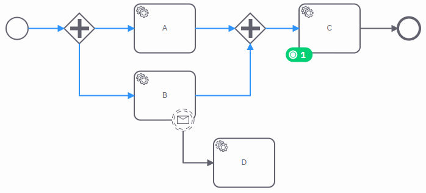

The process instance completed the first tasks `A` and `B` and waits on task `C`.

We could apply the following migrations, but the process instance may end up in an unintended situation:

- If we map task `C` to `A` or `B`, the process instance is stuck on the parallel gateway.
- If we map task `C` to `D`, the variables that would be provided by the message are not set, the task `D` could be processed with the wrong input.

The process instance doesn't detect these situations. It is up to you to apply suitable migrations.

When in doubt, we recommend testing your migration on a non-production cluster, or using [zeebe process test](../../apis-tools/java-client/zeebe-process-test.md).

:::tip
Often it's safer to migrate in multiple smaller steps rather than in one big migration.
For example, you can start by migrating the process instance introducing changes to the inactive parts only to keep the current situation unchanged.

In some cases it's useful to prepare the process instance before migrating.
If your process needs specific variables immediately after migrating, you can set these before migrating the process instance.
Both global and local variables are migrated automatically.
Before migrating, you can also use process instance modification [activating an element](./process-instance-modification.md#activate-an-element)
to avoid the process instance getting stuck on a parallel gateway, or [terminate an element instance](./process-instance-modification.md#terminate-an-element-instance) to get rid of a parallel flow.
:::
