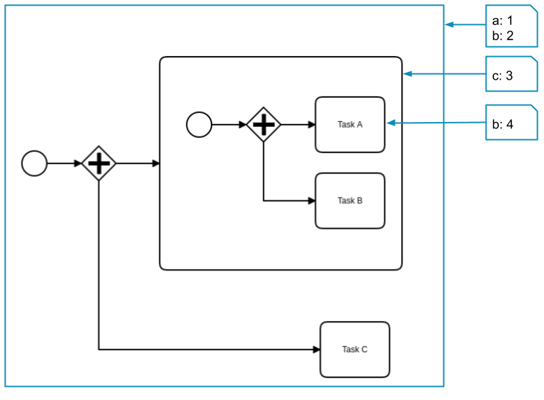
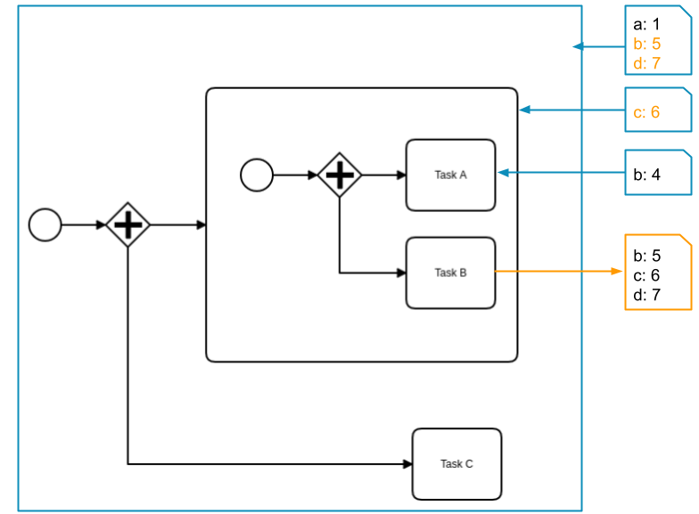
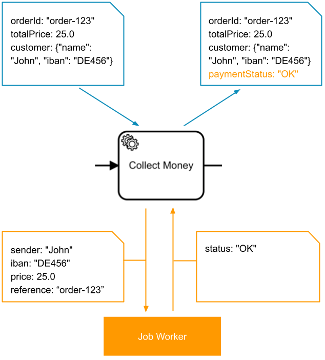
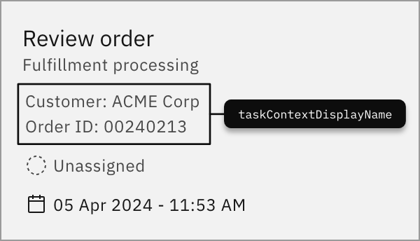

Variables are part of a process instance and represent the data of the instance.

A variable has a name and a JSON value. The visibility of a variable is defined by its variable scope.

When [automating a process using BPMN](../../guides/automating-a-process-using-bpmn.md) or [orchestrating human tasks](../../guides/getting-started-orchestrate-human-tasks.md), you can leverage the scope of these variables and customize how variables are merged into the process instance.

## Variable names

The name of a variable can be any alphanumeric string including the `_` symbol. For a combination of words, it's recommended to use the `camelCase` or the `snake_case` format. The `kebab-case` format is not allowed because it contains the operator `-`.

When accessing a variable in an expression, keep in mind the variable name is case-sensitive.

Restrictions of a variable name:

- It may not start with a **number** (e.g. `1stChoice` is not allowed; you can use `firstChoice`instead).
- It may not contain **whitespaces** (e.g. `order number` is not allowed; you can use `orderNumber` instead).
- It may not contain an **operator** (e.g. `+`, `-`, `*`, `/`, `=`, `>`, `?`, `.`).
- It may not be a **literal** (e.g. `null`, `true`, `false`) or a **keyword** (e.g. `function`, `if`, `then`, `else`, `for`, `between`, `instance`, `of`, `not`).

## Variable values

The value of a variable is stored as a JSON value. It can have one of the following types:

- String (e.g. `"John Doe"`)
- Number (e.g. `123`, `0.23`)
- Boolean (e.g. `true` or `false`)
- Array (e.g. `["item1" , "item2", "item3"]`)
- Object (e.g. `{ "orderNumber": "A12BH98", "date": "2020-10-15", "amount": 185.34}`)
- Null (`null`)

## Variable size limitation

Generally, there is a limit of 4 MB for the payload of a process instance. This 4 MB includes the variables and the workflow engine internal data, which means there is slightly less memory available for variables. The exact limitation depends on a few factors, but you can consider 3 MB as being safe. If in doubt, run a quick test case.

:::note
Regardless, we don't recommend storing much data in your process context. Refer to our [best practice on handling data in processes](/components/best-practices/development/handling-data-in-processes.md).
:::

## Variable scopes

Variable scopes define the _visibility_ of variables. The root scope is the process instance itself. Variables in this scope are visible everywhere in the process.

When the process instance enters a subprocess or an activity, a new scope is created. Activities in this scope can observe all variables of this and of higher scopes (i.e. parent scopes). However, activities outside of this scope can not observe the variables which are defined in this scope.

If a variable has the same name as a variable from a higher scope, it covers this variable. Activities in this scope observe only the value of this variable and not the one from the higher scope.

The scope of a variable is defined when the variable is created. By default, variables are created in the root scope.

This process instance has the following variables:

- `a` and `b` are defined on the root scope and can be seen by **Task A**, **Task B**, and **Task C**.
- `c` is defined in the subprocess scope and can be seen by **Task A** and **Task B**.
- `b` is defined again on the activity scope of **Task A** and can be seen only by **Task A**. It covers the variable `b` from the root scope.

### Variable propagation

When variables are merged into a process instance (e.g. on job completion, on message correlation, etc.) each variable is propagated from the scope of the activity to its higher scopes.

The propagation ends when a scope contains a variable with the same name. In this case, the variable value is updated.

If no scope contains this variable, it's created as a new variable in the root scope.

The job of **Task B** is completed with the variables `b`, `c`, and `d`. The variables `b` and `c` are already defined in higher scopes and are updated with the new values. Variable `d` doesn't exist before and is created in the root scope.

### Local variables

In some cases, variables should be set in a given scope, even if they don't exist in this scope before.

To deactivate the variable propagation, the variables are set as **local variables**. This means the variables are created or updated in the given scope, regardless if they existed in this scope before.

## Input/output variable mappings

Input/output variable mappings can be used to create new variables or customize how variables are merged into the process instance.

Variable mappings are defined in the process as extension elements under `ioMapping`. Every variable mapping has a `source` and a `target` expression.

The `source` expression defines the **value** of the mapping. Usually, it [accesses a variable](/components/modeler/feel/language-guide/feel-variables.md#access-variable) of the process instance that holds the value. If the variable or the nested property doesn't exist, it uses `null` as the value.

The `target` expression defines **where** the value of the `source` expression is stored. It can reference a variable by its name or a nested property of a variable. If the variable or the nested property doesn't exist, it's created.

Variable mappings are evaluated in the defined order. Therefore, a `source` expression can access the target variable of a previous mapping.

**Input mappings**

| Source          | Target      |
| --------------- | ----------- |
| `customer.name` | `sender`    |
| `customer.iban` | `iban`      |
| `totalPrice`    | `price`     |
| `orderId`       | `reference` |

**Output mapping**

| Source   | Target          |
| -------- | --------------- |
| `status` | `paymentStatus` |

### Input mappings

Input mappings can be used to create new variables. They can be defined on service tasks and subprocesses.

When an input mapping is applied, it creates a new **local variable** in the scope where the mapping is defined.

For string literals containing escaped characters (e.g., a newline character `\n`), the string is returned in its original form as expected (without double escaping).

Examples:

| Process instance variables             | Input mappings                                                                                               | New variables                               |
| -------------------------------------- | ------------------------------------------------------------------------------------------------------------ | ------------------------------------------- |
| `orderId: "order-123"`                 | **source:** `=orderId`  **target:** `reference`                                                          | `reference: "order-123"`                    |
| `customer:{"name": "John"}`            | **source:** `=customer.name` **target:** `sender`                                                        | `sender: "John"`                            |
| `customer: "John"` `iban: "DE456"` | **source:** `=customer`  **target:** `sender.name` **source:** `=iban` **target:** `sender.iban` | `sender: {"name": "John", "iban": "DE456"}` |

### Output mappings

Output mappings can be used for several purposes:

- To customize how variables are merged into the process instance.
- They can be defined on service tasks, receive tasks, message catch events, and subprocesses.
- They can be used in script and user tasks.

If **one or more** output mappings are defined, the results variables are set as **local variables** in the scope where the mapping is defined. Then, the output mappings are applied to the variables and create new variables in this scope. The new variables are merged into the parent scope. If there is no mapping for a job/message variable, the variable is not merged.

If **no** output mappings are defined, all results variables are merged into the process instance.

In the case of a subprocess, the behavior is different. There are no results variables to be merged. However, output mappings can be used to propagate **local variables** of the subprocess to higher scopes. By default, all **local variables** are removed when the scope is left.

Examples:

| Results variables                                    | Output mappings                                                                                                                      | Process instance variables                         |
| ---------------------------------------------------- | ------------------------------------------------------------------------------------------------------------------------------------ | -------------------------------------------------- |
| `status: "Ok"`                                       | **source:** `=status` **target:** `paymentStatus`                                                                                | `paymentStatus: "OK"`                              |
| `result: {"status": "Ok", "transactionId": "t-789"}` | **source:** `=result.status` **target:** `paymentStatus` **source:** `=result.transactionId` **target:** `transactionId` | `paymentStatus: "Ok"` `transactionId: "t-789"` |
| `status: "Ok"` `transactionId: "t-789"`          | **source:** `=transactionId` **target:** `order.transactionId`                                                                   | `order: {"transactionId": "t-789"}`                |

### Context variable

A context variable is a reserved variable that describes the context of a task. It can group variables together to provide a detailed description of the task or offer more descriptive data about it.
The reserved variable name for a context variable is `taskContextDisplayName`. This name is reserved exclusively for this purpose and should not be used for other variables.

Example:

| Input variable           | Example                              |
| ------------------------ | ------------------------------------ |
| `taskContextDisplayName` | `This is a context variable example` |

The data from the variable will be shown on the task tile, as shown in the example below:

## Next steps

- [Access variables](/components/modeler/feel/language-guide/feel-variables.md#access-variable)
