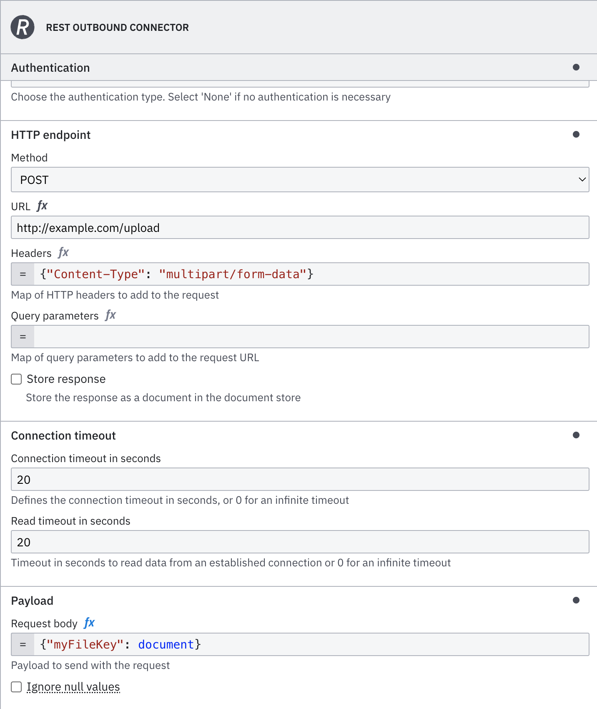

:::caution
If you use the REST connector, ensure you do not have any instance variable named in the list below:

- `body`, `url`, `method`, `headers`, `authentication`, `queryParameters`, `connectionTimeoutInSeconds`, `readTimeoutInSeconds`, `writeTimeoutInSeconds`

:::

The **REST connector** is an outbound protocol connector that allows you to make a request to a REST API and use the response in the next steps of your process.

## Create a REST connector task

import ConnectorTask from '../../../components/react-components/connector-task.md'

<ConnectorTask/>

## Make your REST connector executable

To make the **REST connector** executable, choose the required authentication type and fill out the mandatory fields highlighted in red in the properties panel on the right side of the screen.

:::note
All the mandatory and non-mandatory fields will be covered in the upcoming sections. Depending on the authentication selection you make, more fields might be required. We will also cover this in the next section.
:::

### Configure a proxy server in Self-Managed

In Camunda Self-Managed you can configure the connector to use an HTTP or HTTPS proxy server.

Depending on how you want the proxy to be used, configure it using either JVM properties or environment variables.

The difference between these two configuration types is the scope of the configuration:

| Configuration type                                                                        | Scope                                                                                                                                                  | Example                                                                                                                                                                                  |
| :---------------------------------------------------------------------------------------- | :----------------------------------------------------------------------------------------------------------------------------------------------------- | :--------------------------------------------------------------------------------------------------------------------------------------------------------------------------------------- |
| [JVM properties](https://docs.oracle.com/javase/8/docs/technotes/guides/net/proxies.html) | JVM, **the whole runtime** will be affected. **Any HTTP client** used internally (for example, in a connector, or the Zeebe client) might be affected. | `-Dhttp.proxyHost=proxy -Dhttp.proxyPort=3128 -Dhttps.proxyHost=proxy -Dhttps.proxyPort=3128 -Dhttp.nonProxyHosts=OTHER_DOMAIN`                                                          |
| Environment variables                                                                     | connector, **only the connector (and REST-based connectors)** will be affected                                                                         | `CONNECTOR_HTTP_PROXY_HOST=proxy; CONNECTOR_HTTP_PROXY_PORT=3128; CONNECTOR_HTTPS_PROXY_HOST=proxy; CONNECTOR_HTTPS_PROXY_PORT=3128; CONNECTOR_HTTP_PROXY_NON_PROXY_HOSTS=OTHER_DOMAIN;` |

:::note
To ensure Camunda can properly access Camunda components when using JVM properties, non-proxy hosts must contain `camunda-platform-zeebe|camunda-platform-keycloak`.
:::

#### HTTP/HTTPS properties

Depending on the **target URL**, you can set the proxy as an HTTP or HTTPS protocol handler. A target URL such as `http://example.com` will use the HTTP protocol handler, while a target URL such as `https://example.com` will use the HTTPS protocol handler.

##### JVM properties

You can set the following standard JVM properties for HTTP and HTTPS:

| Property (HTTP target URL) | Property (HTTPS target URL)                         | Description                                                                                                                                                                                                                                                                                                                     |
| :------------------------- | :-------------------------------------------------- | :------------------------------------------------------------------------------------------------------------------------------------------------------------------------------------------------------------------------------------------------------------------------------------------------------------------------------ |
| `http.proxyHost`           | `https.proxyHost`                                   | The host name of the proxy server.                                                                                                                                                                                                                                                                                              |
| `http.proxyPort`           | `https.proxyPort`                                   | The port number (default is 80).                                                                                                                                                                                                                                                                                                |
| `http.nonProxyHosts`       | `http.nonProxyHosts` (similar to the HTTP property) | <p> _(optional)_ A list of hosts to connect to directly, bypassing the proxy.</p><p><ul><li>Specify as a list of patterns, separated by <code>\|</code>.</li><li>Patterns can start or end with a `*` for wildcards.</li><li>Any host matching one of these patterns uses a direct connection instead of a proxy.</li></ul></p> |

Some HTTP clients might offer more properties to configure the proxy. For example, the [Apache HTTP client](https://hc.apache.org/httpcomponents-client-5.4.x/current/apidocs/org/apache/hc/client5/http/impl/classic/HttpClientBuilder.html) used in the REST connector offers the following properties:

| Property (HTTP target URL) | Property (HTTPS target URL) | Description                                       |
| :------------------------- | :-------------------------- | :------------------------------------------------ |
| `http.proxyUser`           | `https.proxyUser`           | _(optional)_ The username to log in to the proxy. |
| `http.proxyPassword`       | `https.proxyPassword`       | _(optional)_ The password to log in to the proxy. |

##### Environment variables

As an alternative to using JVM properties, the proxy settings can also be set with environment variables:

| Property (HTTP target URL)       | Property (HTTPS target URL)                                     | Description                                                                                                                                                                                                                                                                                                                                                                                                                                       |
| :------------------------------- | :-------------------------------------------------------------- | :------------------------------------------------------------------------------------------------------------------------------------------------------------------------------------------------------------------------------------------------------------------------------------------------------------------------------------------------------------------------------------------------------------------------------------------------ |
| `CONNECTOR_HTTP_PROXY_HOST`      | `CONNECTOR_HTTPS_PROXY_HOST`                                    | The host name of the proxy server.                                                                                                                                                                                                                                                                                                                                                                                                                |
| `CONNECTOR_HTTP_PROXY_PORT`      | `CONNECTOR_HTTPS_PROXY_PORT`                                    | The port number (default is 80).                                                                                                                                                                                                                                                                                                                                                                                                                  |
| `CONNECTOR_HTTP_NON_PROXY_HOSTS` | `CONNECTOR_HTTP_NON_PROXY_HOSTS` (similar to the HTTP property) | <p> _(optional)_ A list of hosts to connect to directly, bypassing the proxy.</p><p><ul><li>Specify as a list of patterns, separated by <code>\|</code>.</li><li>Patterns can start or end with a `*` for wildcards.</li><li>Any host matching one of these patterns uses a direct connection instead of a proxy.</li></ul>The REST connector will also use the exception list provided by the `http.nonProxyHosts` JVM property if existing.</p> |
| `CONNECTOR_HTTP_PROXY_USER`      | `CONNECTOR_HTTPS_PROXY_USER`                                    | _(optional)_ The username to log in to the proxy.                                                                                                                                                                                                                                                                                                                                                                                                 |
| `CONNECTOR_HTTP_PROXY_PASSWORD`  | `CONNECTOR_HTTPS_PROXY_PASSWORD`                                | _(optional)_ The password to log in to the proxy.                                                                                                                                                                                                                                                                                                                                                                                                 |
| `CONNECTOR_HTTP_PROXY_SCHEME`    | `CONNECTOR_HTTPS_PROXY_SCHEME`                                  | _(optional)_ The scheme of the proxy server. This allows you to the `https` protocol to contact your proxy. The default is `http`.                                                                                                                                                                                                                                                                                                                |

:::note
The HTTPS properties also use the `http.nonProxyHosts` or `CONNECTOR_HTTP_NON_PROXY_HOSTS` property to specify non-proxy hosts.
:::

| Proxy config set | nonProxyHost config set | valid login provided      | domain1.com (proxied site, no auth required) | domain2.com (proxied site, auth required) | domain3.com (nonProxyHost site) |
| ---------------- | ----------------------- | ------------------------- | -------------------------------------------- | ----------------------------------------- | ------------------------------- |
| ❌               | N/A                     | N/A                       | no proxy                                     | no proxy                                  | no proxy                        |
| ✅               | ❌                      | ✅                        | proxy                                        | proxy                                     | proxy                           |
| ✅               | ✅                      | ❌ (incorrect or missing) | proxy                                        | Auth error                                | no proxy                        |
| ✅               | ✅                      | ✅                        | proxy                                        | proxy                                     | no proxy                        |

### Authentication

You can choose among the available authentication type according to your authentication requirements.

### REST connector (None)

Click **None** in the **Authentication** section.
No extra authentication configuration is required; you can jump to the [next section](#request).

### REST connector (API key)

For services that require an API key for authentication, you can configure the REST connector to include your API key in the request.

#### Create a new connector secret

We advise you to keep your **API key** safe and avoid exposing it in the BPMN `xml` file by creating a secret:

1. Follow our [guide for creating secrets](/components/console/manage-clusters/manage-secrets.md).
2. Name your secret (i.e `REST_API_KEY_SECRET`) so you can reference it later in the connector.

### Configure API key authentication

Select the **REST connector** and fill out the following properties under the **Authentication** section:

1. In the **Authentication** section, select **API key**.
2. Choose the location where the API key should be included:
   - **Query parameters**: The API key will be added to the URL as a query string.
   - **Headers**: The API key will be included in the request headers.
3. Specify your API key details:
   - **API key name**: Enter the parameter name expected by the API (e.g., apiKey).
   - **API key value**: Reference the secret you created for your API key (e.g., `{{secrets.REST_API_KEY_SECRET}}`).

### REST connector (Basic)

##### Create a new connector secret

We advise you to keep your **Password** safe and avoid exposing it in the BPMN `xml` file by creating a secret:

1. Follow our [guide for creating secrets](/components/console/manage-clusters/manage-secrets.md).
2. Name your secret (i.e `REST_BASIC_SECRET`) so you can reference it later in the connector.

### Configure Basic Authentication

Select the **REST connector** and fill out the following properties under the **Authentication** section:

1. Click **Basic** in the **Authentication** section.
2. Set **Username** (i.e. `{{secrets.YOUR_USERNAME}}`).
3. Set **Password** to the secret you created (i.e. `{{secrets.REST_BASIC_SECRET}}`).

### REST connector (Bearer Token)

#### Create a new connector secret

We advise you to keep your **Bearer token** safe and avoid exposing it in the BPMN `xml` file by creating a secret:

1. Follow our [guide for creating secrets](/components/console/manage-clusters/manage-secrets.md).
2. Name your secret (i.e `REST_BEARER_TOKEN`) so you can reference it later in the connector.

#### Configure the Bearer token

Select the **REST connector** and fill out the following properties under the **Authentication** section:

1. Click **Bearer token** in the **Authentication** section.
2. Set **Bearer** to the secret you created (i.e. `{{secrets.REST_BEARER_TOKEN}}`).

### REST connector (OAuth token)

#### Create a new connector secret

We advise you to keep your **OAUTH_TOKEN_ENDPOINT** safe and avoid exposing it in the BPMN `xml` file by creating a secret:

1. Follow our [guide for creating secrets](/components/console/manage-clusters/manage-secrets.md).
2. Name your secret (i.e `OAUTH_TOKEN_ENDPOINT`) so you can reference it later in the connector.

#### Configure the OAuth token

Select the **REST connector** and fill out the following properties under the **Authentication** section:

1. Click **OAuth 2.0** in the **Authentication** section.
2. Set **OAuth token endpoint** to the secret you created (i.e. `{{secrets.OAUTH_TOKEN_ENDPOINT}}`).
3. Set **Client ID** to the secret you created (i.e. `{{secrets.CLIENT_ID}}`).
4. Set **Client secret** to the secret you created (i.e. `{{secrets.CLIENT_SECRET}}`).
5. (Optional) Set **Scopes** (i.e. `read:clients`). Depending on the OAuth provider you're using, this may or may not be required.
6. Set **Audience** to the secret you created (i.e. `{{secrets.AUDIENCE}}`). It is an optional field. Depending on the OAuth provider you're using, you should fill this field or not.
7. Choose **Client authentication** from the dropdown menu (i.e. `Send client credentials in body`).

Find more information about the OAuth client credentials flow at the [RFC reference](https://www.rfc-editor.org/rfc/rfc6749#section-4.4).

## Request

Under the **HTTP Endpoint** section, select the desired **Method** and fill the **URL** with your desired REST API.

### Query parameters

The **Query parameters** field can be configured using the [FEEL Map](/components/modeler/feel/language-guide/feel-data-types.md#context) data type.

```text
= {
    q: "Berlin",
    appid: "{{secrets.OPEN_WEATHER_MAP_API_KEY}}",
    units: "metric",
    lang:"en"
}
```

:::note
Secrets are not like regular variables and must be wrapped in double quotes (`"`) when used in an expression.
:::

### HTTP Headers

Similarly to the Query Parameters, the **HTTP headers** can be specified using the [FEEL Map](/components/modeler/feel/language-guide/feel-data-types.md#context) data type.

```
= {
    Origin: "https://modeler.camunda.io/"
}
```

:::note
If you do not set the `Content-Type` header in your HTTP headers, the connector will automatically set the `Content-Type` to `application/json`.
:::

### Request body

When you are making a PUT, POST, or PATCH request, you might need to provide a body.
You can provide a body for your request under the **Payload** section in the **Request body** field.

:::note
Secrets are currently not supported in the body of a **REST connector**.
:::

```
= {
     "temp": 25,
     "pressure": 1013,
     "humidity": 44,
     "temp_min": 16,
     "temp_max": 30
}
```

#### File upload

To upload a file, you can take advantage of [Camunda document handling](/components/document-handling/getting-started.md).

Depending on the `Content-Type`, the file will be uploaded as a binary or a JSON object (base64 encoded).

- **Binary**: The file will be uploaded as a binary object. The `Content-Type` header **must** be set to `multipart/form-data`. The body must a map, where the key is the name of the file field and the value is a document reference.
  
- **JSON**: The file will be uploaded as a JSON object. The `Content-Type` header **must** be set to `application/json` (this is the default). The body must be a map, where the key is the name of the file field and the value is a document reference, similar to the binary upload. The file will be **base64 encoded** and included in the JSON object.

### Encoding

In certain scenarios, such as when working with APIs that require pre-encoded URL elements, the REST connector's default behavior may inadvertently modify encoded segments.

To avoid this, set the `skipEncoding` value to `"true"` in the XML. This disables the automatic decoding and re-encoding process, ensuring the URL is sent to the server exactly as provided.

### Network communication timeouts

- **Connection timeout in seconds** determines the time frame in which the client will try to establish a connection with the server. If you do not specify a value, the system uses the default of 20 seconds. For cases where you need to wait indefinitely, set this value to 0.

- **Read timeout in seconds** is the amount of time the client will wait to read data from the server after the connection has been made. The default is also set to 20 seconds. To allow an unlimited wait time for slow responses, set this to 0.

## Response

The following fields are available in the returned object variable:

- **status**: Response status.
- **body**: Response body of your request.
- **headers**: Response headers.
- **document**: If the `Store response` checkbox is selected, this field represents the stored document:
  - **documentId**: The ID of the stored document.
  - **storeId**: The store ID.
  - **metadata**: Metadata of the stored document (if available).
    - **size**: Size of the stored document (in bytes).
    - **expiresAt**: Expiration date of the stored document.
    - **fileName**: Name of the stored document.
    - **customProperties**: Custom properties of the stored document.
    - **contentType**: Content type of the stored document.

:::note
Starting from version 8.7.0, the REST connector supports storing the response as a document. See additional details and limitations in [document handling](/components/document-handling/getting-started.md).
:::

## Output mapping

### Result variable

You can export a complete response from an HTTP REST call into a dedicated variable accessible anywhere in a process.
To do so, just input a variable name in the **Result variable** field. We recommend using a unique name to avoid
variables being overwritten, for example `currentWeather`.

## Result expression

Additionally, you can choose to unpack the content of your `response` into multiple process variables using the **Result expression**, which is a [FEEL Context Expression](/components/modeler/feel/language-guide/feel-context-expressions.md).

```
= {
    actual_temp: response.body.main.temp,
    feel_temp: response.body.main.feels_like,
    weather: response.body.weather[1].main,
    weather_report_id: response.document.documentId
}
```

## Error handling

If an error occurs, the connector throws an error and includes the error response in the `error` variable in Operate. Click on the REST connector in Operate to see this variable.

The following example shows the `error` variable in an error response:

```json
{
  "code": "400",
  "variables": {
    "response": {
      "headers": {
        "Content-Length": "70",
        "Date": "Thu, 17 Oct 2024 09:31:51 GMT",
        "Content-Type": "application/json"
      },
      "body": {
        "temperature": 36,
        "message": "My custom error message",
        "booleanField": true
      }
    }
  },
  "message": "Bad Request",
  "type": "io.camunda.connector.api.error.ConnectorException"
}
```

You can handle this error using an Error Boundary Event and the following error expression:

```json
if matches(error.code, "400") and error.variables.response.body.temp = 36
then bpmnError("Too hot", error.variables.response.body.message, error.variables.response.body)
else null
```

In this example, passing `error.variables.response.body` as the third argument to the `bpmnError` function allows you to pass additional information about the error to the error boundary event. For example, the `message`, `temperature` and `booleanField` fields from the error response are passed to the error boundary event.

## OData support

The **REST connector** supports JSON-based [OData protocol](https://www.odata.org/).

### Requesting resources

Requesting resources works the same way regular REST requests work:

1. Under the **HTTP Endpoint** section, select the desired **Method**.
2. Fill in the **URL** with your desired REST API.
3. Depending on your provider, you may also need to set `OData-Version` and `OData-MaxVersion` headers.

### Requesting an individual resource

Similar to requesting resources, to request an individual resource you need to have a process variable. Use a FEEL string concatenation function
when building **URL**, e.g. `="https://my.odata.service/v4/Service/Resource('" + resourceId + "')"`.

### Queries

Additionally, if your provider supports OData queries, such as `$top`, you can use these when defined in the **Query parameters** field, e.g. `={"$top": 3, "$select": "FirstName, LastName"}`.
