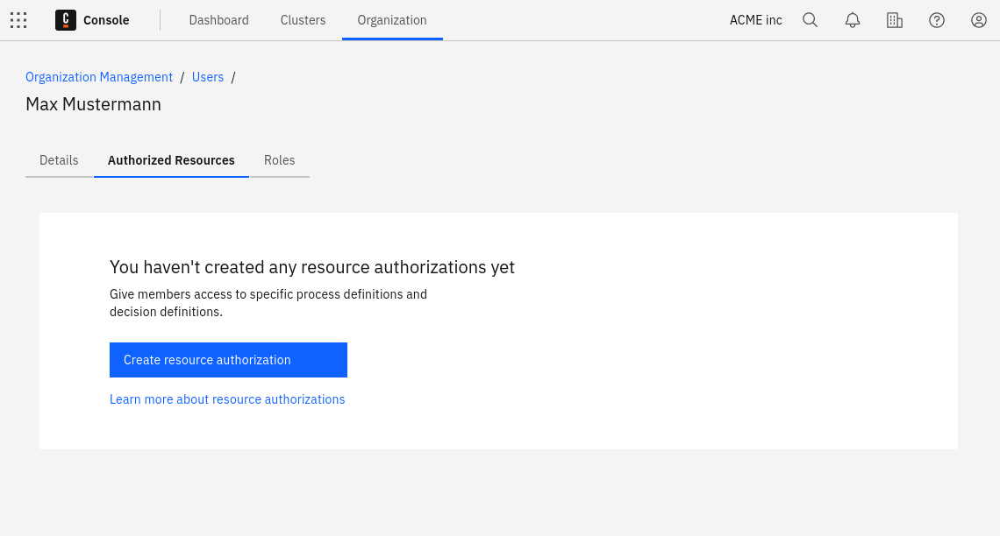
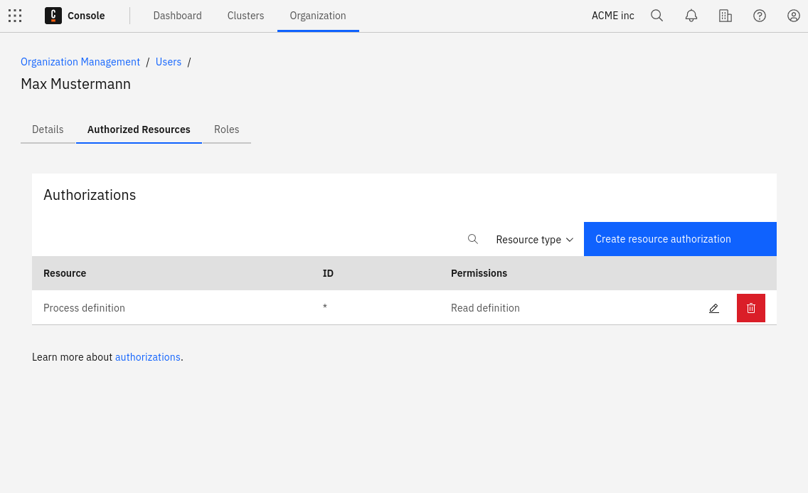

When a user signs up for Camunda 8 as the first user from their organization, company, or group, they become the owner of the Camunda organization. This organization owns Modeler files and Zeebe clusters. The owner and any admins they assign can control access to these resources through managing their organization.

## Users

An owner has all rights in an organization and can manage all settings accordingly. An organization cannot have more than one owner.

To change the owner of the organization, utilize the user administration. The current owner selects another member of the organization, and selects **Assign as owner** from the menu. In the dialog that appears, select which new roles are to be assigned to the current owner.

### Roles and permissions

In addition to the owner, the **Admin** role is available as a second role with comprehensive rights.

The admin role has the same rights as the owner, but an admin cannot manage other admins.

The following roles are additionally available, providing dedicated rights for specific elements in Camunda 8:

- **Operations Engineer**: Full access to Console, except deletion privileges. Full access to Operate and Web Modeler, except deployment privileges
- **Analyst**: Full access to Optimize and Web Modeler, except deployment privileges. Read-only access to Clusters
- **Task User**: Full access to Tasklist and Web Modeler, except deployment privileges. Read-only access to Clusters
- **Developer**: Full access to Console, except deletion privileges. Full access to Operate, Tasklist, and Web Modeler
- **Visitor**: Read-only access to Console, Operate, and Tasklist. Full access to Web Modeler, except deployment privileges
- **Modeler**: Full access to Web Modeler, except deployment privileges. Read-only access to Console and clusters, except access to cluster components

Users can be assigned multiple roles. For example, a user can have the role of **Operations Engineer** and **Task User**, which gives them access to **[Operate](../../operate/operate-introduction.md)** and **[Tasklist](../../tasklist/introduction-to-tasklist.md)**.

Users with full access to Console can update clusters and toggle [auto-updates](/reference/auto-updates.md).

Users are invited to a Camunda 8 organization via their email address, which must be accepted by the user. The user remains in the `Pending` state until the invitation is accepted.

People who do not yet have a Camunda 8 account can also be invited to an organization. To access the organization, however, the invited individual must first create a Camunda 8 account by following the instructions in the invitation email.

## Resource-based authorizations

Resource authorizations allow you to control the level of access a user has to a particular resource in the system. To create, update, or delete the resource authorizations
assigned to a user, click on the respective row of the users table.

### Creation

To initiate the creation flow, click **Create resource authorization**.

### Updating and deleting

To update an existing authorization, click on the **pencil icon** of the relevant row. To delete an existing authorization, click the **trash can** icon.

## User task access restrictions

User task access restrictions allow you to restrict access of user tasks in [Tasklist](/components/tasklist/introduction-to-tasklist.md) to users or groups where they are assignees or candidates.

For example, if a task has a candidate group named `Team A` and a candidate user named `example`, only the users that belong to `Team A` and the user `example` will have access to the task.

To learn more, visit the [user task access restrictions documentation](/components/concepts/access-control/user-task-access-restrictions.md).

## Limitations

Depending on the plan to be used, the number of users that can be part of an organization varies. If an organization is on a Starter plan, the number of users can be updated via the **Billing** page. There, under **General users**, the number can be increased or decreased.

## Restrictions

In Enterprise plans, the hostname section of the email address for invites can be restricted to meet your internal security policies. Contact your Customer Success Manager to get this configured according to your needs.
