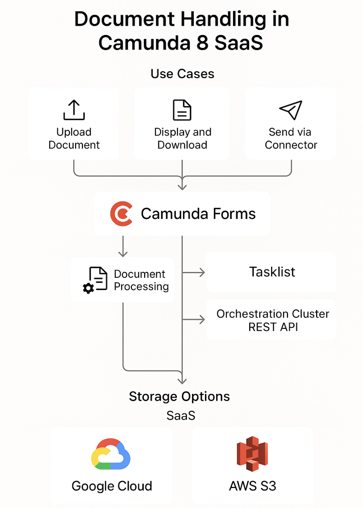

Camunda 8 provides built-in support for storing, tracking, and managing documents using Camunda Forms, connectors, Tasklist, and the [Camunda 8 REST API](/apis-tools/camunda-api-rest/specifications/create-documents.api.mdx) in both SaaS and Self-Managed.

:::note
For a closer look at storage options for handling documents in Self-Managed environments, visit the [Self-Managed configuration docs](/self-managed/concepts/document-handling/configuration/overview.md).
:::

Document handling is automatically integrated into each SaaS cluster, allowing you to manage binary data, like PDFs, images and other file types, across development and production environments without needing to configure or maintain storage infrastructure yourself.

## Use cases and capabilities

Document handling can be beneficial for different process use cases, such as uploading a document to a BPMN process, displaying and downloading a document, sending a document to an external system via a connector, and automating documents with [intelligent document processing](/components/modeler/web-modeler/idp/idp-example.md).

Step through all of these capabilities in the [use cases](/components/document-handling/overview.md) section.

## Storage options

### SaaS

Camunda SaaS manages storage for you by integrating with [**Google Cloud Platform (GCP)**](https://cloud.google.com/storage) and [**AWS S3**](https://aws.amazon.com/s3/) bucket storage.

- Each cluster automatically includes one pre-configured storage bucket. Clusters hosted on GCP use a GCP bucket. Clusters hosted on AWS use an AWS S3 bucket.
- **Maximum upload size per request (whether you're uploading one or multiple files in that request)**: 10 MB
- **File expiration time/time-to-live (TTL) policy**: 30 days. A custom expiration date can be specified via metadata for each document. The [document upload API](/apis-tools/camunda-api-rest/specifications/create-document.api.mdx) allows this. For forms, this defaults to the cluster configuration as there is no set custom TTL for forms.

### Self-Managed

If you're deploying Camunda in a Self-Managed environment, document storage must be configured manually. To learn more, visit the [Self-Managed configuration docs](/self-managed/concepts/document-handling/configuration/overview.md).

:::note
For storage options in SaaS, you cannot combine AWS and GCP, but you can in Self-Managed (for example, a cluster on GCP and document storage on AWS). This may be the case based on your existing infrastructure. However, having a cluster and document storage by the same provider (GCP or AWS) is more practical. In this case, you may reduce latency, simplify configuration, and avoid potential cross-cloud data transfer costs.
:::
