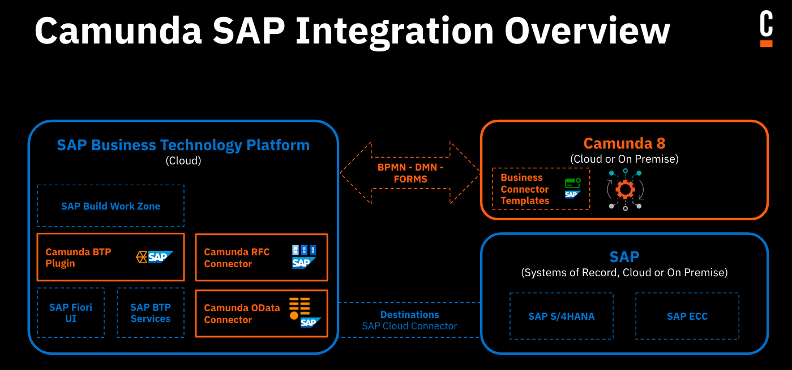

Camunda's SAP integration consists of several modules that can be used independently of one another: SAP OData, RFC, and BTP.

- [SAP OData outbound Connector](./odata-connector.md): Interact with a S/4HANA or ECC System via OData v2 + v4 APIs, directly from your BPMN model.
- [SAP RFC outbound Connector](./rfc-connector.md): Query BAPIs and remote-enabled function modules on SAP ECC systems.
- [SAP BTP plugin](./btp-plugin.md)
  - Use [Tasklist's](/components/tasklist/introduction-to-tasklist.md) forms in the Fiori UI
  - Operate SAP BTP services from [BPMN tasks](/components/modeler/bpmn/bpmn.md)
  - Inbound proxy endpoint to start process instances of BPMN models, including custom variables

These features run in the customer's [SAP BTP instance](https://www.sap.com/products/technology-platform.html). They do not require a proprietary Camunda setup, and instead re-use an existing infrastructure with minimal prerequisites.

## Technical requirements

All SAP integration artifacts have the following technical requirements:

- Camunda version 8.5+
- They run on SAP BTP, Cloud Foundry environment, and thus [need the respective service](https://discovery-center.cloud.sap/serviceCatalog/cloud-foundry-runtime?region=all).
- [(free) Destination Service](https://discovery-center.cloud.sap/serviceCatalog/destination?region=all&service_plan=lite&commercialModel=btpea) for system and service connectivity.
- If the S/4 or ECC system is located on-premises:
  - [(free) Connectivity Service](https://discovery-center.cloud.sap/serviceCatalog/connectivity-service?region=all)
  - [SAP Cloud Connector](https://help.sap.com/docs/connectivity/sap-btp-connectivity-cf/cloud-connector) configured and connected to both S/4 ECC and the BTP subaccount where the Camunda SAP integration artifacts will run.
- Technical user with respective access right to the S/4 and/or ECC system.

### SAP OData Connector

No additional requirements.

### SAP RFC Connector

- [(free) SAP Authorization and Trust Management Service](https://discovery-center.cloud.sap/serviceCatalog/authorization-and-trust-management-service?region=all)

### SAP BTP integration

- [(free) SAP Authorization and Trust Management Service](https://discovery-center.cloud.sap/serviceCatalog/authorization-and-trust-management-service?region=all)
- [PostgreSQL on SAP BTP, hyperscaler option](https://discovery-center.cloud.sap/serviceCatalog/postgresql-hyperscaler-option?region=all)

For scaling out and up, either add multiple instances of an integration module (for example, the SAP OData Connector) or equip an integration module with more runtime memory (for example, the SAP BTP plugin).

For more sophisticated tuning, all mechanisms of BTP can be applied (such as the [(free) Application Autoscaler](https://discovery-center.cloud.sap/serviceCatalog/application-autoscaler?service_plan=standard&region=all&commercialModel=btpea)), as all SAP integration artifacts fully adhere to the BTP cloud-based development standards and can be fully configured just as any custom developed apps on BTP.
