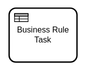

A business rule task is used to model the evaluation of a business rule; for example, a decision
modeled in [Decision Model and Notation](https://www.omg.org/dmn/) (DMN).



:::info
Camunda 8 supports alternative task implementations for the business rule task. If you want
to use your own implementation for a business rule task, refer to the [job worker
implementation](#job-worker-implementation) section below. The sections before this job worker implementation apply to the DMN
decision implementation only.
:::

:::info
If you only want to evaluate a DMN decision, you can use the
[`EvaluateDecision`](/apis-tools/zeebe-api/gateway-service.md#evaluatedecision-rpc) API.
:::

When the process instance arrives at a business rule task, a decision is evaluated using the
internal DMN decision engine. Once the decision is made, the process instance continues.

If the decision evaluation is unsuccessful, an [incident](/components/concepts/incidents.md) is
raised at the business rule task. When the incident is resolved, the decision is evaluated again.

## Defining a called decision

A called decision links the business rule task to a DMN decision, either to
a [decision table](/components/modeler/dmn/decision-table.md) or to
a [decision literal expression](/components/modeler/dmn/decision-literal-expression.md)
. It can be defined using the
`zeebe:calledDecision` extension element.

A business rule task must define the [DMN decision id](/components/modeler/dmn/decision-table.md#decision-id) of the
called decision as `decisionId`. Usually, the `decisionId` is defined as a [static value](/components/concepts/expressions.md#expressions-vs-static-values) (e.g. `shipping_box_size`), but
it can also be defined as an [expression](/components/concepts/expressions.md) (
e.g. `= "shipping_box_size_" + countryCode`). The expression is evaluated on activating the business rule task (or when
an incident at the business rule task is resolved) after input mappings have been applied. The expression must result in
a `string`.

The `bindingType` attribute determines which version of the called decision is evaluated:

- `latest`: The latest deployed version at the moment the business rule task is activated.
- `deployment`: The version that was deployed together with the currently running version of the process.
- `versionTag`: The latest deployed version that is annotated with the version tag specified in the `versionTag` attribute.

To learn more about choosing binding types, see [choosing the resource binding type](/components/best-practices/modeling/choosing-the-resource-binding-type.md).

:::note
If the `bindingType` attribute is not specified, `latest` is used as the default.
:::

A business rule task must define the process variable name of the decision result as
`resultVariable`. The result of the decision is stored in this variable. The `resultVariable`
is defined as a static value.

## Variable mappings

By default, the variable defined by `resultVariable` is merged into the process instance. This
behavior can be customized by defining an output mapping at the business rule task.

All variables in scope of the business rule task are available to the decision engine when the
decision is evaluated. Input mappings can be used to transform the variables into a format accepted
by the decision.

:::info
Input mappings are applied on activating the business rule task (or when an incident at the business
rule task is resolved), before the decision evaluation. When an incident is resolved at the business
rule task, the input mappings are applied again before evaluating the decision. This can affect
the result of the decision.
:::

For more information about this topic, visit the documentation about [input/output variable
mappings](/components/concepts/variables.md#inputoutput-variable-mappings).

## Job worker implementation

A business rule task does not have to evaluate a decision modeled with DMN. Instead, you can also
use [job workers](/components/concepts/job-workers.md) to implement your business rule task.

A job worker implementation can be defined using the `zeebe:taskDefinition` extension element.

Business rule tasks with a job worker implementation behave exactly like [service tasks](/components/modeler/bpmn/service-tasks/service-tasks.md). The differences between these task
types are the visual representation (i.e. the task marker) and the semantics for the model.

When a process instance enters a business rule task with alternative task implementation, it creates
a corresponding job and waits for its completion. A job worker should request jobs of this job type
and process them. When the job is completed, the process instance continues.

A business rule task must define a [job type](/components/modeler/bpmn/service-tasks/service-tasks.md#task-definition) the same way as a service task does. This is used as reference to specify which job workers request the respective business rule task job. For example, `order-items`. Note that `type` can be specified as any static value (`myType`) or as a FEEL [expression](../../../concepts/expressions.md) prefixed by `=` that evaluates to any FEEL string; for example, `= "order-" + priorityGroup`.

Use [task headers](/components/modeler/bpmn/service-tasks/service-tasks.md#task-headers) to pass static parameters to the job
worker (e.g. the key of the decision to evaluate).

Define [variable mappings](/components/concepts/variables.md#inputoutput-variable-mappings)
the [same way as a service task does](/components/modeler/bpmn/service-tasks/service-tasks.md#variable-mappings)
to transform the variables passed to the job worker, or to customize how the variables of the job merge.

## Additional resources

### XML representation

A business rule task with a called decision that does not specify the binding type (`latest` is used implicitly):

```xml
<bpmn:businessRuleTask id="determine-box-size" name="Determine shipping box size">
  <bpmn:extensionElements>
    <zeebe:calledDecision decisionId="shipping_box_size" resultVariable="boxSize" />
  </bpmn:extensionElements>
</bpmn:businessRuleTask>
```

A business rule task with a called decision that uses the `deployment` binding type:

```xml
<bpmn:businessRuleTask id="determine-box-size" name="Determine shipping box size">
  <bpmn:extensionElements>
    <zeebe:calledDecision decisionId="shipping_box_size" bindingType="deployment"
                          resultVariable="boxSize" />
  </bpmn:extensionElements>
</bpmn:businessRuleTask>
```

A business rule task with a called decision that uses the `versionTag` binding type:

```xml
<bpmn:businessRuleTask id="determine-box-size" name="Determine shipping box size">
  <bpmn:extensionElements>
    <zeebe:calledDecision decisionId="shipping_box_size"
                          bindingType="versionTag" versionTag="v1.0"
                          resultVariable="boxSize" />
  </bpmn:extensionElements>
</bpmn:businessRuleTask>
```

A business rule task with a job worker implementation and a custom header:

```xml
<bpmn:businessRuleTask id="calculate-risk" name="Calculate risk">
  <bpmn:extensionElements>
    <zeebe:taskDefinition type="calculate_risk" />
    <zeebe:taskHeaders>
      <zeebe:header key="decisionRef" value="risk" />
    </zeebe:taskHeaders>
  </bpmn:extensionElements>
</bpmn:businessRuleTask>
```

### References

- [DMN decision](/components/modeler/dmn/dmn.md)
- [Job handling](/components/concepts/job-workers.md)
- [Variable mappings](/components/concepts/variables.md#inputoutput-variable-mappings)
