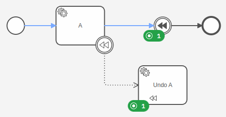
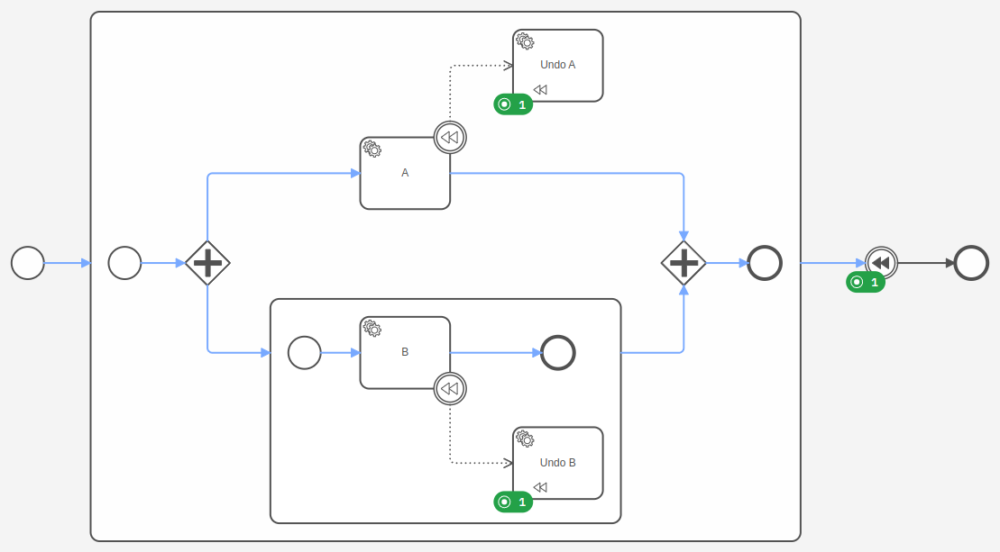
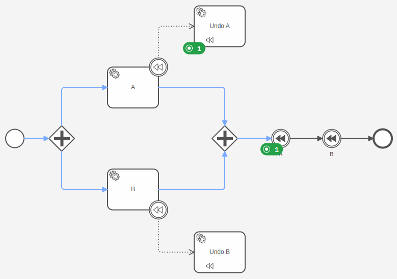
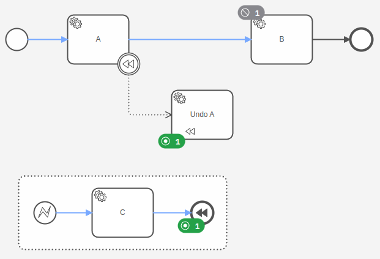

Compensation events assist with undoing steps that were already successfully completed in the case that their results
are no longer desired and need to be reversed.

To revert the effects of an activity, a compensation boundary event is attached to the activity. This activity is called
**compensation activity**. The compensation boundary event is associated with
the [compensation handler](../compensation-handler/compensation-handler.md), an activity with a compensation marker that
is in charge of reverting the effects of the compensation activity.



The example above shows the execution of compensation events:

1. After the service task `A` is completed, the process reaches the compensation intermediate throw event.
2. This invokes the compensation handler `Undo A` associated with the compensation boundary event.
3. Once the compensation handler `Undo A` is completed, the process completes the compensation intermediate throw event
   and takes the outgoing sequence flow.

## Triggering compensation

When a process instance enters a compensation intermediate throw or end event, it triggers the compensation within its
scope and invokes all compensation handlers of completed activities. The compensation handlers of active or terminated
activities are not invoked. The compensation throw event remains active until all invoked compensation handlers are
completed.

:::note
The process instance invokes all compensation handlers at once without any specific order. If the order is
important, the compensation can be triggered for a specific activity. Read more about this
case in [triggering compensation for an activity](#triggering-compensation-for-a-specific-activity).
:::

## Compensating embedded subprocesses

If a process instance enters a compensation throw event and there are
completed [embedded subprocesses](/components/modeler/bpmn/embedded-subprocesses/embedded-subprocesses.md) in the
same scope, it invokes the compensation handlers within these subprocesses and nested subprocesses. The compensation
handlers are not invoked if the subprocess is active or terminated.



If the compensation throw event is inside an embedded subprocess, the process instance invokes only the compensation
handlers within the subprocess. It doesn't invoke any compensation handler outside the subprocess.

:::info

Compensation handlers of child processes are not invoked. The triggering of the compensation stops at the call activity.
To revert the effects of a child process, attach a compensation boundary event on the call activity. Read more about
this in [call activities as compensation handlers](../compensation-handler/compensation-handler.md#call-activity-as-compensation-handler).

:::

## Compensating multi-instance activities

The compensation handler of a multi-instance activity is invoked only once, rather than for each item in the input
collection. The compensation handler is responsible for reverting the effects of all instances of the multi-instance
activity.


To revert the effects of each instance separately, the compensation handler could be marked as multi-instance as well.
Read more about this in [multi-instance activities as compensation handlers](../compensation-handler/compensation-handler.md#multi-instance-activity-as-compensation-handler).

:::note
The process instance invokes the compensation handler only if all instances of the multi-instance activity are
completed.
:::

## Triggering compensation for a specific activity

By default, a compensation throw event invokes all compensation handlers in its scope. However, it is also possible to
trigger the compensation for a specific activity. This can be used to enforce that compensation handlers are invoked
synchronously in a given order.



On a compensation intermediate throw or end event, it is possible to specify the activity to compensate by using the
property `activityRef`. The referenced activity must have a compensation boundary event and must be in the same scope of
the compensation throw event.

## Triggering compensation from an event subprocess

An interrupting or non-interrupting event subprocess can contain compensation intermediate throw events or a
compensation end event. These compensation events can specify an activity or broadcast the compensation within the outer
scope of the event subprocess.



A common pattern is to use this in combination with an error event subprocess to revert the effects of compensation
activities if a failure occurs that can't be recovered from.

## Additional resources

### XML representation

An intermediate compensation throw event with a referenced activity:

```xml
<intermediateThrowEvent id="CompensationThrowEvent">
    <incoming>Flow_0b2blc2</incoming>
    <outgoing>Flow_1goayj7</outgoing>
    <compensateEventDefinition id="CompensateEventDefinition_1afu1vn" activityRef="Task_A" />
</intermediateThrowEvent>
```
