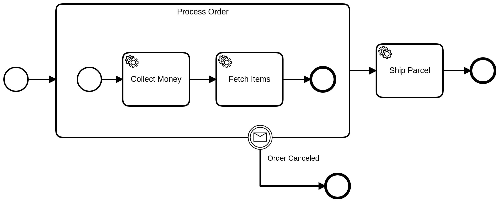
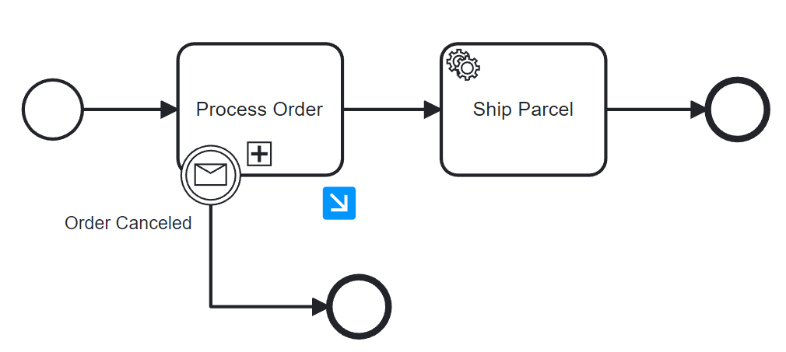

An embedded subprocess allows you to group elements of the process.



An embedded subprocess must have exactly **one** none start event. Other start events are not allowed.

When an embedded subprocess is entered, the start event is activated. The subprocess stays active as long as one containing element is active. When the last element is completed, the subprocess is completed and the outgoing sequence flow is taken.

Embedded subprocesses are often used together with **boundary events**. One or more boundary events can be attached to a subprocess. When an interrupting boundary event is triggered, the entire subprocess (including all active elements) is terminated.

When adding an embedded subprocess to your model, you can either add a collapsed or expanded subprocess. You cannot collapse an existing expanded subprocess in your model.

## Collapsed subprocesses

:::caution
Collapsed subprocesses are currently only partially supported by Optimize. While diagrams containing collapsed subprocesses can be imported, it is not possible to drill down into the subprocesses.

All other Camunda components fully support collapsed subprocesses.
:::

A collapsed subprocess conceals its internal details, thereby hiding complexity within an activity and enabling the nesting of multiple levels of subprocesses. This functionality allows you to simplify the view of a process diagram and facilitates drill-down capabilities to examine details.

Collapsed subprocesses serve purely display purposes. For the creation of reusable processes, it is recommended to utilize [call activities](../call-activities/call-activities.md).



## Variable mappings

Input mappings can be used to create new local variables in the scope of the subprocess. These variables are only visible within the subprocess.

By default, the local variables of the subprocess are not propagated (i.e. they are removed with the scope.) This behavior can be customized by defining output mappings at the subprocess. The output mappings are applied on completing the subprocess.

## Additional resources

### XML representation

An embedded subprocess with a start event:

```xml
<bpmn:subProcess id="process-order" name="Process Order">
  <bpmn:startEvent id="order-placed" />
  ... more contained elements ...
</bpmn:subProcess>
```

### References

- [Variable mappings](/components/concepts/variables.md#inputoutput-variable-mappings)
