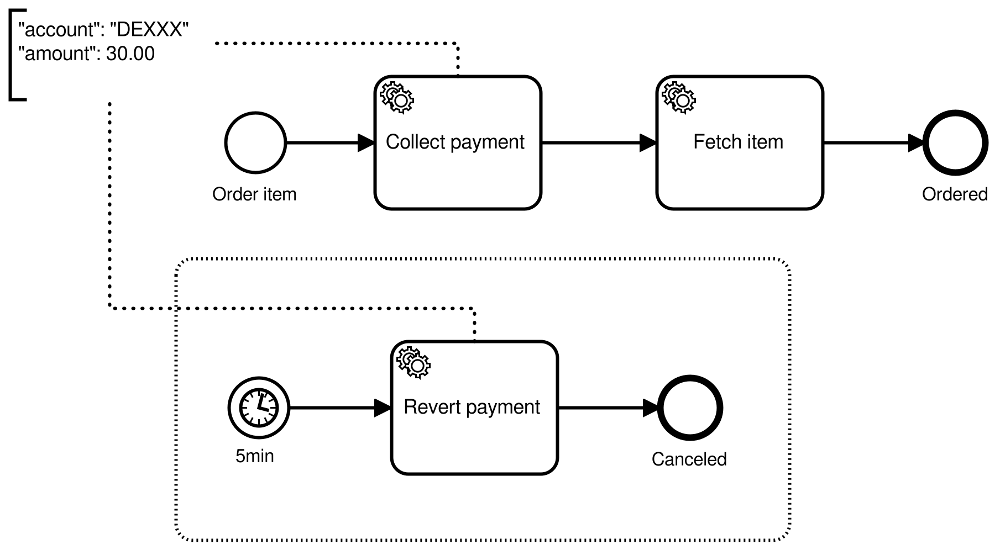

An event subprocess is a subprocess triggered by an event. This can be added globally to the process, or locally inside an embedded subprocess.



An event subprocess must have exactly **one** start event of one of the following types:

- [Timer](../timer-events/timer-events.md)
- [Message](../message-events/message-events.md)
- [Error](../error-events/error-events.md)

An event subprocess behaves like a boundary event, but is inside the scope instead of attached to the scope. Like a boundary event, the event subprocess can be interrupting or non-interrupting (indicated in BPMN by a solid or dashed border of the start event). The start event of the event subprocess can be triggered when its containing scope is activated.

A non-interrupting event subprocess can be triggered multiple times. An interrupting event subprocess can be triggered only once.

When an interrupting event subprocess is triggered, all active instances of its containing scope are terminated, including instances of other non-interrupting event subprocesses.

If an event subprocess is triggered, its containing scope is not completed until the triggered instance is completed.

## Variables

Unlike a boundary event, an event subprocess is inside the scope. Therefore, it can access and modify all local variables of its containing scope. This is not possible with a boundary event because a boundary event is outside of the scope.

Input mappings can be used to create new local variables in the scope of the event subprocess. These variables are only visible within the event subprocess. If no input mappings are defined, the [default behavior](../../../concepts/variables.md#variable-scopes) is applied to the variables alongside the event.

By default, the local variables of the event subprocess are not propagated (i.e. removed with the scope). This behavior can be customized by defining output mappings at the event subprocess. The output mappings are applied on completion of the event subprocess.

## Additional resources

### XML representation

An event subprocess with an interrupting timer start event:

```xml
<bpmn:subProcess id="compensate-subprocess" triggeredByEvent="true">
  <bpmn:startEvent id="cancel-order" isInterrupting="true">
    <bpmn:timerEventDefinition>
      <bpmn:timeDuration>PT5M</bpmn:timeDuration>
    </bpmn:timerEventDefinition>
  ... other elements
</bpmn:subProcess>
```

### References

- [Embedded subprocess](../embedded-subprocesses/embedded-subprocesses.md)
- [Variable scopes](/components/concepts/variables.md#variable-scopes)
