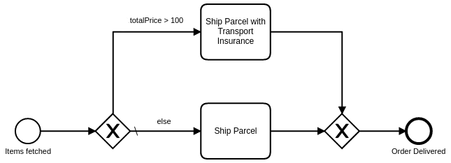

An exclusive gateway (or XOR-gateway) allows you to make a decision based on data (i.e. on process instance variables).



If an exclusive gateway has multiple outgoing sequence flows, all sequence flows except one must have a `conditionExpression` to define when the flow is taken. The gateway can have one sequence flow without `conditionExpression`, which must be defined as the default flow.

When an exclusive gateway is entered, the `conditionExpression` is evaluated. The process instance takes the first sequence flow where the condition is fulfilled.

If no condition is fulfilled, it takes the **default flow** of the gateway. If the gateway has no default flow, an [incident](/components/concepts/incidents.md) is created.

An exclusive gateway can also be used to join multiple incoming flows together and improve the readability of the BPMN. A joining gateway has a pass-through semantic and doesn't merge the incoming concurrent flows like a parallel gateway.

## Conditions

A `conditionExpression` defines when a flow is taken. It is a [boolean expression](/components/modeler/feel/language-guide/feel-boolean-expressions.md) that can access the process instance variables and compare them with literals or other variables. The condition is fulfilled when the expression returns `true`.

Multiple boolean values or comparisons can be combined as disjunction (`or`) or conjunction (`and`).

For example:

```feel
= totalPrice > 100

= order.customer = "Paul"

= orderCount > 15 or totalPrice > 50

= valid and orderCount > 0
```

## Additional resources

### XML representation

An exclusive gateway with two outgoing sequence flows:

```xml
<bpmn:exclusiveGateway id="exclusiveGateway" default="else" />

<bpmn:sequenceFlow id="priceGreaterThan100" name="totalPrice &#62; 100"
  sourceRef="exclusiveGateway" targetRef="shipParcelWithInsurance">
  <bpmn:conditionExpression xsi:type="bpmn:tFormalExpression">
    = totalPrice &gt; 100
  </bpmn:conditionExpression>
</bpmn:sequenceFlow>

<bpmn:sequenceFlow id="else" name="else"
  sourceRef="exclusiveGateway" targetRef="shipParcel" />
```

### References

- [Expressions](/components/concepts/expressions.md)
- [Incidents](/components/concepts/incidents.md)
