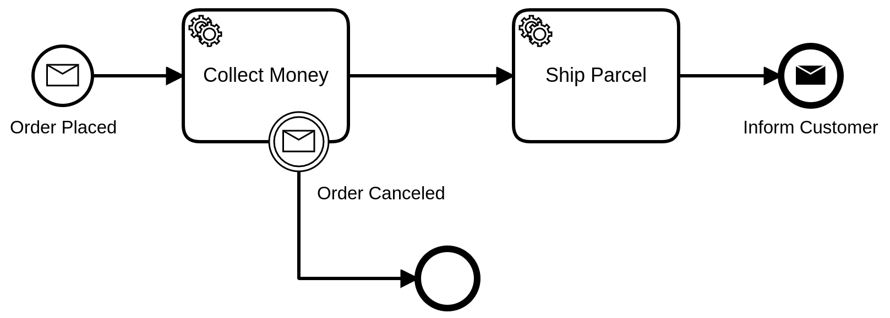

Message events are events which reference a message; they are used to wait until a proper message is received.



## Message start events

A process can have one or more message start events (besides other types of start events). Each of the message events must have a unique message name.

When a process is deployed, it creates a message subscription for each message start event. Message subscriptions of the previous version of the process (based on the BPMN process ID) are closed.

### Message correlation

When the message subscription is created, a message can be correlated to the start event if the message name matches. On correlating the message, a new process instance is created and the corresponding message start event is activated.

Messages are **not** correlated if they were published before the process was deployed or if a new version of the process is deployed without a proper start event.

The `correlationKey` of a published message can be used to control the process instance creation.

- If an instance of this process is active (independently from its version) and it was triggered by a message with the same `correlationKey`, the message is **not** correlated and no new instance is created. If the message has a time-to-live (TTL) > 0, it is buffered.
- When the active process instance is completed or terminated and a message with the same `correlationKey` and a matching message name is buffered (that is, TTL > 0), this message is correlated and a new instance of the latest version of the process is created.

If the `correlationKey` of a message is empty, it creates a new process instance and does not check if an instance is already active.

:::note

You do not specify a `correlationKey` for a message start event in the BPMN model when designing a process.

- When an application sends a message that is caught by a message start event, the application can specify a `correlationKey` in the message.
- If a message caught by a start event contains a `correlationKey` value, the created process is tagged with that `correlationKey` value.
- Follow-up messages are then checked against this `correlationKey` value (that is, is there an active process instance that was started by a message with the same `correlationKey`?).

:::

## Intermediate message catch events

When an intermediate message catch event is entered, a corresponding message subscription is created. The process instance stops at this point and waits until the message is correlated. When a message is correlated, the catch event is completed and the process instance continues.

:::note
An alternative to intermediate message catch events is a [receive task](../receive-tasks/receive-tasks.md), which behaves the same but can be used together with boundary events.
:::

## Message boundary events

An activity can have one or more message boundary events. Each of the message events must have a unique message name.

When the activity is entered, it creates a corresponding message subscription for each boundary message event. If a non-interrupting boundary event is triggered, the activity is not terminated and multiple messages can be correlated.

## Message throw events

A process can contain intermediate message throw events or message end events to model the
publication of a message to an external system; for example, to a Kafka topic.

Currently, intermediate message throw events and message end events behave exactly
like [service tasks](../service-tasks/service-tasks.md) or [send tasks](../send-tasks/send-tasks.md)
, and have the same job-related properties (e.g. job type, custom headers, etc.) The message throw
events and the tasks are based on jobs
and [job workers](../../../../components/concepts/job-workers.md). The differences between the message
throw events and the tasks are the visual representation and the semantics for the model. Read more
about the [job properties](../../../../components/concepts/job-workers.md).

When a process instance enters a message throw event, it creates a corresponding job and waits for
its completion. A job worker should request jobs of this job type and process them. When the job is
complete, the process instance continues or completes if it is a message end event.

:::note
Message throw events are not processed by Zeebe itself (i.e. to correlate a message to a message
catch event). Instead, it creates jobs with the defined job type. To process them, provide a job
worker.
:::

## Messages

A message can be referenced by one or more message events. It must define the name of the message (e.g. `Money collected`) and the `correlationKey` expression (e.g. `= orderId`). If the message is only referenced by message start events, the `correlationKey` is not required.

Usually, the name of the message is defined as a [static value](/components/concepts/expressions.md#expressions-vs-static-values) (e.g. `order canceled`), but it can also be defined as [expression](/components/concepts/expressions.md) (e.g. `= "order " + awaitingAction`). If the expression belongs to a message start event of the process, it is evaluated on deploying the process. Otherwise, it is evaluated on activating the message event. The evaluation must result in a `string`.

The `correlationKey` is an expression that usually [accesses a variable](/components/modeler/feel/language-guide/feel-variables.md#access-variable) of the process instance that holds the correlation key of the message. The expression is evaluated on activating the message event and must result either in a `string` or in a `number`.

To correlate a message to the message event, the message is published with the defined name (e.g. `Money collected`) and the **value** of the `correlationKey` expression. For example, if the process instance has a variable `orderId` with value `"order-123"`, the message must be published with the correlation key `"order-123"`.

## Variable mappings

By default, all message variables are merged into the process instance. This behavior can be customized by defining an output mapping at the message catch event.

Visit the documentation regarding [variable mappings](/components/concepts/variables.md#inputoutput-variable-mappings) for more information on this topic.

## Additional resources

### XML representation

A message start event with message definition:

```xml
<bpmn:message id="Message_0z0aft4" name="order-placed" />

<bpmn:startEvent id="order-placed" name="Order placed">
  <bpmn:messageEventDefinition messageRef="Message_0z0aft4" />
</bpmn:startEvent>
```

An intermediate message catch event with message definition:

```xml
<bpmn:message id="Message_1iz5qtq" name="money-collected">
  <bpmn:extensionElements>
    <zeebe:subscription correlationKey="= orderId" />
  </bpmn:extensionElements>
</bpmn:message>

<bpmn:intermediateCatchEvent id="money-collected" name="Money collected" >
  <bpmn:messageEventDefinition messageRef="Message_1iz5qtq" />
</bpmn:intermediateCatchEvent>
```

A boundary message event:

```xml
<bpmn:boundaryEvent id="order-canceled" name="Order Canceled"
  attachedToRef="collect-money">
  <bpmn:messageEventDefinition messageRef="Message_1iz5qtq" />
</bpmn:boundaryEvent>
```

### References

- [Message correlation](/components/concepts/messages.md)
- [Expressions](/components/concepts/expressions.md)
- [Variable mappings](/components/concepts/variables.md#inputoutput-variable-mappings)
- [Incidents](/components/concepts/incidents.md)
- [Job handling](/components/concepts/job-workers.md)
