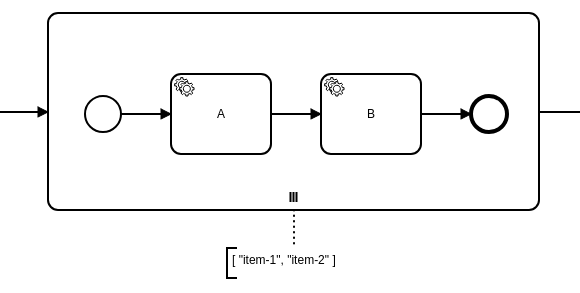
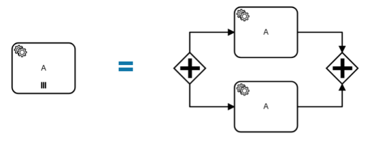
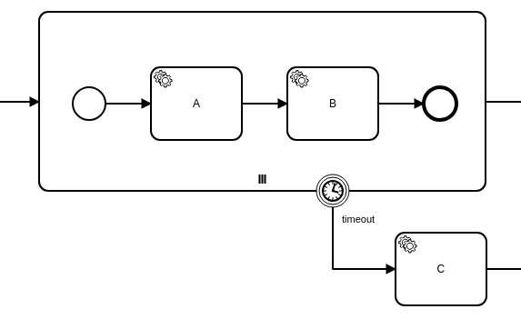

A multi-instance activity is executed multiple times - once for each element of a given collection (like a _foreach_ loop in a programming language).

The following activities can be marked as multi-instance:

- [Service tasks](../service-tasks/service-tasks.md)
- [Receive tasks](../receive-tasks/receive-tasks.md)
- [Embedded subprocesses](../embedded-subprocesses/embedded-subprocesses.md)
- [Call activities](../call-activities/call-activities.md)



On the execution level, a multi-instance activity has two parts: a multi-instance body, and an inner activity. The multi-instance body is the container for all instances of the inner activity.

When the activity is entered, the multi-instance body is activated and one instance for every element of the `inputCollection` is created (sequentially or in parallel). When all instances are completed, the body is completed and the activity is left.

## Sequential vs. parallel

A multi-instance activity is executed either sequentially or in parallel (default). In the BPMN, a sequential multi-instance activity is displayed with three horizontal lines at the bottom. A parallel multi-instance activity is represented by three vertical lines.

In case of a **sequential** multi-instance activity, the instances are executed one at a time. When one instance is completed, a new instance is created for the next element in the `inputCollection`.


In case of a **parallel** multi-instance activity, all instances are created when the multi-instance body is activated. The instances are executed concurrently and independently from each other.



## Defining the collection to iterate over

A multi-instance activity must have an `inputCollection` expression that defines the collection to iterate over (e.g. `= items`). Usually, it [accesses a variable](/components/modeler/feel/language-guide/feel-variables.md#access-variable) of the process instance that holds the collection. The expression is evaluated on activating the multi-instance body. It must result in an `array` of any type (e.g. `["item-1", "item-2"]`).

:::tip

If you need to iterate `n` times (like with a loop-cardinality), you can use the following expression with a [for-loop](/components/modeler/feel/language-guide/feel-control-flow.md#for-loops): `for i in 1..n return i`.

:::

To access the current element of the `inputCollection` value within the instance, the multi-instance activity can define the `inputElement` variable (e.g. `item`). The element is stored as a local variable of the instance under the given name.

If the `inputCollection` value is **empty**, the multi-instance body is completed immediately and no instances are created. It behaves like the activity is skipped.

## Collecting the output

The output of a multi-instance activity (e.g. the result of a calculation) can be collected from the instances by defining the `outputCollection` and the `outputElement` expression.

`outputCollection` defines the name of the variable under which the collected output is stored (e.g. `results`). It is created as a local variable of the multi-instance body and is updated when an instance is completed. When the multi-instance body is completed, the variable is propagated to its parent scope.

`outputElement` is an expression that defines the output of the instance (e.g. `= result`). Usually, it [accesses a variable](/components/modeler/feel/language-guide/feel-variables.md#access-variable) of the instance that holds the output value. If the expression only accesses a variable or a nested property, it's created as a **local variable** of the instance. This variable should be updated with the output value; for example, by a job worker providing a variable with the name `result`. Since the variable is defined as a local variable, it is not propagated to its parent scope and is only visible within the instance.

When the instance is completed, the `outputElement` expression is evaluated and the result is inserted into the `outputCollection` at the same index as the `inputElement` of the `inputCollection`. Therefore, the order of the `outputCollection` is determined and matches to the `inputCollection`, even for parallel multi-instance activities. If the `outputElement` variable is not updated, `null` is inserted instead.

If the `inputCollection` value is empty, an empty array is propagated as `outputCollection`.

## Boundary events



Interrupting and non-interrupting boundary events can be attached to a multi-instance activity.

When an interrupting boundary event is triggered, the multi-instance body and all active instances are terminated. The `outputCollection` variable is not propagated to the parent scope (i.e. no partial output).

When a non-interrupting boundary event is triggered, the instances are not affected. The activities at the outgoing path have no access to the local variables since they are bound to the multi-instance activity.

## Special multi-instance variables

Every instance has a local variable `loopCounter`. It holds the index in the `inputCollection` of this instance, starting with `1`.

## Variable mappings

Input and output variable mappings can be defined at the multi-instance activity; they are applied on each instance on activating and on completing.

The input mappings can be used to create new local variables in the scope of an instance. These variables are only visible within the instance; it is a way to restrict the visibility of variables. By default, new variables (e.g. provided by a job worker) are created in the scope of the process instance and are visible to all instances of the multi-instance activity as well as outside of it.

In case of a parallel multi-instance activity, this can lead to variables that are modified by multiple instances and result in race conditions. If a variable is defined as a local variable, it is not propagated to a parent or the process instance scope and can't be modified outside the instance.

The input mappings can access the local variables of the instance (e.g. `inputElement`, `loopCounter`); for example, to extract parts of the `inputElement` variable and apply them to separate variables.

The output mappings can be used to update the `outputElement` variable; for example, to extract a part of the job variables.

**Example:** We have a call activity marked as a parallel multi-instance. When the called process instance completes, its variables are [merged](/components/concepts/variables.md#variable-propagation) into the call activity's process instance. Its result is collected in the output collection variable, but this has become a race condition where each completed child instance again overwrites this same variable. We end up with a corrupted output collection. An output mapping can be used to overcome this, because it restricts which variables are merged. In the case of:

- Parallel multi-instance call activity
- Multi-instance output element: `=output`
- Variable in the child instance that holds the result: `x`

The output mapping on the call activity should be:

```
source: =x
target: output
```

## Completion condition

A `completionCondition` defines whether the multi-instance body can be completed immediately when the condition is satisfied. It is a [boolean expression](/components/modeler/feel/language-guide/feel-boolean-expressions.md) that will be evaluated each time the instance of the multi-instance body completes. Any instances that are still active are terminated and the multi-instance body is completed when the expression evaluates to `true`.

The BPMN 2.0 specification defines the following properties of a multi-instance body:

- `numberOfInstances`: The number of instances created.
- `numberOfActiveInstances`: The number of instances currently active.
- `numberOfCompletedInstances`: The number of instances already completed.
- `numberOfTerminatedInstances`: The number of instances already terminated.

These properties are available for use in the `completionCondition` expression. For example, using these properties you can express "complete the multi-instance body when 50% or more of the instances already completed" as `= numberOfCompletedInstances / numberOfInstances >= 0.5`. Although these properties are available in this expression, they do not exist as process variables. These properties take precedence over process variables with the same name.

Multiple boolean values or comparisons can be combined as disjunction (`and`) or conjunction (`or`).

For example:

```feel
= result.isSuccessful

= count(["a", "b", "c", "d"]) > 3

= orderCount >= 5 and orderCount < 15

= list contains([6,7], today().weekday)

= numberOfCompletedInstances = 2

= numberOfCompletedInstances / numberOfInstances >= 0.5
```

## Additional resources

### XML representation

A sequential multi-instance service task:

```xml
<bpmn:serviceTask id="task-A" name="A">
  <bpmn:multiInstanceLoopCharacteristics isSequential="true">
    <bpmn:extensionElements>
      <zeebe:loopCharacteristics
          inputCollection="= items" inputElement="item"
          outputCollection="results" outputElement="= result" />
    </bpmn:extensionElements>
    <bpmn:completionCondition xsi:type="bpmn:tFormalExpression">
        = result.isSuccessful
    </bpmn:completionCondition>
  </bpmn:multiInstanceLoopCharacteristics>
</bpmn:serviceTask>
```

### References

- [Variable scopes](/components/concepts/variables.md#variable-scopes)
- [Expressions](/components/concepts/expressions.md)
- [Variable mappings](/components/concepts/variables.md#inputoutput-variable-mappings)
