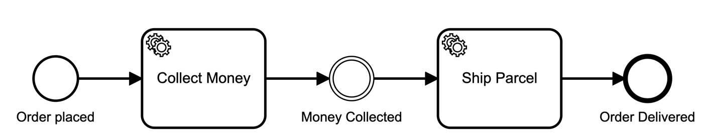

None events are unspecified events, also called "blank" events.



## None start events

At most, a process can have **one** none start event (besides other types of start events).

A none start event is where the process instance or a subprocess starts when the process or the subprocess is activated.

A none start event is required if you want to [trigger a process via a form](../../web-modeler/run-or-publish-your-process.md#publish-via-a-public-form).

## None end events

A process or subprocess can have multiple none end events. When a none end event is entered, the current execution path ends. If the process instance or subprocess has no more active execution paths, it is completed.

If an activity has no outgoing sequence flow, it behaves the same as it would be connected to a none end event. When the activity is completed, the current execution path ends.

## Intermediate none events (throwing)

Intermediate none events can be used to indicate some state achieved in the process. They are especially useful for monitoring to understand how the process is doing, for example, as milestones or key performance indicators (KPIs).

The engine itself doesn't do anything in the event, it just passes through it.

## Variable mappings

All none events can have [variable output mappings](../../../../components/concepts/variables.md#output-mappings).

For start events, this is often used to initialize process variables.

## Additional resources

### XML representation

A none start event:

```xml
<bpmn:startEvent id="order-placed" name="Order Placed" />
```

A none end event:

```xml
<bpmn:endEvent id="order-delivered" name="Order Delivered" />
```

An intermediate none event:

```xml
<bpmn:intermediateThrowEvent id="money-collected" name="Money Collected" />
```
