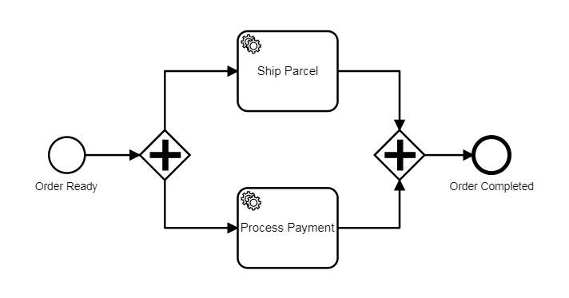

A parallel gateway (or AND-gateway) allows you to split the flow into concurrent paths.



When a parallel gateway with multiple outgoing sequence flows is entered, all flows are taken. The paths are executed concurrently and independently.

The concurrent paths can be joined using a parallel gateway with multiple incoming sequence flows. The process instance waits at the parallel gateway until each incoming sequence is taken.

:::note
The outgoing paths of the parallel gateway are executed concurrently and not parallel in the sense of parallel threads. All records of a process instance are written to the same partition (single stream processor).
:::

## Additional resources

### XML representation

A parallel gateway with two outgoing sequence flows:

```xml
<bpmn:parallelGateway id="split" />

<bpmn:sequenceFlow id="to-ship-parcel" sourceRef="split"
  targetRef="shipParcel" />

<bpmn:sequenceFlow id="to-process-payment" sourceRef="split"
  targetRef="processPayment" />
```
