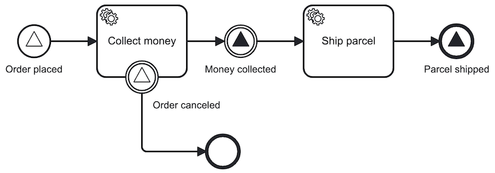

Signal events are events which reference a [signal](../../../concepts/signals.md).
Broadcasting a signal will trigger _all_ signal events matching the name of the broadcasted signal.



## Signal start events

Signal start events can be used to start process instances. Deploying several processes with a signal start event enables
creation of multiple process instances by performing a single broadcast.

Broadcasting a signal iterates over the available subscriptions. If the name of the broadcasted signal matches the
name of the signal start event, the process instance is created.

Signal subscriptions only exist for the latest version of a process definition. Deploying a new version of the same
process (based on the BPMN process ID) will delete the old signal subscription. A new subscription is opened for the
new deployed process definition. When the latest version of a process is deleted, the signal subscription is also deleted. If the previous version of the same process (based on the BPMN process ID) contains a signal start event, a new subscription
is opened for it.

## Signal intermediate catch events

When a signal intermediate catch event is entered, a signal subscription is created.
The process instance stops at this point and waits until it is triggered by a broadcasted signal with the same name.

Broadcasting a signal will iterate over the available subscriptions. If the name of the broadcasted signal matches the
name of the signal subscription, it triggers the signal subscription.

When the subscription is triggered, the corresponding signal catch event is completed and the process instance continues.

## Signal boundary events

An activity can have one or more signal boundary events.
Each of the signal events must have a unique signal name.

When the activity is entered, it creates a signal subscription for each boundary signal event.
If a non-interrupting boundary event is triggered, the activity is not terminated and multiple broadcasted signals can
trigger the boundary events.

## Signal throw events

A process can contain signal intermediate throw events or signal end events to model the broadcasting of a signal.

When a signal throw events is entered, it broadcasts a signal that can trigger signal subscriptions.

## Signals

In BPMN, a signal event references a `signal`.
Signals can be referenced by one or more signal events.

A signal must define a `name`. The value is used to determine:

- The name of the signal to broadcast for a signal throw event.
- The name of the signal to subscribe to for a signal catch event.

Usually, the name of the signal is defined as a [static value](../../../concepts/expressions/#expressions-vs-static-values)
(e.g. `order canceled`), but it can also be defined as an [expression](../../../concepts/expressions/)
(e.g. `= "order " + awaitingAction`). If the expression belongs to a signal start event of the process, it is evaluated
on deploying the process. Otherwise, it is evaluated on activating the signal event. The evaluation must result in a
`string`.

## Variable mappings

When broadcasting a signal you can pass along variables.

By default, all signal variables are merged into the process instance.
This behavior can be customized by defining an output mapping at the signal catch event.

When a signal throw event broadcasts a signal, all local variables are passed along.
You can use input mappings to define these local variables.

For more information about variable scopes, visit the documentation about [variable scopes](../../../concepts/variables#variable-scopes).

## Additional resources

### XML representation

A signal start event with signal definition:

```xml
<bpmn:startEvent id="startEventId" name="Order placed">
    <bpmn:signalEventDefinition id="signalEventDefinitionId" signalRef="signalId" />
</bpmn:startEvent>

<bpmn:signal id="signalId" name="order placed" />
```

A signal boundary event with signal definition:

```xml
<bpmn:boundaryEvent id="order-canceled" name="Order canceled" attachedToRef="ActivityId">
  <bpmn:signalEventDefinition id="signalId" />
</bpmn:boundaryEvent>

<bpmn:signal id="signalId" name="order canceled" />
```

A signal intermediate catch event with signal definition:

```xml
<bpmn:intermediateThrowEvent id="money-collected" name="Money collected">
    <bpmn:signalEventDefinition id="signalEventDefinitionId" signalRef="signalId" />
</bpmn:intermediateThrowEvent>

<bpmn:signal id="signalId" name="money collected" />
```

A signal end event with signal definition:

```xml
<bpmn:endEvent id="parcel_shipped" name="Parcel shipped">
  <bpmn:signalEventDefinition id="signalEventDefinitionId" signalRef="signalId" />
</bpmn:endEvent>

<bpmn:signal id="signalId" name="parcel shipped" />
```
