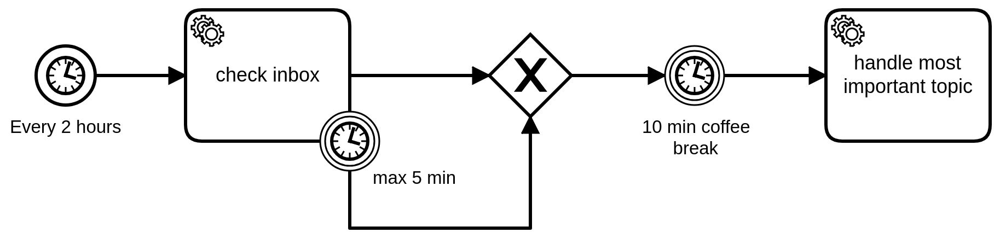

Timer events are events triggered by a defined timer.



## Timer start events

A process can have one or more timer start events (besides other types of start events). Each of the timer events must have either a time date or time cycle definition.

When a process is deployed, it schedules a timer for each timer start event. Scheduled timers of the previous version of the process (based on the BPMN process ID) are canceled.

When a timer is triggered, a new process instance is created and the corresponding timer start event is activated.

## Intermediate timer catch events

An intermediate timer catch event can either be a time duration, or a time date.

When an intermediate timer catch event is entered, a corresponding timer is scheduled. The process instance stops at this point and waits until the timer is triggered. When the timer is triggered, the catch event is completed and the process instance continues.

## Timer boundary events

An interrupting timer boundary event must have a time duration, or a time date definition. When the corresponding timer
is triggered, the activity is terminated. Interrupting timer boundary events are often used to model timeouts; for
example, canceling the processing after five minutes and doing something else.

A non-interrupting timer boundary event must have either a time duration, a time cycle definition, or a time date
definition. When the activity is entered, it schedules a corresponding timer. If the timer is triggered and defined as
time cycle with repetitions greater than zero, it schedules the timer again until the defined number of repetitions is
reached. It's important to note that a non-interrupting timer boundary event that's defined with a time duration will
only trigger a single time once the date is reached.

Non-interrupting timer boundary events are often used to model notifications; for example, contacting support if the processing takes longer than an hour.

## Timers

Timers must be defined by providing either a date, a duration, or a cycle.

A timer can be defined either as a [static value](/components/concepts/expressions.md#expressions-vs-static-values) (e.g. `P3D`) or as an [expression](/components/concepts/expressions.md). There are two common ways to use an expression:

- [Access a variable](/components/modeler/feel/language-guide/feel-variables.md#access-variable) (e.g. `= remainingTime`).
- [Use temporal values](/components/concepts/expressions.md#temporal-expressions) (e.g. `= date and time(expirationDate) - date and time(creationDate)`).

If the expression belongs to a timer start event of the process, it is evaluated on deploying the process. Otherwise, it is evaluated on activating the timer catch event. The evaluation must result in either a `string` that has the same ISO 8601 format as the static value, or an equivalent temporal value (i.e. a date-time, a duration, or a cycle).

:::note
Zeebe is an asynchronous system. As a result, there is no guarantee a timer triggers exactly at the configured time.

Depending on how much load the system is under, timers could trigger later than their due date. However, timers will never trigger earlier than the due date.
:::

### Time date

import ISO8601DateTime from '../assets/react-components/iso-8601-date-time.md'

<ISO8601DateTime/>

### Time duration

A duration is defined as a ISO 8601 durations format, which defines the amount of intervening time in a time interval and are represented by the format `P(n)Y(n)M(n)DT(n)H(n)M(n)S`. Note that the `n` is replaced by the value for each of the date and time elements that follow the `n`.

The capital letters _P_, _Y_, _M_, _W_, _D_, _T_, _H_, _M_, and _S_ are designators for each of the date and time elements and are not replaced, but can be omitted.

- _P_ is the duration designator (for period) placed at the start of the duration representation.
- _Y_ is the year designator that follows the value for the number of years.
- _M_ is the month designator that follows the value for the number of months.
- _W_ is the week designator that follows the value for the number of weeks.
- _D_ is the day designator that follows the value for the number of days.
- _T_ is the time designator that precedes the time components of the representation.
- _H_ is the hour designator that follows the value for the number of hours.
- _M_ is the minute designator that follows the value for the number of minutes.
- _S_ is the second designator that follows the value for the number of seconds.

Examples:

- `PT15S` - 15 seconds
- `PT1H30M` - 1 hour and 30 minutes
- `P14D` - 14 days
- `P14DT1H30M` - 14 days, 1 hour and 30 minutes
- `P3Y6M4DT12H30M5S` - 3 years, 6 months, 4 days, 12 hours, 30 minutes and 5 seconds

If the duration is zero or negative, the timer fires immediately.

### Time cycle

A cycle defined as ISO 8601 repeating intervals format; it contains the duration and the number of repetitions. If the repetitions are not defined, the timer repeats infinitely until it is canceled.

- `R5/PT10S`: Every 10 seconds, up to five times
- `R/P1D`: Every day, infinitely

It's possible to define a start time. By doing this, the timer triggers for the first time on the given start time. Afterwards, it will follow the interval as usual.

- `R3/2022-04-27T17:20:00Z/P1D`: Every day up to three times, starting from April 27, 2022 at 5:20 p.m. UTC
- `R/2022-01-01T10:00:00+02:00[Europe/Berlin]/P1D`: Every day infinitely, starting from January 1, 2022 at 10 a.m. UTC plus 2 hours

Additionally, you can specify a time cycle using cron expressions. Refer to the [CronExpression Tutorial](https://spring.io/blog/2020/11/10/new-in-spring-5-3-improved-cron-expressions) for additional information about using cron expressions.

- `0 0 9-17 * * MON-FRI`: Every hour on the hour from 9-5 p.m. UTC Monday-Friday

## Additional resources

### XML representation

A timer start event with time date:

```xml
 <bpmn:startEvent id="release-date">
  <bpmn:timerEventDefinition>
    <bpmn:timeDate>2019-10-01T12:00:00Z</bpmn:timeDate>
  </bpmn:timerEventDefinition>
</bpmn:startEvent>
```

An intermediate timer catch event with time duration:

```xml
<bpmn:intermediateCatchEvent id="coffee-break">
  <bpmn:timerEventDefinition>
    <bpmn:timeDuration>PT10M</bpmn:timeDuration>
  </bpmn:timerEventDefinition>
</bpmn:intermediateCatchEvent>
```

A non-interrupting boundary timer event with time cycle:

```xml
<bpmn:boundaryEvent id="reminder" cancelActivity="false" attachedToRef="process-order">
  <bpmn:timerEventDefinition>
    <bpmn:timeCycle>R3/PT1H</bpmn:timeCycle>
  </bpmn:timerEventDefinition>
</bpmn:boundaryEvent>
```

### References

- [Expressions](/components/concepts/expressions.md)
- [ISO 8601](https://en.wikipedia.org/wiki/ISO_8601)
