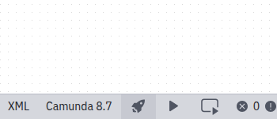
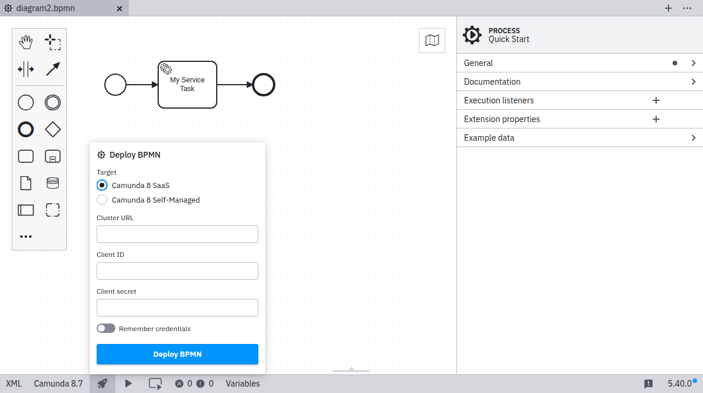
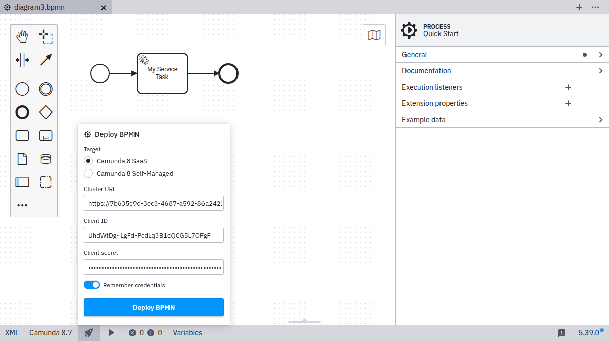
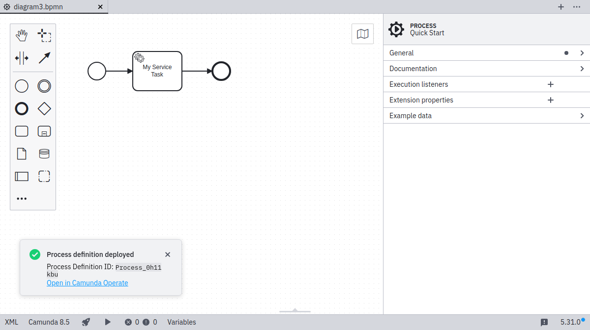

Desktop Modeler can directly deploy diagrams and start process instances in Camunda 8. Follow the steps below to deploy a diagram to **Camunda 8 SaaS**. To deploy to a local installation, visit the [Camunda 8 Self-Managed guide](../../../self-managed/modeler/desktop-modeler/deploy-to-self-managed.md).

1. Click the deployment icon:

2. Click **Camunda 8 SaaS**:

3. Input the `Cluster URL` and the credentials (`Client ID`, `Client Secret`) of your [API client](../../console/manage-clusters/manage-api-clients.md):

4. Toggle **Remember credentials** to locally store the connection information.

5. Click **Deploy** to perform the actual deployment.

:::note
As a next step, [start a new process instance](./start-instance.md).
:::
