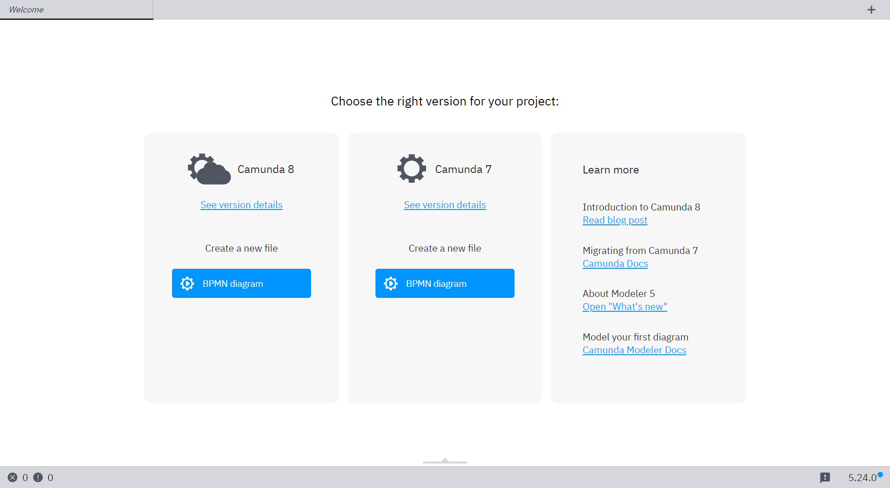
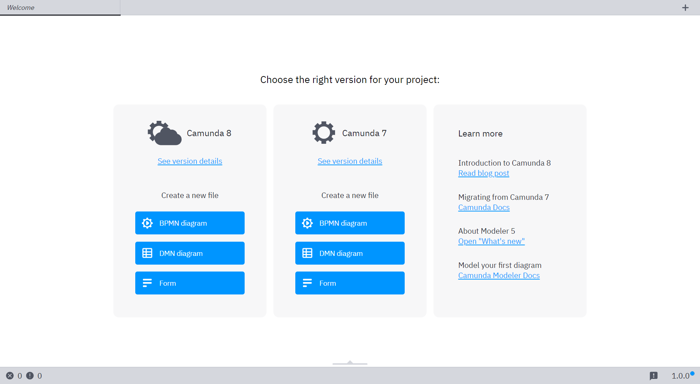
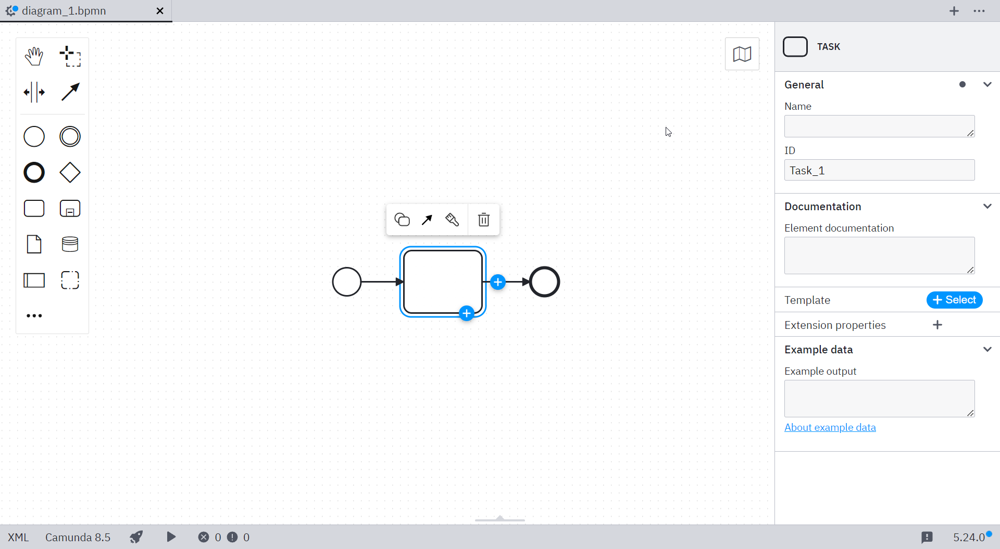

import Tabs from "@theme/Tabs";
import TabItem from "@theme/TabItem";

Flags allow you to control the availability of certain features within Desktop Modeler. Learn which flags [are available](#available-flags) and how to [configure them](#configuration).

## Configuration

You may configure flags in a `flags.json` file or pass them via CLI.

### Configuration via `flags.json`

:::note
Configuration changes via `flags.json` will only take effect once you restart the application.
:::

Place a `flags.json` file inside the `resources` folder of your local [`{USER_DATA}`](../search-paths#user-data-directory) or [`{APP_DATA_DIRECTORY}`](../search-paths#app-data-directory) directory to persist them.

### Configuration via command line

Pass flags via the command line when starting the application.

<Tabs groupId="os" defaultValue="windows" queryString values={
[
{label: 'Windows', value: 'windows' },
{label: 'macOS', value: 'macos' },
{label: 'Linux', value: 'linux' }
]
}>

<TabItem value='windows'>

```plain
"Camunda Modeler.exe" --disable-plugins
```

</TabItem>

<TabItem value='macos'>

```plain
camunda-modeler --disable-plugins
```

</TabItem>

<TabItem value='linux'>

```plain
camunda-modeler --disable-plugins
```

</TabItem>
</Tabs>

Flags passed as command line arguments take precedence over those configured via a configuration file.

## Available flags

| flag                                                          | default value                       |
| ------------------------------------------------------------- | ----------------------------------- |
| ["disable-plugins"](#disable-plug-ins)                        | false                               |
| "disable-adjust-origin"                                       | false                               |
| "disable-cmmn"                                                | true                                |
| "disable-dmn"                                                 | false                               |
| "disable-form"                                                | false                               |
| ["disable-httl-hint"](#disable-history-time-to-live-hint)     | false                               |
| ["default-httl"](#default-history-time-to-live)               | false                               |
| "disable-platform"                                            | false                               |
| "disable-zeebe"                                               | false                               |
| "disable-remote-interaction"                                  | false                               |
| "single-instance"                                             | false                               |
| "user-data-dir"                                               | [Electron default](../search-paths) |
| ["display-version"](#custom-display-version-label)            | `undefined`                         |
| ["zeebe-ssl-certificate"](#zeebe-ssl-certificate)             | `undefined`                         |
| ["c7-engine-version"](#default-execution-platform-version)    | `undefined`                         |
| ["c8-engine-version"](#default-execution-platform-version)    | `undefined`                         |
| ["enable-new-context-pad"](#enable-new-context-pad)           | `false`                             |
| ["disable-connector-templates"](#disable-connector-templates) | `false`                             |

## Examples

### Disable plug-ins

Start the modeler without activating installed plug-ins. This is useful to debug modeler errors.

### BPMN-only mode

To disable the CMMN and DMN editing capabilities of the App, configure your `flags.json` like this:

```js
{
    "disable-dmn": true,
    "disable-form": true
}
```

As a result, the app will only allow users to model BPMN diagrams.



### Disable `history-time-to-live` hint

<span class="badge badge--platform">Camunda 7 only</span>

To disable the [history time to live hint](../../reference/modeling-guidance/rules/history-time-to-live.md) in scenarios where the engine configures HTTL, configure `flags.json`:

```js
{
    "disable-httl-hint": true
}
```

### Default `history-time-to-live`

<span class="badge badge--platform">Camunda 7 only</span>

To set a default [history time to live](../../reference/modeling-guidance/rules/history-time-to-live.md) value to be used in newly created models, configure `flags.json`:

```js
{
    "default-httl": 30
}
```

### Custom `display-version` label

To display a custom version information in the status bar of the app, configure `flags.json`:

```js
{
    "display-version": "1.0.0"
}
```



### Zeebe SSL certificate

<span class="badge badge--cloud">Camunda 8 only</span>

> :information_source: Modeler will read trusted certificates from your operating system's trust store.

Provide additional certificates to validate secured connections to a Camunda 8 installation.

Configure your `flags.json`:

```js
{
    "zeebe-ssl-certificate": "C:\\path\\to\\certs\\trusted-custom-roots.pem"
}
```

Additional information adapted from the [upstream documentation](https://nodejs.org/docs/latest/api/tls.html#tlscreatesecurecontextoptions):

> The peer (Camunda 8) certificate must be chainable to a CA trusted by the app for the connection to be authenticated. When using certificates that are not chainable to a well-known CA, the certificate's CA must be explicitly specified as trusted or the connection will fail to authenticate. If the peer uses a certificate that doesn't match or chain to one of the default CAs, provide a CA certificate that the peer's certificate can match or chain to. For self-signed certificates, the certificate is its own CA, and must be provided.

### Default execution platform version

To change default execution platform version, configure your `flags.json` as follows:

```json
{
  "c7-engine-version": "7.18.0",
  "c8-engine-version": "8.0.0"
}
```

New diagrams created in Desktop Modeler will use the configured version instead of the latest stable version.

### Enable new context pad

To use the new context pad, configure your `flags.json` as follows:

```json
{
  "enable-new-context-pad": true
}
```



### Disable Connector templates

<span class="badge badge--cloud">Camunda 8 only</span>

To [disable automatic Connector template fetching](../use-connectors.md#automatic-connector-template-fetching), configure your `flags.json` as follows:

```json
{
  "disable-connector-templates": true
}
```
