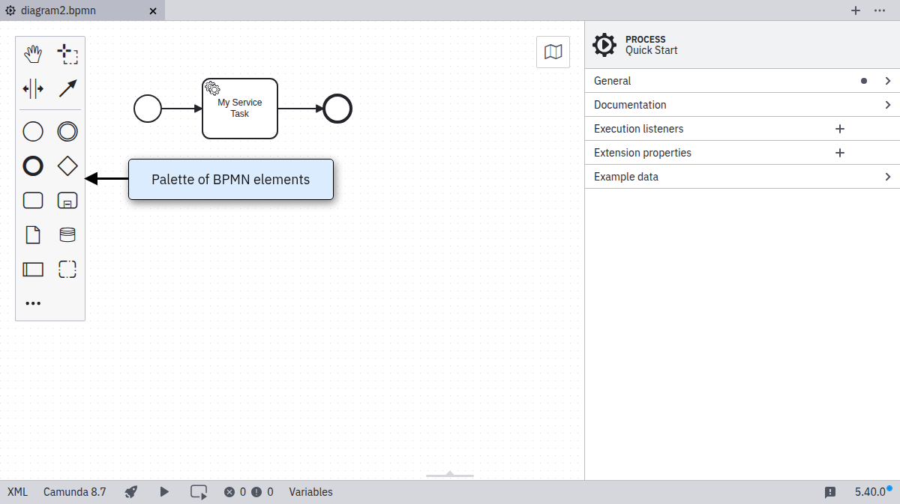
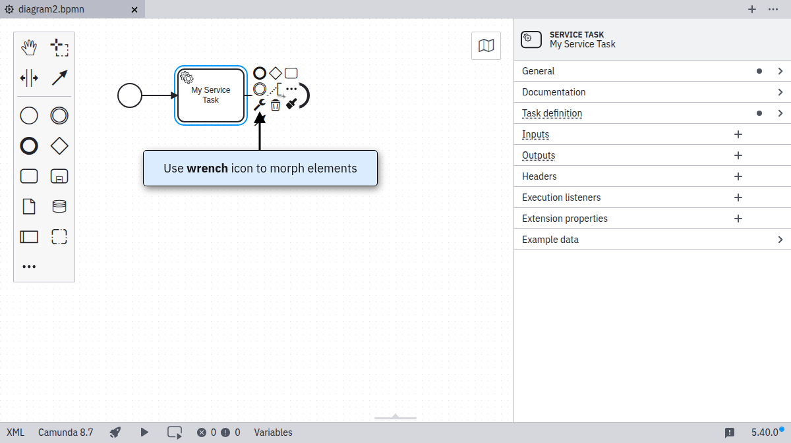
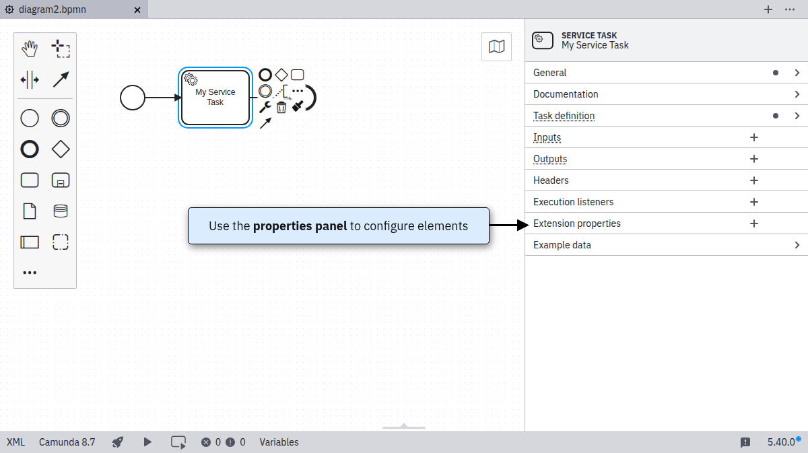

After starting [Desktop Modeler](./index.md), you can model your first BPMN diagram. Follow the steps below:

1. Create a [BPMN](../bpmn/bpmn.md) diagram:

2. View the BPMN diagram with a start event:

3. On the left side of the screen you will find the element palette. Drag and drop the elements onto the diagram:

Elements that support different types can be reconfigured by clicking on the corresponding icon. In the following screenshot, a task has been added to the diagram. It can be converted to a [service task](../bpmn/service-tasks/service-tasks.md), for example, by clicking on the task and the wrench-shaped icon.

4. Use the properties panel on the right side of the page to edit the properties of the currently selected element:

1. Once you finish modeling and configuring your diagram, you can deploy it to a [Camunda 8 cluster](./connect-to-camunda-8.md).
