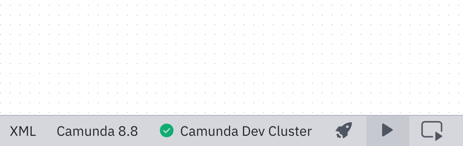
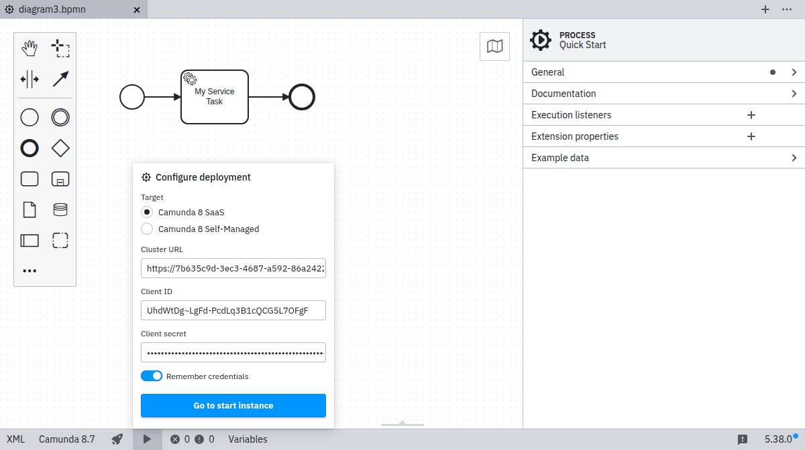
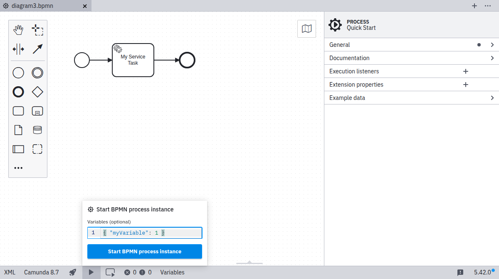
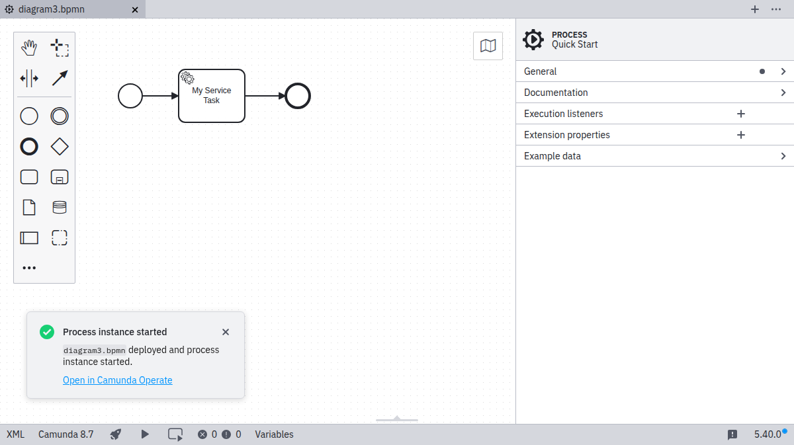

After you have [deployed your process to Camunda 8](./connect-to-camunda-8.md), you can start a new instance of this process via the play icon:

1. Deploy the diagram to **Camunda 8 SaaS**. You can skip this step if you have already deployed the diagram.

2. Start the process the instance with optional variables.

After the instance was started successfully, a corresponding message is displayed.

