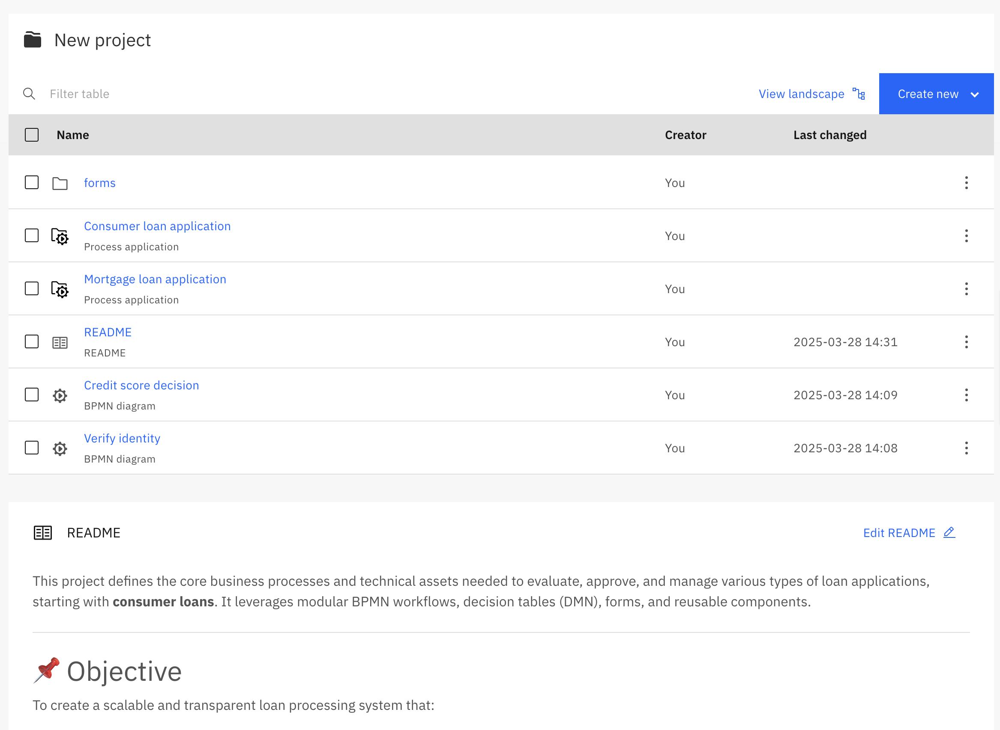
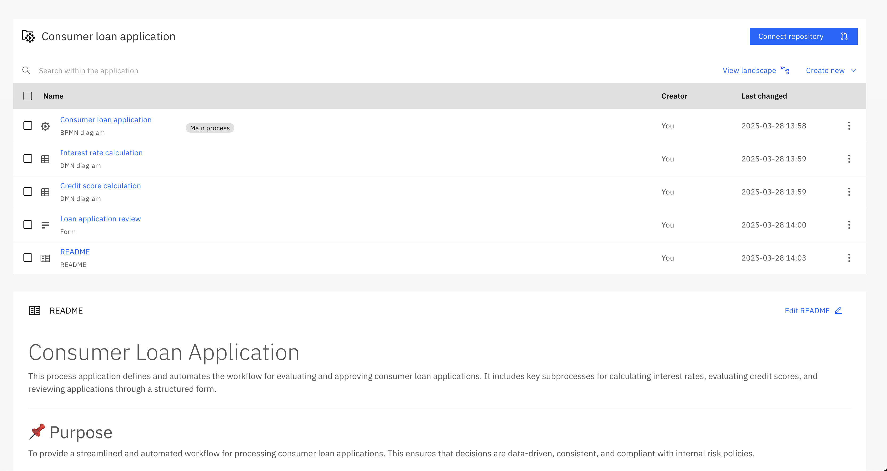
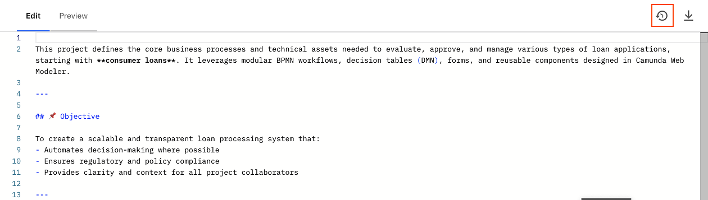

Camunda 8 only

The README feature brings project documentation directly into the modeling workspaces of business users, developers, and project owners to help capture important context in a way that’s versioned, visible, and maintainable.

## Why use READMEs

Process documentation is essential, but often stored outside modeling tools. This makes it hard to find and update, and disconnected from your work.
With README support in Web Modeler, you can:

- Document your processes **right where you build them**.
- Keep information **versioned and automatically synced** with Git.
- Make your projects **easier to understand** for everyone involved — from team members to stakeholders.

## What you can document

- Project goals, scope, and stakeholders
- Links to related assets
- Embedded BPMN diagrams
- Go-live dates, status updates, and project health
- Requirements, process owners, and change logs

## Where READMEs appear

- In every project, process application, and folder (each can have its own README)
  
  > Git-connected process applications sync README content just like any other file
- In the [process landscape view](../process-landscape-visualization.md) as context for a node or the entire app
  

:::note
Each README is unique to its folder and can’t be moved through the UI. However, you can download or delete associated README files.
:::

## Best Practices

### Writing a README

README files use standard [Markdown](https://www.markdownguide.org/), a lightweight markup language. A README should provide a snapshot of what your project, process application, or folder is about. Consider including:

- What this project, application, or folder is for
- Who owns or maintains it
- Key requirements and business rules
- Links to related documentation or dashboards

:::note
Refer to [GitHub’s README guide](https://docs.github.com/en/repositories/managing-your-repositorys-settings-and-features/customizing-your-repository/about-readmes) for general inspiration.
:::

## README interaction

README file changes are fully versioned, you can see previous versions and recent changes by selecting the **Show versions** icon:

README files can be downloaded by selecting the **Download** icon:

To see the final result of a README file, select the **Preview** tab:

## Related resources

- [Process applications](../process-applications.md)
- [Process landscape visualization](../process-landscape-visualization.md)
