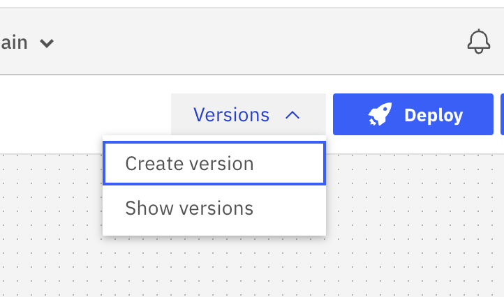
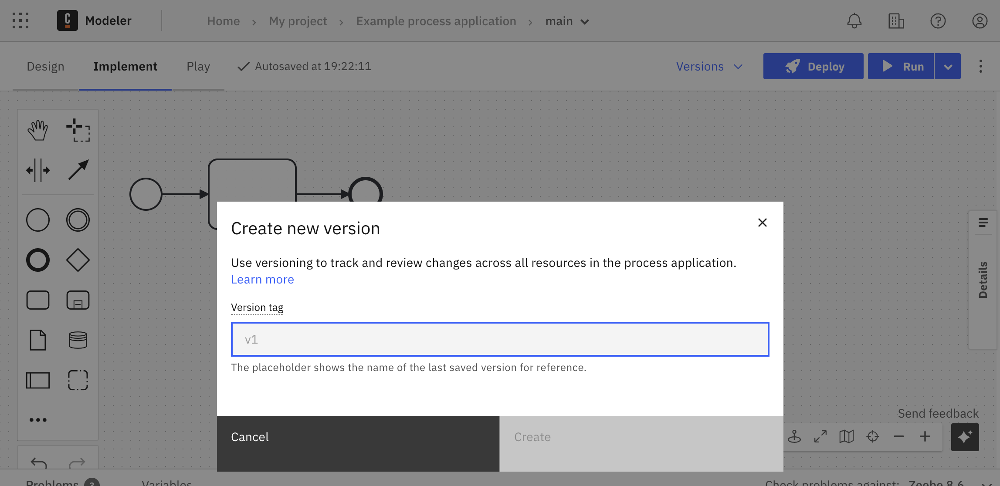
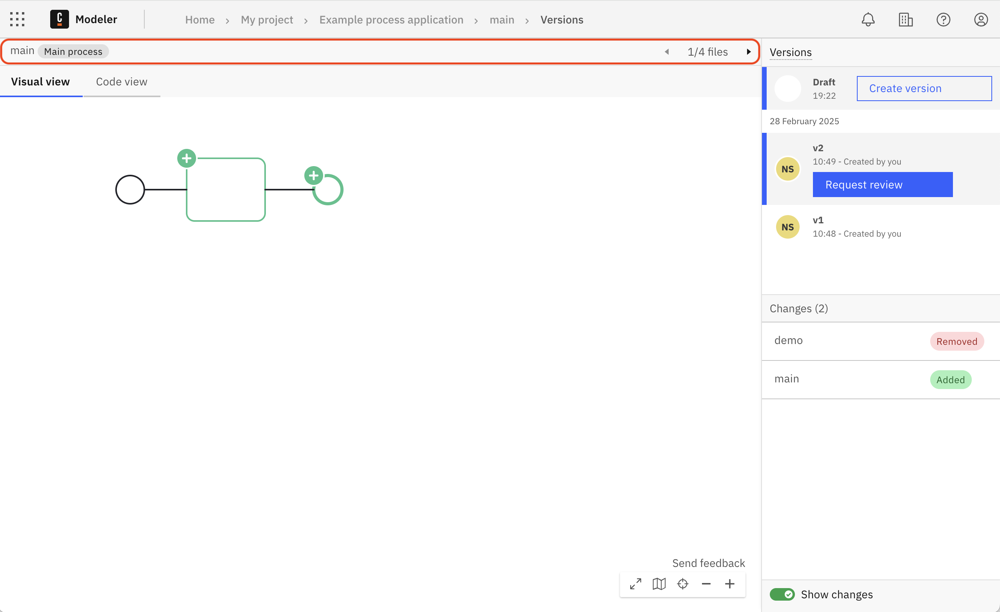
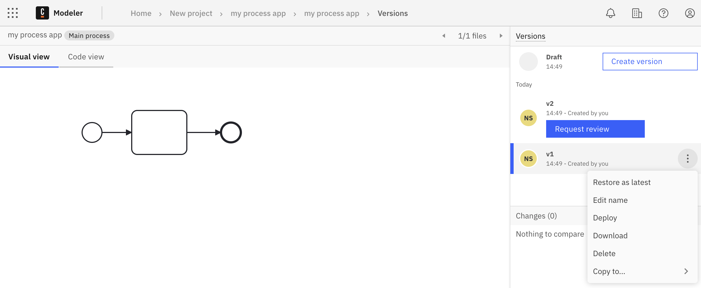

:::note
With 8.7, "milestone" has been renamed to "version". To learn more about this change, see [the related release note](/reference/announcements-release-notes/870/870-release-notes.md#web-modeler-milestones-renamed-to-versions).
:::

Process applications support versioning, allowing you to create distinct versions for the entire application. You can use versioning to save a single snapshot of all the process application files in one action.

- When you create a process application version, the input version tag is applied to the `versionTag` field in the main process XML.
- This helps you track a process application throughout its development lifecycle and ensures the correct version is referenced.

## Version creation

To create a process application version:

1. Open any file in a process application, click on the **Create version** button in the **Versions** dropdown menu.
   
2. Enter a **Version tag** in the version creation modal.
   
3. Select the **Create** button.

When you open the versions page (use the **Show versions** button in the **Versions** dropdown menu), you can now use the file navigation header buttons to switch between files and view their content. See also [compare versions](/components/modeler/web-modeler/versions.md#compare-versions).

## Version actions

You can perform the following actions on a process application version:

1. Restore as latest, useful for reverting changes, making further edits, [git syncing](/components/modeler/web-modeler/git-sync.md), downloading, or using Play.
2. Edit name
3. Deploy, especially after the version has been [reviewed](/components/modeler/web-modeler/process-application-pipeline.md#review).
4. Download
5. Delete
6. Copy, creates a new process application with the files from the version.

