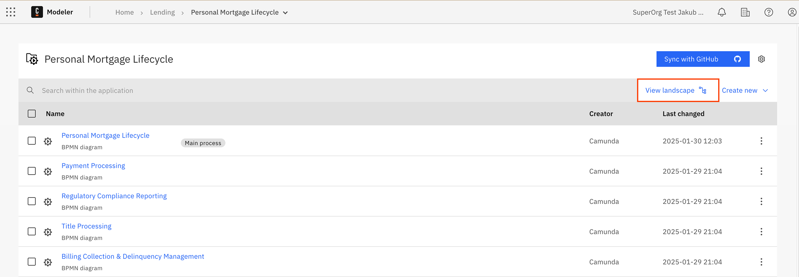
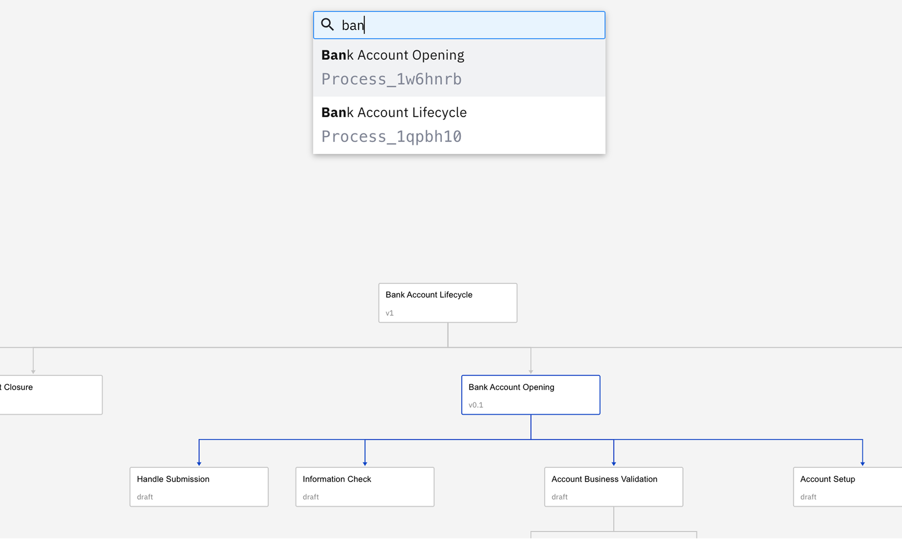
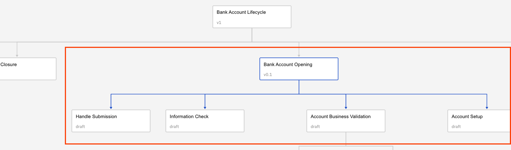

import ProcessLandscapeVisualization from './img/process-landscape-visualization.png';

Camunda 8 only

The process landscape view provides a visual map of all BPMN files within a project and the interfile [call activities](/components/modeler/bpmn/call-activities/call-activities.md) connections between them.
It helps quickly understand process dependencies, flow relationships, and overall project structure — all in one interactive canvas.

The landscape view is automatically generated from all BPMN diagrams within a project, offering insights without the need for manual maintenance or updates.

Landscape view is available by clicking **Landscape view** button from:

- Project view
- Folder view
- [Process application](/docs/components/modeler/web-modeler/process-applications.md) view

  

## Landscape interaction

1. **Selecting a BPMN File:** Click on any node to see the BPMN file’s information including the latest version of the process on the sidebar.
   :::note
   For process applications, version tags represents a unified "versioned" snapshot of all process application files rather than separate versions for each file as is done with simple BPMN files.
   :::
   
2. **Searching**: Press `Ctrl+F` or `⌘+F` combination to initialize search. Type the name or identifier of a BPMN file to quickly find, highlight and jump to the corresponding node.
   
3. **Highlighting Paths:** Clicking on a node or connection will highlight the entire chain of related connections.
   
