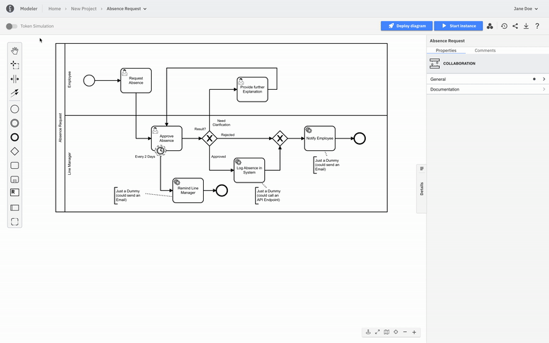
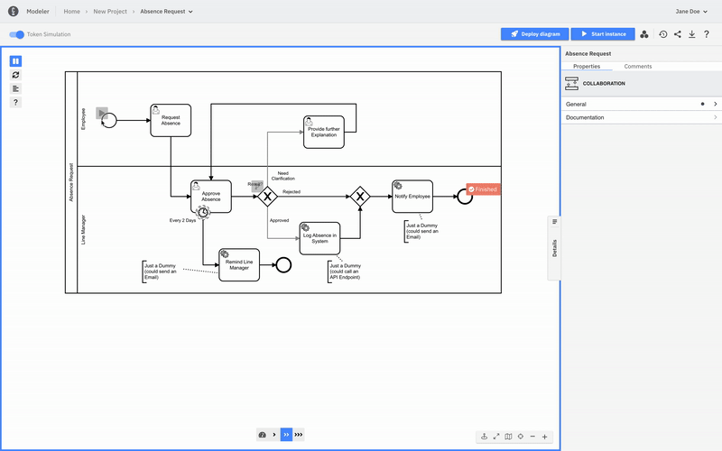
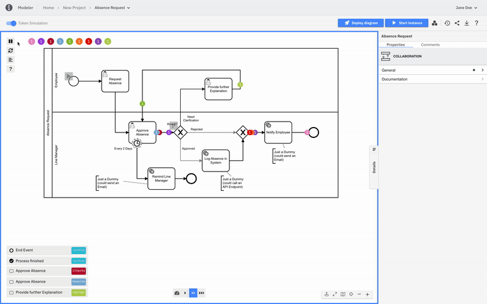
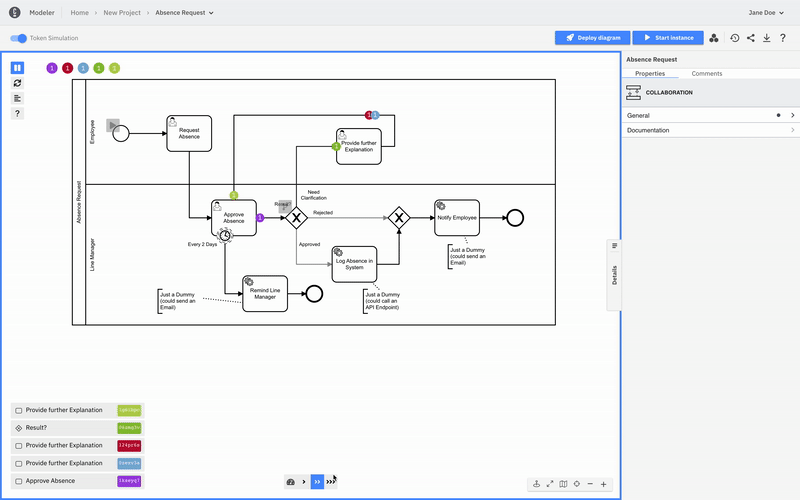

Available in Modeler's **Design** mode, token simulation helps you to get a deeper understanding of the BPMN execution semantic and allows you to play, pause, and step through a process just like a BPMN 2.0 compliant engine would.

:::tip

Token simulation is a BPMN learning tool, not a fully featured BPMN engine.

If you are developing your process and want to validate how _exactly_ it would execute on Camunda, [give Play a try](./play-your-process.md).

:::

### Turn on/off

First, open your BPMN diagram in Modeler and switch to **Design** mode.

To turn the feature on/off, use the **Token simulation** toggle (or the keyboard shortcut `T` inside the canvas). The modeling features will not work while you are in token simulation mode.

### Start simulation

The simulation can be started by triggering an event using the corresponding button:

### Token simulation palette

The palette on the left side provides the following controls:

- Play/pause simulation
- Reset simulation
- Show simulation log

### Animation speed palette

The speed of the simulation can be changed using the controls in the bottom palette:

