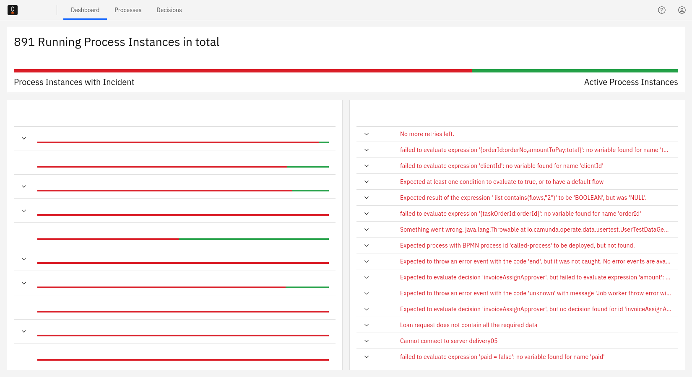

Operate is a tool for monitoring and troubleshooting process instances running in [Zeebe](/components/zeebe/zeebe-overview.md).

In addition to providing visibility into active and completed process instances, Operate can also:

- Carry out key operations such as resolving [incidents](./userguide/resolve-incidents-update-variables.md) and updating process instance variables.
- Retry or cancel [many process instances at once](/components/operate/userguide/selections-operations.md).
- [Delete finished instances](/components/operate/userguide/delete-finished-instances.md) and [resources](/components/operate/userguide/delete-resources.md).
- [Modify](/components/operate/userguide/process-instance-modification.md) an active process instance to allow execution to continue.
- [Batch move](/components/operate/userguide/process-instance-batch-modification.md) active process instances to allow execution to continue.

Learn how to use Operate to monitor process instances and more features in the [Operate user guide](/components/operate/userguide/basic-operate-navigation.md).

## Availability

Because Operate can be a helpful tool when getting started with Zeebe and building an initial proof of concept, we make it available under the [Operate trial license](https://camunda.com/legal/terms/cloud-terms-and-conditions/general-terms-and-conditions-for-the-operate-trial-version/). There are no restrictions under this license when it comes to the length of the evaluation period or the available feature set _as long as you use Operate in non-production environments only._

Operate is available for production use (with support) in the Camunda 8 offering. [Try out Operate in Camunda 8](https://signup.camunda.com/accounts?utm_source=docs.camunda.io&utm_medium=referral&utm_content=operate).
