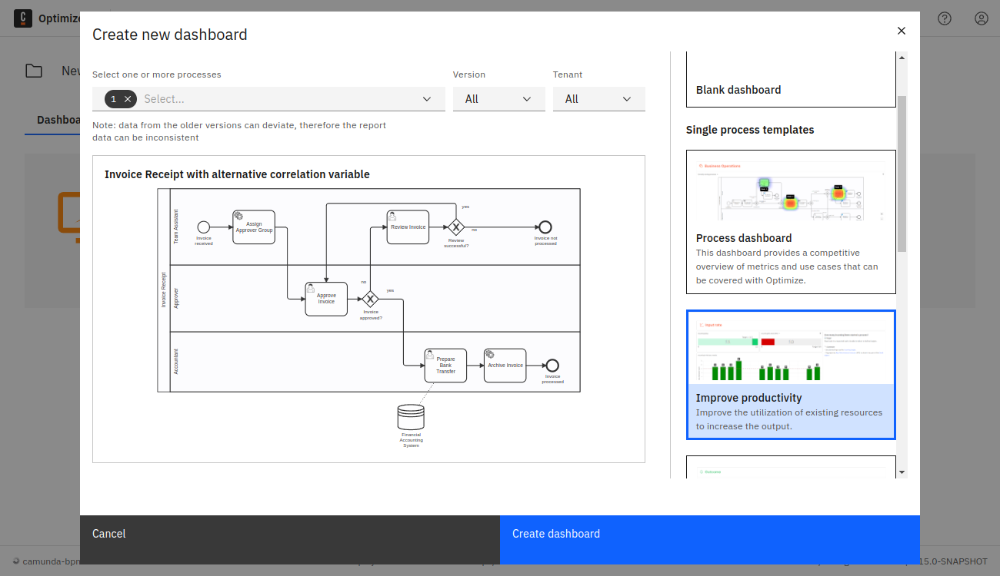

Efficiently monitor business performance by defining reports in Optimize based on relevant Key Performance Indicators (KPIs). Dashboards, comprising [**edit mode**](./edit-mode.md) and [**view mode**](./view-mode.md), offer a comprehensive view of system productivity.

To create a new dashboard, click the **Create New** button on the homepage or collection page and select the **New dashboard** option. This opens a dialog where you can set the dashboard name and select one of multiple dashboard templates. When not creating a blank dashboard, select a process definition. This process definition is used to create new reports for the dashboard.

Creating a dashboard from a template also creates new reports which are saved as soon as the dashboard is saved.

:::note
Click the **Share** tab to share a created dashboard. Toggle to **Enable sharing**, and copy or embed the provided link. Colleagues without access to Optimize can still view your report with the shared link. Learn more about [user permissions](./user-permissions.md).
:::
