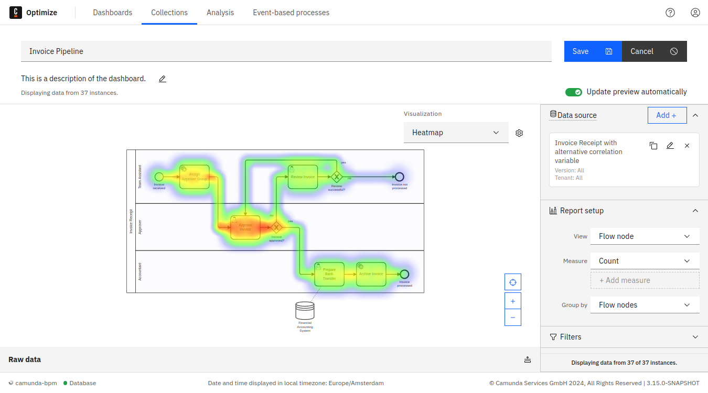
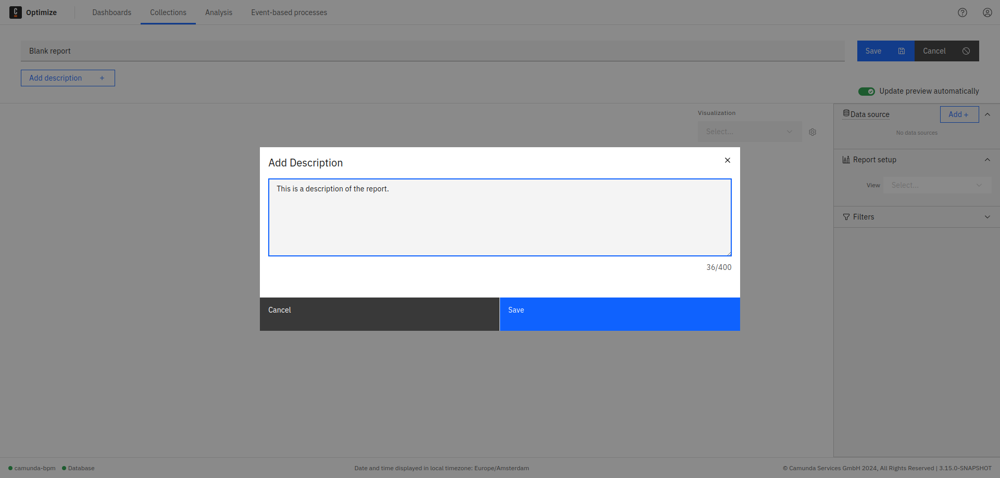

## Overview

Reports offer the ability to view your data from different angles, and thus capture all aspects that influence your processes, show new trends, or depict your current business state.

Each report consists of the [edit mode](./process-analysis/report-analysis/edit-mode.md) and [view mode](./process-analysis/report-analysis/view-mode.md) to perform different kinds of actions on it.

## Creating a single report

To create a custom report based on a key performance indicator (KPI) you’d like to analyze, and to incorporate this report into a dashboard, follow the steps below:

1. On the right side of the **Collections** page, select **Create New > Report**. Here we’ll take a look at a single process, though you can also view data from multiple processes.
2. Click the text box under **Select Process** and select the process you’d like to analyze.
3. Select the type of report you’d like to use on the right side of the **Create new Report** box. As with dashboards, Optimize offers preconfigured templates such as heatmaps and tables. We’ll begin with a heatmap.
4. Click **Create Report**.
   
5. Set up and customize your report. Begin by naming your report in the text box at the top of the page.
6. In the gray text box to the right, confirm your data source, and select what you’d like to review from the process. You can also group by topics such as duration or start date.
7. If you’d like, filter the process instance or flow nodes. For example, you can filter by duration, only viewing process instances running for more than seven days.
8. Additionally, a **Report** can be given a description which is displayed below the **Report** name. Using the **Add/Edit** button, you can add, edit, or remove the description. You are limited to a 400-character plain text description.

9. You have the option to view particular sets of data from the instance (like instance count or absolute value) by selecting the gear icon to the left of your data customization. You can also choose to visualize your data in the box beneath **Visualization** (i.e. bar chart, pie chart, etc.). Once you’ve made your selections, click **Save**.

:::note
Click the **Share** tab to share a created report. Toggle to **Enable sharing**, and copy or embed the provided link. Colleagues without access to Optimize can still view your report with the shared link. Learn more about [user permissions](./user-permissions.md).
:::
