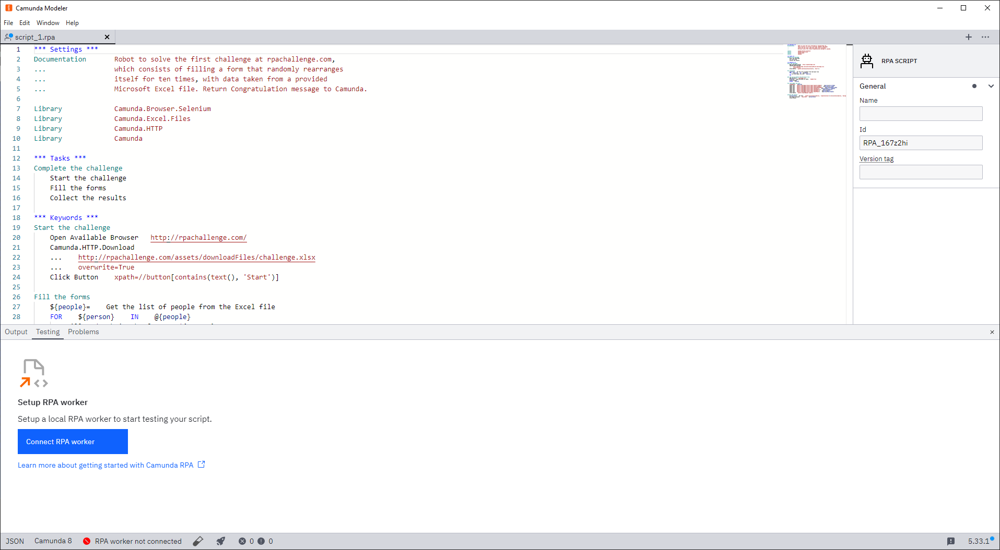
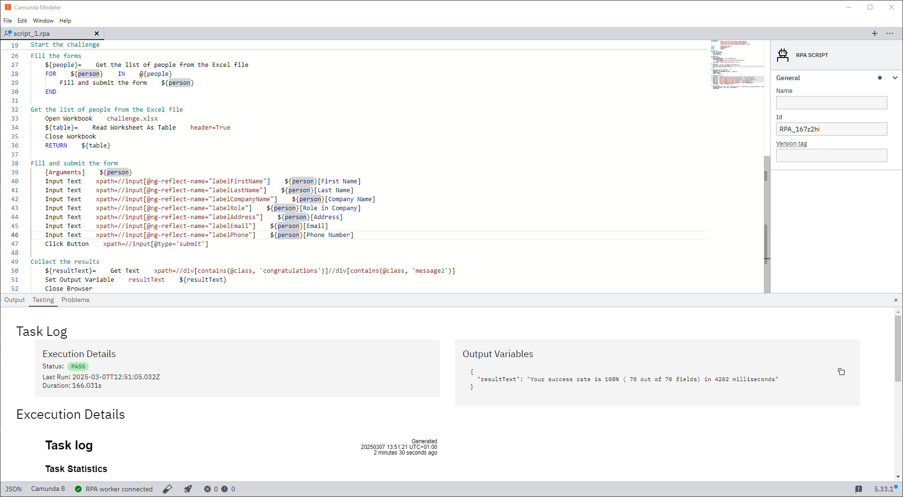
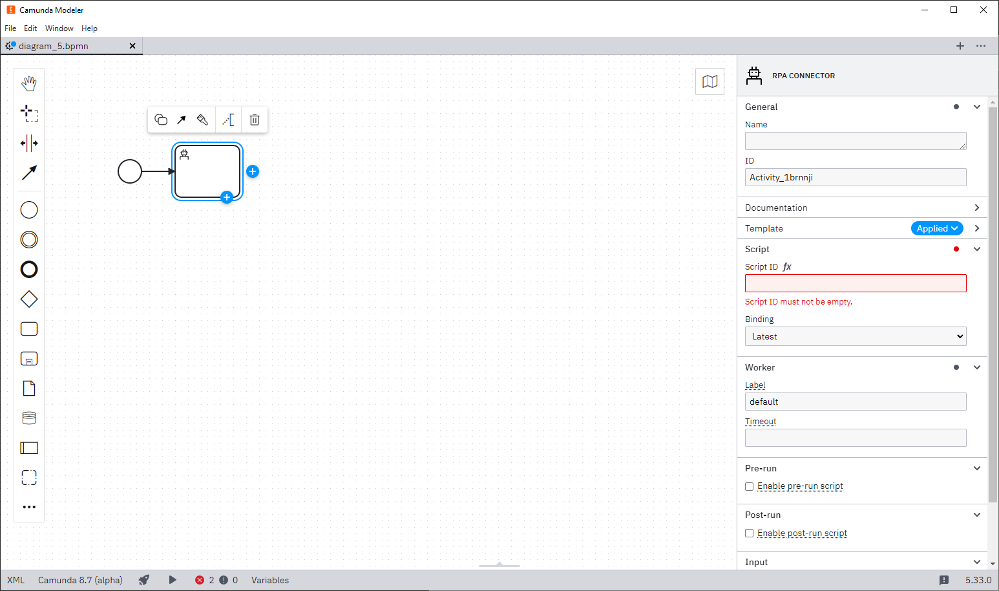

:::note
New to RPA? Visit the [overview page](/components/rpa/overview.md) to get familiar with Robotic Process Automation (RPA) capabilities.
:::

:::note
Before getting started, review the [current known issues for RPA](https://github.com/camunda/rpa-worker/discussions/categories/known-issues) to ensure environment compatibility.
:::

The RPA worker is available on all major platforms (Windows, Linux, and Mac). This allows you to automate your applications on their native platforms. In most cases, this will be Windows. For console applications or browser automation, you can use a more light-weight distribution, such as the [Docker image](/self-managed/setup/deploy/other/docker.md).

## Create your first script

To get started with RPA, you first need to write an RPA script. [Camunda Modeler](/components/modeler/about-modeler.md) offers an interface for editing and testing your scripts:

1. **Download Camunda Modeler**: Download the latest version of Camunda Modeler from the [Camunda website](https://camunda.com/download/modeler/). As RPA scripts are run locally on your machine, the RPA editor is only available in [Desktop Modeler](/components/modeler/desktop-modeler/index.md).
2. **Open the RPA script editor**: Open Desktop Modeler and navigate to the RPA script editor under **Testing**.
   
3. **Start writing your RPA script using Robot Framework**: Use the interface provided to write your first RPA script. Scripts use the [Robot Framework](https://robotframework.org/) syntax.

## Test your script

Once you have written your script, you can test it on a local RPA worker.

1. **Start the RPA worker**:
   1. Download the latest version of the [RPA worker](https://github.com/camunda/rpa-worker/releases).
   2. Unpack the `rpa-worker_*.zip` file. The zip archive contains the worker executable and an example configuration file.
   3. Start the worker by running the executable.

2. **Check Desktop Modeler**: Ensure the RPA worker is now connected to Desktop Modeler. The worker should automatically connect. If not, click on the connection status to display additional configuration options.

3. **Test the script**:
   1. Click the test tube (🧪) icon in the footer of Desktop Modeler to open the run dialog. You can add any variables you expect from the process in JSON format. Once you start the execution, the execution tab will open.
   2. Review the execution log and the variables created during the script execution within Modeler.
      

## Automate execution

Once you are happy with your script and have tested it locally, you can start automating it with Camunda.

### Link RPA task to BPMN

1. **Deploy the RPA file**:
   1. If you haven't already, [set up client connection credentials](/guides/setup-client-connection-credentials.md) for your Modeler.
   2. Deploy your RPA script file by clicking on the rocket (🚀) icon in Modeler.
   3. Note the ID of your RPA script. You will need this in the next step.

2. **Add RPA to your process**:
   1. In Camunda Modeler, create a new BPMN file or open an existing one.
   2. Add a new task and change it to an "RPA connector".
      
   3. Configure the task with the script ID from the previous step. Add any input mappings required for your script to work.
      

3. **Deploy and run the process**:
   1. Deploy the BPMN model with the configured RPA task by clicking on the rocket (🚀) icon in Modeler.
   2. Start an instance of your process.

### Connect worker to Zeebe

The last step is to configure the RPA worker to pick up the jobs from Camunda.

1. **Create credentials for the worker**:
   1. Create the necessary worker credentials in Console. You can follow the same steps as for the Modeler credentials. Give your new client the scopes `Zeebe` and `Secrets`.
   2. Add the generated credentials to your `application.properties` in the same directory as your RPA worker executable.

2. **Restart the worker**: If your worker is still running, restart it to apply the new credentials. The RPA worker should now be connected and ready to execute scripts from Zeebe.

## Interact with the process

Now that you have integrated your first script, it can be part of a larger BPMN process. The main interaction between the script and your process will be the variables and documents.

### Variables

Process variables will be mapped to robot variables automatically. Use the `Camunda` library and `Set Output Variable` keyword to set return variables.

In this example, the input would be the following:

```Robot
*** Settings ***
Library             Camunda

*** Tasks ***
Log X
    Log                    Process variable 'x' is set to ${x}
    Set Output Variable    result    We logged x
```

### Documents

:::note
Documents can be created by multiple components. Visit our [concepts page](/components/document-handling/getting-started.md) to learn how Camunda handles binary data.
:::

Documents managed by Camunda can be consumed or created by an RPA script. Use `Download Documents` to resolve a document descriptor to a file and `Upload Documents` to create a document descriptor from a file.

The script below downloads a file, appends a line, and uploads the document with the same variable name:

```Robot
*** Settings ***
Library             Camunda
Library             Camunda.FileSystem

*** Tasks ***
Log Operation
    ${path}=    Download Documents     ${operationLog}
    Append To File    ${path}     new Line, appended by RPA script
    Upload Documents    ${path}     operationLog
```

### Handling exceptions

There are two ways to handle problems in your tasks: exceptions and errors. We recommend reading our [best practices](/components/best-practices/development/dealing-with-problems-and-exceptions.md) to understand which strategy is best for your case.

#### Incidents

If your RPA script runs into an unexpected error during execution, this error (alongside the output) will be reported to Zeebe. If the job retries are exceeded, an [incident](/components/concepts/incidents.md) will be created in [Operate](/components/operate/operate-introduction.md).

To ensure your environment is always clean and all open applications are closed, create a "clean up" step and tag it as `[Teardown]`. Read more about setup and teardown in the [Robot Framework documentation](https://robotframework.org/robotframework/latest/RobotFrameworkUserGuide.html#user-keyword-setup-and-teardown).

```
*** Settings ***
Library             Camunda
Library             Camunda.Browser.Selenium

*** Tasks ***
Main
    Perform Work
    [Teardown]    Cleanup

*** Keywords ***
Perform Work
    Open Browser      about:blank
    Fail

Cleanup
    # Close your application, even when encountering errors
    Close All Browsers
```

#### BPMN errors

If you encounter an error that should be handled as a BPMN error, you can use the `Throw BPMN Error` keyword. Instead of creating an incident, this will create a [BPMN error](/components/best-practices/development/dealing-with-problems-and-exceptions.md#handling-errors-on-the-process-level).

:::note
A BPMN error cannot be caught in the script, it will always stop the script execution and initiate the teardown procedure.
:::

```robot
*** Settings ***
Library             Camunda

*** Tasks ***
Log Operation
    Throw BPMN Error     MY_ERROR_CODE       We encountered a business error
    [Teardown]    Log    Teardown is still executed
```

### Shared script resources

Currently, multiple script files are not supported. Each task should be contained within a single script. You can use [pre-run and post-run scripts](components/rpa/production.md#pre--and-post-run-scripts) for environment setup and cleanup.
