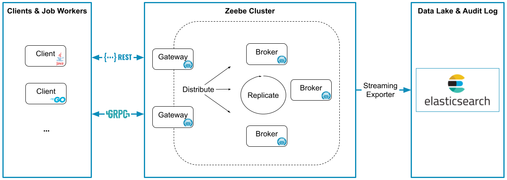

There are four main components in Zeebe's architecture:

- Clients
- Gateways
- Brokers
- Exporters

In Camunda 8, you work exclusively with clients. Gateways, brokers, and exporters are pre-configured to provide the service, but are not accessible.

In local or private cloud deployments, all components are relevant.

## Clients

Clients send commands to Zeebe to:

- Deploy processes
- Carry out business logic
  - Start process instances
  - Publish messages
  - Activate jobs
  - Complete jobs
  - Fail jobs
- Handle operational issues
  - Update process instance variables
  - Resolve incidents

Client applications can be scaled up and down separately from Zeebe. The Zeebe brokers do not execute any business logic.

Clients are libraries you embed in an application (e.g. a microservice that executes your business logic) to connect to a Zeebe cluster.

Clients connect to the Zeebe Gateway via a mix of REST and [gRPC](https://grpc.io). While REST can be served over any HTTP version, the gRPC part of the API requires an HTTP/2-based transport. To learn more about how REST is used in Zeebe, review the [Camunda API](/apis-tools/camunda-api-rest/camunda-api-rest-overview.md). To learn more about gRPC in Zeebe, review the [Zeebe API (gRPC)](/apis-tools/zeebe-api/grpc.md).

The Zeebe project includes officially-supported Java and Go clients. [Community clients](/apis-tools/community-clients/index.md) have been created in other languages, including C#, Ruby, and JavaScript. Thanks to code generators for gRPC and the OpenAPI spec, it is possible to [generate clients](/apis-tools/build-your-own-client.md) in a range of different programming languages.

### Job workers

A job worker is a Zeebe client that uses the client API to first activate jobs, and upon completion, either complete or fail the job.

## Gateways

A gateway serves as a single entry point to a Zeebe cluster and forwards requests to brokers.

The gateway is stateless and sessionless, and gateways can be added as necessary for load balancing and high availability.

## Brokers

The Zeebe Broker is the distributed workflow engine that tracks the state of active process instances.

Brokers can be partitioned for horizontal scalability and replicated for fault tolerance. A Zeebe deployment often consists of more than one broker.

It's important to note that no application business logic lives in the broker. Its only responsibilities are:

- Processing commands sent by clients
- Storing and managing the state of active process instances
- Assigning jobs to job workers

Brokers form a peer-to-peer network in which there is no single point of failure. This is possible because all brokers perform the same kind of tasks and the responsibilities of an unavailable broker are transparently reassigned in the network.

## Exporters

The exporter system provides an event stream of state changes within Zeebe. This data has many potential uses, including but not limited to:

- Monitoring the current state of running process instances
- Analysis of historic process data for auditing, business intelligence, etc.
- Tracking [incidents](/components/concepts/incidents.md) created by Zeebe

The exporter includes an API you can use to stream data into a storage system of your choice. Zeebe includes an out-of-the-box [Elasticsearch exporter](https://github.com/camunda/camunda/tree/main/zeebe/exporters/elasticsearch-exporter), and other [community-contributed exporters](https://github.com/camunda-community-hub/awesome-camunda-platform-8) are also available.
