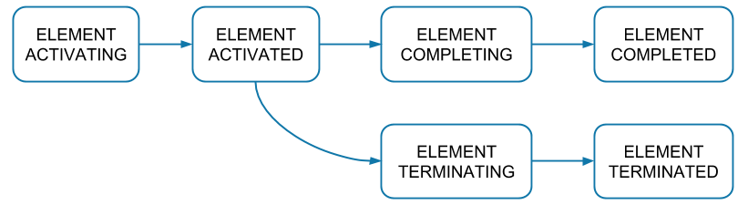
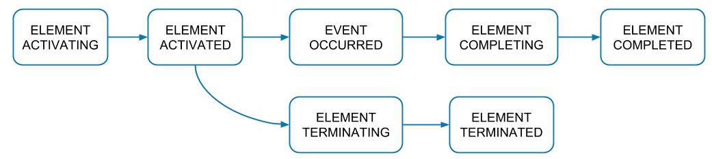
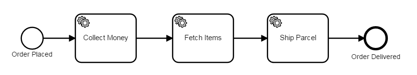

In Zeebe, the process execution is represented internally by events of type `ProcessInstance`. The events are written to the log stream and can be observed by an exporter.

Each event is one step in a process instance lifecycle. All events of one process instance have the same `processInstanceKey`.

Events which belong to the same element instance (e.g. a task) have the same `key`. The element instances have different lifecycles depending on the type of element.

## (Sub-)Process/Activity/Gateway lifecycle

## Event lifecycle

## Sequence flow lifecycle

## Example

Given the above process, a successful execution yields the following records in the commit log:

<table>
    <tr>
        <th>Intent</th>
        <th>Element ID</th>
        <th>Element type</th>
    </tr>
    <tr>
        <td>ELEMENT_ACTIVATING</td>
        <td>order-process</td>
        <td>process</td>
    </tr>
    <tr>
        <td>ELEMENT_ACTIVATED</td>
        <td>order-process</td>
        <td>process</td>
    </tr>
    <tr>
        <td>ELEMENT_ACTIVATING</td>
        <td>order-placed</td>
        <td>start event</td>
    </tr>
    <tr>
        <td>ELEMENT_ACTIVATED</td>
        <td>order-placed</td>
        <td>start event</td>
    </tr>
    <tr>
        <td>ELEMENT_COMPLETING</td>
        <td>order-placed</td>
        <td>start event</td>
    </tr>
    <tr>
        <td>ELEMENT_COMPLETED</td>
        <td>order-placed</td>
        <td>start event</td>
    </tr>
    <tr>
        <td>SEQUENCE_FLOW_TAKEN</td>
        <td>to-collect-money</td>
        <td>sequence flow</td>
    </tr>
    <tr>
        <td>ELEMENT_ACTIVATING</td>
        <td>collect-money</td>
        <td>task</td>
    </tr>
    <tr>
        <td>ELEMENT_ACTIVATED</td>
        <td>collect-money</td>
        <td>task</td>
    </tr>
    <tr>
        <td>ELEMENT_COMPLETING</td>
        <td>collect-money</td>
        <td>task</td>
    </tr>
    <tr>
        <td>ELEMENT_COMPLETED</td>
        <td>collect-money</td>
        <td>task</td>
    </tr>
    <tr>
        <td>SEQUENCE_FLOW_TAKEN</td>
        <td>to-fetch-items</td>
        <td>sequence flow</td>
    </tr>
    <tr>
        <td>...</td>
        <td>...</td>
        <td>...</td>
    </tr>
    <tr>
        <td>SEQUENCE_FLOW_TAKEN</td>
        <td>to-order-delivered</td>
        <td>sequence flow</td>
    </tr>
    <tr>
        <td>ELEMENT_ACTIVATING</td>
        <td>order-delivered</td>
        <td>end event</td>
    </tr>
    <tr>
        <td>ELEMENT_ACTIVATED</td>
        <td>order-delivered</td>
        <td>end event</td>
    </tr>
    <tr>
        <td>ELEMENT_COMPLETING</td>
        <td>order-delivered</td>
        <td>end event</td>
    </tr>
    <tr>
        <td>ELEMENT_COMPLETED</td>
        <td>order-delivered</td>
        <td>end event</td>
    </tr>
    <tr>
        <td>ELEMENT_COMPLETING</td>
        <td>order-process</td>
        <td>process</td>
    </tr>
    <tr>
        <td>ELEMENT_COMPLETED</td>
        <td>order-process</td>
        <td>process</td>
    </tr>
</table>
