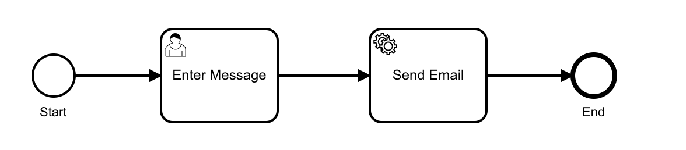
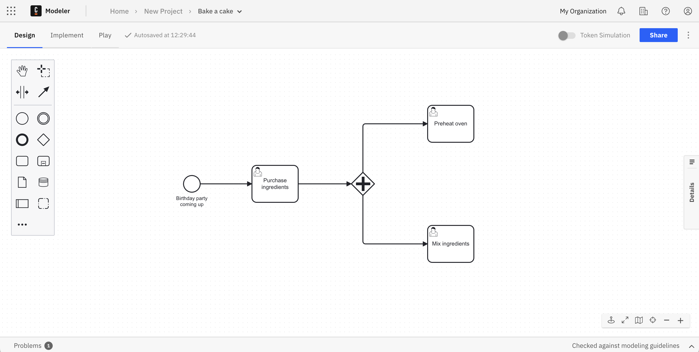
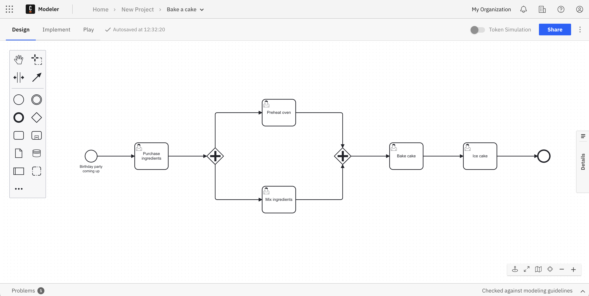

Beginner
Time estimate: 20 minutes

Business Process Model and Notation (BPMN) is the global standard for process modeling. Combining BPMN, an easy-to-adopt visual modeling language, with Camunda, you can automate your business processes.

Processes are the algorithms that determine how an organization runs based on independent tasks. Successful businesses grow from proven, effective processes. Therefore, Camunda’s workflow engine executes processes defined in BPMN to ensure these processes can be swiftly orchestrated within a diagram.

Take the following example where we've outlined a process in a BPMN diagram to send an email. Don't worry too much about the symbols as we'll get to that shortly. For now, recognize the start and end of the process, comprised of entering a message, and sending the email.

BPMN offers control and visibility over your critical business processes in a way that is understandable for both experienced engineers and business stakeholders. The workflow engine orchestrates processes that span across a wide variety of elements, including APIs, microservices, business decisions and rules, human work, IoT devices, RPA bots, and more.

## Set up

Begin by building your BPMN diagrams with [Modeler](../components/modeler/about-modeler.md).
To get started, ensure you’ve [created a Camunda 8 account](/guides/create-account.md).

## Getting started with BPMN

Once logged in to your Camunda 8 account, take the following steps:

1. Within Modeler, click **Create new > BPMN diagram**.
2. Right after creating your diagram, you can name it by replacing the **New BPMN Diagram** text with the name of your choice. In this case, we'll name it "Bake a Cake."

### BPMN elements

Before building out the diagram to bake a cake, let's examine the significance of the components on the left side of the screen.

You can build out a BPMN diagram for a process using several elements, including the following:

- Events: The things that happen. For example, start and end events which begin and terminate the process.
- Tasks: For example, user tasks for a particular user to complete, or service tasks to invoke various web services.
- Gateways: For example, parallel gateways that move the process along between two tasks at the same time.
  - Utilize [variables](../components/concepts/variables.md) to reflect the data of process instances.
  - Leverage [expressions](../components/concepts/expressions.md) to access variables and calculate their value(s).
- Subprocesses: For example, a transaction subprocess which can be used to group multiple activities to a transaction.

For a complete list of BPMN elements and their capabilities, visit the [BPMN reference material](../components/modeler/bpmn/bpmn.md).

### BPMN in action

Using these elements, let's build out a BPMN diagram to examine the process of baking a cake.

Take the following steps:

1. On our diagram, we've already been given an element as a start event in the shape of a circle. Click on the circle, and then the wrench icon to adjust this element. For now, keep it as a start event. Double click on the circle to add text.
2. Drag and drop an arrow to the first task (the rectangle shape), or click the start event, and then click the task element to automatically attach it.
3. Click on the task, then click on the wrench icon to declare it a user task, which will be named "Purchase Ingredients." Note that each element added has adjustable attributes. Use the properties panel on the right side of the page to adjust these attributes.
4. Click on the user task to connect a gateway to it. By clicking the wrench icon on the gateway and declaring it a parallel gateway, you can connect it to two tasks that can happen at the same time: mixing the ingredients, and preheating the oven.
   
5. Attach the next gateway once these two tasks have completed to move forward.
6. Add a user task to bake the cake, and finally a user task to ice the cake.
7. Add an end event, represented by a bold circle.
8. No need to save. Web Modeler will autosave every change you make.

:::note
You can also import a BPMN diagram with Web Modeler. See how to do that [here](../components/modeler/web-modeler/import-diagram.md).
:::

## Execute your process diagram

:::note
If you change a diagram and it is auto-saved, this has no effect on your cluster(s).

When you deploy the diagram, it becomes available on the selected cluster and new instances can start.
:::

To execute your completed process diagram, click the blue **Deploy** button.

You can now start a new process instance to initiate your process diagram. Click the blue **Run** button.

You can now monitor your instances in [Operate](/components/operate/operate-introduction.md). Click the square-shaped **Camunda components** button to move between apps, and view process instances once in Operate.

You can also visit an ongoing list of user tasks required in your BPMN diagram. Navigate to [Tasklist](/components/tasklist/introduction-to-tasklist.md) for a closer look.

:::note
Variables are part of a process instance and represent the data of the instance. To learn more about these values, variable scope, and input/output mappings, visit our documentation on [variables](../components/concepts/variables.md).
:::

## Additional resources and next steps

- [Camunda BPMN tutorial](https://camunda.com/bpmn/)
- [BPMN implementation reference](https://docs.camunda.org/manual/latest/reference/bpmn20/)
- [Zeebe engine](../components/zeebe/zeebe-overview.md)
- [BPMN reference](../components/modeler/bpmn/bpmn.md)
- [Camunda 8 overview with Camunda Academy](https://bit.ly/3TjNEm7)
- [Operate](/components/operate/operate-introduction.md)
- [Tasklist](/components/tasklist/introduction-to-tasklist.md)
