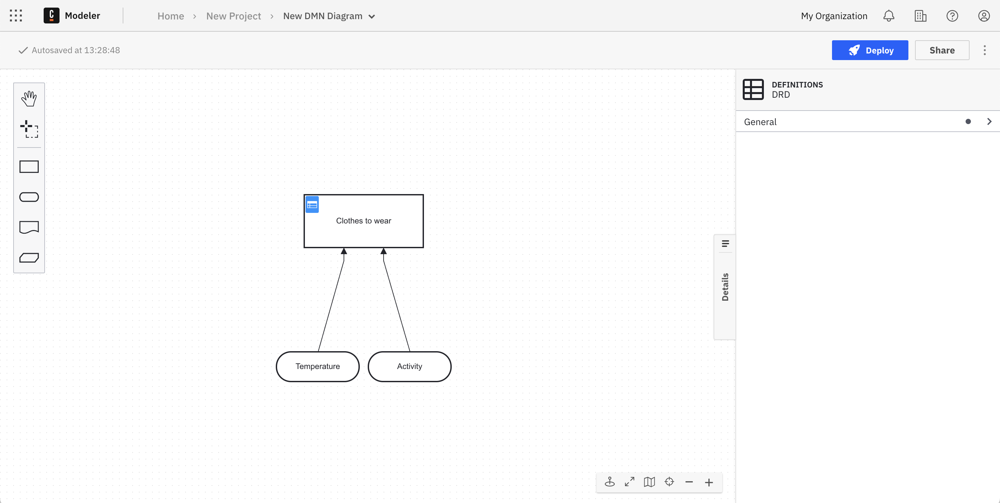
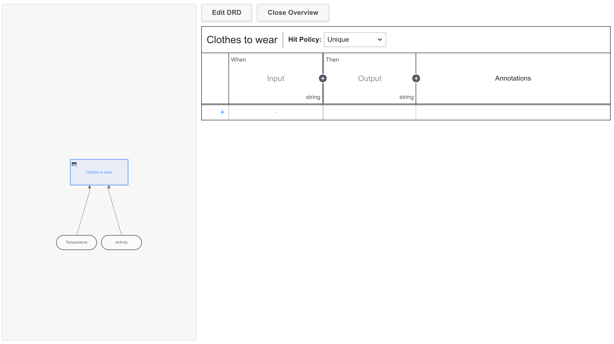
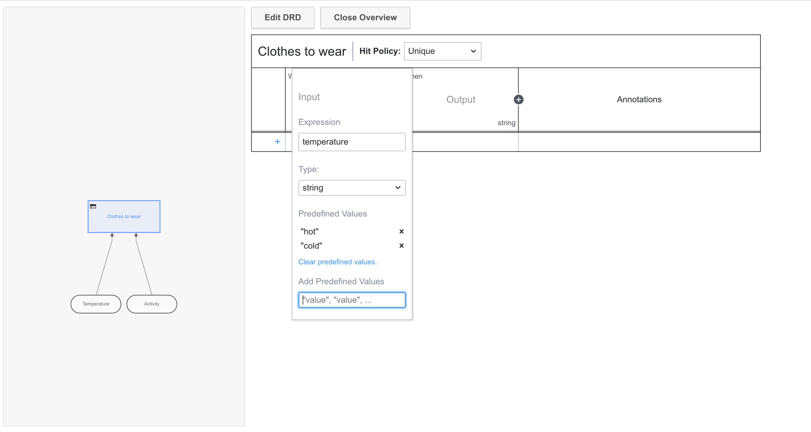
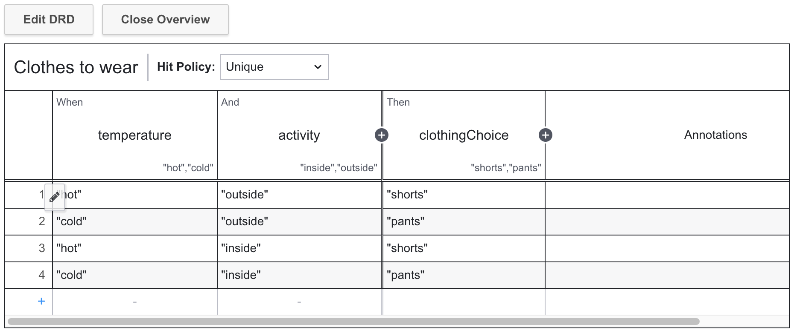

Beginner
Time estimate: 20 minutes

Decision Model and Notation (DMN) is a modeling approach owned by an institution called the Object Management Group ([OMG](https://www.omg.org/)), which also operates worldwide standards for [BPMN](./automating-a-process-using-bpmn.md).

In [DMN](../components/modeler/dmn/dmn.md), decisions are modeled and executed using a language both business analysts and developers can understand. Model a set of rules within a table, and this will yield a decision to rapidly execute a process using a decision engine like Camunda.

In this guide, we'll step through the lightweight implementation of a DMN diagram in [Camunda 8](../components/concepts/what-is-camunda-8.md), as both Camunda [Desktop](../components/modeler/desktop-modeler/index.md) and [Web Modeler](../components/modeler/about-modeler.md) both offer the same modeling experience for DMN 1.3 models.

## Set up

### Create a Camunda 8 account

We'll begin building our DMN diagrams with [Modeler](../components/modeler/about-modeler.md). To get started, ensure you've [created a Camunda 8 account](./create-account.md).

### Create a cluster

import CreateCluster from '../components/react-components/create-cluster.md'

<CreateCluster/>

## Getting started with DMN

Once logged in to your Camunda 8 account, take the following steps:

1. From Modeler, click **New project** and name your project. For this example, we'll name our project "Deciding what to wear".
2. Click **Create new > DMN diagram** and name your diagram. We'll name our diagram "Picking an outfit".

## DMN in action

Modeling starts here in the Decision Requirements Diagram (DRD) view. From here, we can add DMN elements from the palette on the left side by dragging and dropping them onto the diagram canvas.

1. We're automatically set up with a rectangular decision symbol, which we'll rename to "Clothes to wear" by double-clicking on the symbol. We'll also rename the ID in the properties panel on the right side of the screen to "clothingChoice" by clicking the **General** dropdown menu.
2. In this example, we'll append two input data which may determine what we wear for the day: the temperature, and the activity. You can do this in one of two ways:
   - Drag and drop the oval-shaped input data elements from the menu on the left side of the DRD, name them, and connect them by clicking the decision and the arrow icon.
   - Click the decision directly, and click the input data element to drag and drop it onto the canvas. With the second option, you can see this input data will automatically be connected to the decision.
3. Ensure you have also given appropriate IDs to the input data icons. In this example, our IDs are "temperature" and "activity".

:::note
Now that you've created a decision, add some logic to make it executable by morphing it into a decision table in the next section.
:::

## Create your DMN table

Now that our DRD is complete, let's build out the DMN table for our decision.

1. Click the table icon in the top left corner of the box containing our "Clothes to wear" decision. Here, we'll give a set of rules among weather and the activity to determine what we wear. For example, when a certain value is true (or in this case, when two values are true among the weather and the activity), then one outcome is determined for clothes to wear.
   
   :::note
   At any time, you can click **Edit DRD** to return to your DRD and continue moving elements around on the palette.
   :::
2. Click the **+** icon next to the **When** column so we can analyze both the weather and the activity.
3. Double-click the first column. In the **Expression** field, we'll enter "temperature". Given the **Type** will remain **string**, we'll enter "Hot" and "Cold" in the **Add Predefined Values** field, separated by commas. Click your keyboards "enter" key to save these values.
   :::note
   Utilizing a data type other than a string? Take a look at our documentation on different [data types](../components/modeler/dmn/dmn-data-types.md), like booleans and numbers.
   :::
4. Similar to the first column, enter "activity" for the expression and predefined values of "inside" and "outside".
   
5. Double-click the **Output** column. Here, we'll plug in an **Output Name** of "clothingChoice", and Predefined Values of "shorts" and "pants".
6. Once finished, we'll click the pencil icon to write out our possible outcomes. For example, we can select the predefined values of "hot" and "outside" to determine we will wear shorts. These inputs can also be combined with [rules](../components/modeler/dmn/decision-table-rule.md).

:::note
A decision table has a hit policy that specifies what the results of the evaluation of a decision table consist of. You'll notice the hit policy of our table is **Unique**, meaning only one rule can be satisfied or no rule at all. Learn more about different [hit policies](../components/modeler/dmn/decision-table-hit-policy.md).
:::

## Deploy your diagram

Click **Deploy** to launch your DMN decision table.

You can now implement your DMN table in a BPMN diagram using features like a [business rule task](../components/modeler/bpmn/business-rule-tasks/business-rule-tasks.md).

When a process instance arrives at a business rule task, a decision is evaluated using the internal DMN decision engine. Once the decision is made, the process instance continues.

If the decision evaluation is unsuccessful, an [incident](../components/concepts/incidents.md) is raised at the business rule task. When the incident is resolved, the decision is evaluated again.

## Additional resources and next steps

- [DMN in Modeler](../components/modeler/dmn/dmn.md)
- [DMN Tutorial](https://camunda.com/dmn/#introduction-overview)
- [What is FEEL?](../components/modeler/feel/what-is-feel.md)
