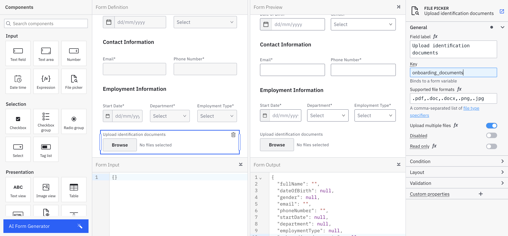
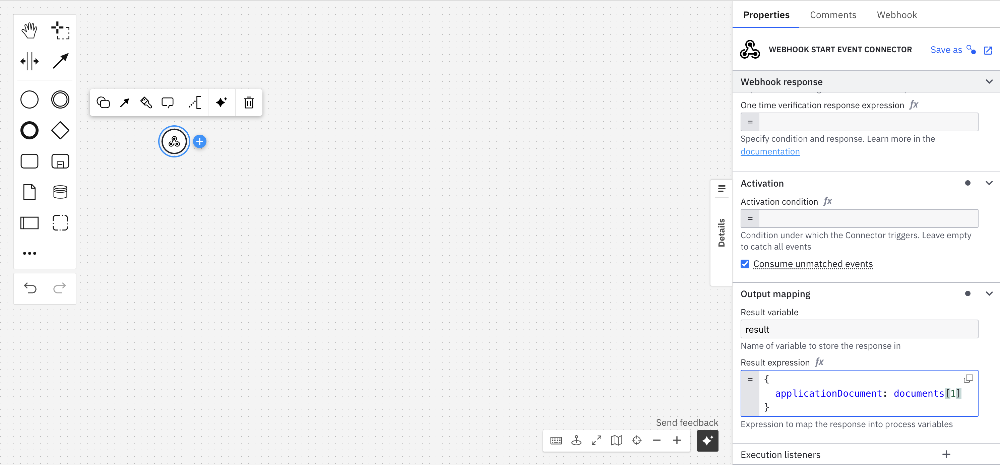
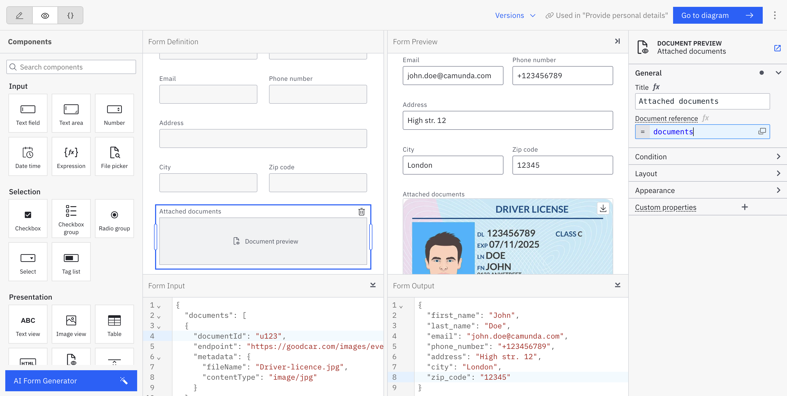
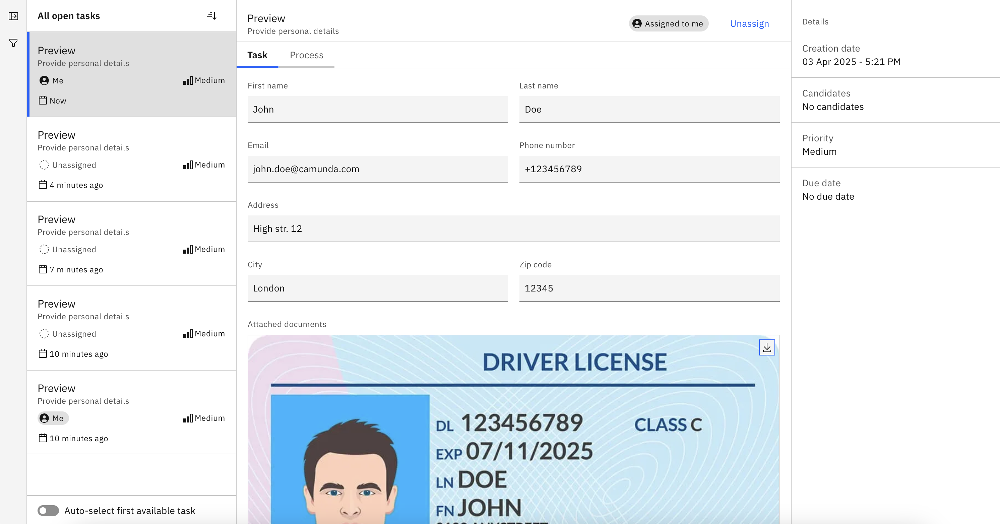
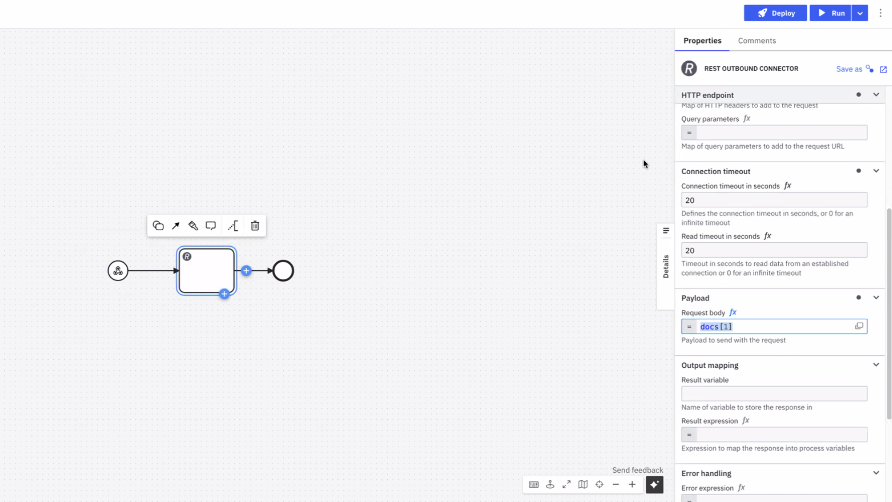

import DocCardList from '@theme/DocCardList';

Offering robust [document handling](/components/concepts/document-handling.md) capabilities within Camunda, users can efficiently manage large volumes of binary data such as PDFs and images across both development and production environments.

In this guide we will cover three main use cases:

- [Upload a document to a BPMN process](#upload-a-document-to-a-bpmn-process);
- [Display and download a document](#display-and-download-a-document);
- [Send a document to an external system via a Connector](#send-a-document-to-an-external-system-via-a-connector).

## Upload a document to a BPMN process

You can implement document uploads in your BPMN processes using [forms](#document-upload-via-a-form), [inbound Connectors](#document-upload-via-inbound-webhook-connector), and [Camunda 8 REST API](../apis-tools/camunda-api-rest/specifications/create-document.api.mdx).

### Build a form for document upload

When [building a form](../guides/utilizing-forms.md) for a process, you can use the [Filepicker form component](/components/modeler/forms/form-element-library/forms-element-library-filepicker.md) to allow users to upload files.

In the Filepicker configuration, you can specify whether users can upload a single file or [multiple files](/components/modeler/forms/form-element-library/forms-element-library-filepicker.md#configurable-properties) and define the list of [supported file formats](https://developer.mozilla.org/en-US/docs/Web/HTML/Element/input/file#unique_file_type_specifiers).



A designed form can be [linked](../components/modeler/web-modeler/advanced-modeling/form-linking.md) to a [user task](#upload-a-document-from-a-user-task-in-tasklist) or used to [start a process](#upload-a-document-to-start-a-process).
Documents uploaded with the form can then be [referenced](#get-reference-to-an-uploaded-document) later in the process.

#### Upload a document from a user task in Tasklist

When the process is deployed and running, users can access and complete user tasks that include a form with the Filepicker component in [Tasklist](../components/tasklist/introduction-to-tasklist.md):


#### Upload a document to start a process

You can configure a form with the Filepicker for a start event of a BPMN process to allow users to upload documents when initiating the process. This is supported in [Tasklist](../components/tasklist/introduction-to-tasklist.md) and is available to logged-in users.

:::note

Only logged-in users can upload files.
[Publicly accessible processes](../components/modeler/web-modeler/advanced-modeling/publish-public-processes.md) with a start form do not support file upload using the Filepicker.

:::

#### Get reference to an uploaded document

Uploaded documents can be referenced later in the process.

Filepicker's output variable is an array of objects with document metadata.
It always returns an array of objects, either a user uploads a single document or multiple documents.

Single document uploads are accessible using `value[1]` (since [FEEL](../components/modeler/feel/what-is-feel.md) uses 1-based indexing).

### Upload a document via inbound Webhook connector

Documents can be added to a process using the [inbound](../components//connectors/connector-types.md#inbound-connectors) [HTTP webhook Connector](/components/connectors/protocol/http-webhook.md).

You can pass the documents in both the response expression and the result expression, where the `documents` object contains the references for created documents. Below, review an example of a webhook configuration:



The document reference received as an output of one Connector should be stored in process variables by using the result expression or result variable.

To call the webhook sending a file, for example:

```curl
curl --location 'https://lpp-1.connectors.dev.ultrawombat.com/e424e404-39d2-4dcf-9937-a1ebde177d7c/inbound/uploadDocument' \
--form 'file=@"/path-to-file/file.pdf"'
```

The result variable will have the following structure:

```
{
 "request": {
   "body": {},
   "headers": {
     "host": "lpp-1.connectors.camunda.io",
     "x-request-id": "335843238a709273200e2055f89147ad",
     "x-real-ip": "109.78.172.42",
     "x-forwarded-host": "lpp-1.connectors.camunda.io",
     "x-forwarded-port": "443",
     "x-forwarded-proto": "https",
     "x-forwarded-scheme": "https",
     "x-scheme": "https",
     "content-length": "70484",
     "user-agent": "PostmanRuntime/7.43.0",
     "accept": "*/*",
     "cache-control": "no-cache",
     "postman-token": "b9d78973-b33f-43a4-8d55-c5ac8b2de656",
     "accept-encoding": "gzip, deflate, br",
     "content-type": "multipart/form-data; boundary=--------------------------300742796701946745140414"
   },
   "params": {}
 },
 "connectorData": {},
 "documents": [
   {
     "storeId": "gcp",
     "documentId": "130ad52a-f90a-4e07-9cfa-0d9abb0b6a68",
     "contentHash": "e3b0c44298fc1c149afbf4c8996fb92427ae41e4649b934ca495991b7852b855",
     "metadata": {
       "contentType": "application/pdf",
       "size": 70266,
       "fileName": "file.pdf"
     },
     "camunda.document.type": "camunda"
   }
 ]
}
```

Here, we use the configuration of the image on the initial steps and assign the portion containing the documents to `applicationDocument`. This can be later used by the process to retrieve documents.

## Display and download a document

### Build a form for document preview and downloading

To display and allow downloading of a document you can use the [document preview component](/components/modeler/forms/form-element-library/forms-element-library-document-preview.md) in [forms](/components/modeler/forms/camunda-forms-reference.md).

The document preview component offers preview of PDF documents and images.
Other document types are listed without the preview and show the file name with the option to download the file.

In the component's configuration, provide a document reference as an array of document metadata.



### Display and download a document from a user task in Tasklist

A document can be displayed in a user task form in [Tasklist](../components/tasklist/introduction-to-tasklist.md).

When a user opens the task, they can view and download the document directly from the form.



## Send a document to an external system via a Connector

You can reference a document in an [outbound Connector](../components//connectors/connector-types.md#outbound-connectors). Connectors can use variables with document metadata as an input. The format of inputs will depend on the Connector, as each Connector has a different input structure.

The [Connector SDK](/components/connectors/custom-built-connectors/connector-sdk.md) provides document support in property/variable bindings.

In most cases for the following outbound Connectors, you can include a **Request body** under **Payload** in the properties panel to send with your request:



### Outbound Connectors that support document handling

| Connector                                                                               | Support details                                                                                                                                                                                                                |
| --------------------------------------------------------------------------------------- | ------------------------------------------------------------------------------------------------------------------------------------------------------------------------------------------------------------------------------ |
| [Amazon Bedrock](/components/connectors/out-of-the-box-connectors/amazon-bedrock.md)    | Supports consuming documents as inputs for conversations. Review the **Document** field in the properties panel where the document reference can be provided.                                                                  |
| [Amazon S3](/components/connectors/out-of-the-box-connectors/amazon-s3.md)              | Supports uploading documents from (or downloading documents to) the Camunda document store. Review the **Document** field in the properties panel where the document reference can be provided.                                |
| [Amazon Textract](/components/connectors/out-of-the-box-connectors/amazon-textract.md)  | Can read the input document directly from the Camunda document store. Review the **Document** field in the properties panel where the document reference can be provided.                                                      |
| [Box](/components/connectors/out-of-the-box-connectors/box.md)                          | Supports uploading documents from (or downloading documents to) the Camunda document store. Review the **Document** field in the properties panel where the document reference can be provided.                                |
| [Email](/components/connectors/out-of-the-box-connectors/email.md#response-structure-1) | Supports sending Camunda documents as attachments, or storing incoming attachments as Camunda documents. These documents are automatically stored in the Camunda document store and available to map in the result expression. |
| [Google Drive](/components/connectors/out-of-the-box-connectors/googledrive.md)         | Supports document upload and download.                                                                                                                                                                                         |
| [Microsoft Teams](/components/connectors/out-of-the-box-connectors/microsoft-teams.md)  | Supports sending documents to channels.                                                                                                                                                                                        |
| [REST](/components/connectors/protocol/rest.md)                                         | Supports storing the response as a document.                                                                                                                                                                                   |
| [SendGrid](/components/connectors/out-of-the-box-connectors/sendgrid.md)                | Provides attachment support.                                                                                                                                                                                                   |
| [Slack](/components/connectors/out-of-the-box-connectors/slack.md)                      | Supports adding attachments and increasing template versions.                                                                                                                                                                  |

## Automate documents with intelligent document processing

Document handling can be integrated with intelligent document processing (IDP).
This allows you to extract specific data from a high volume of documents using an IDP application, and use the extracted data throughout your BPMN process.

Learn more about this in the IDP documentation:

<DocCardList items={[{type:"link", href:"/docs/8.7/components/modeler/web-modeler/idp/idp-example/", label: "IDP integration", docId:"components/modeler/web-modeler/idp/idp-example"}
]}/>
