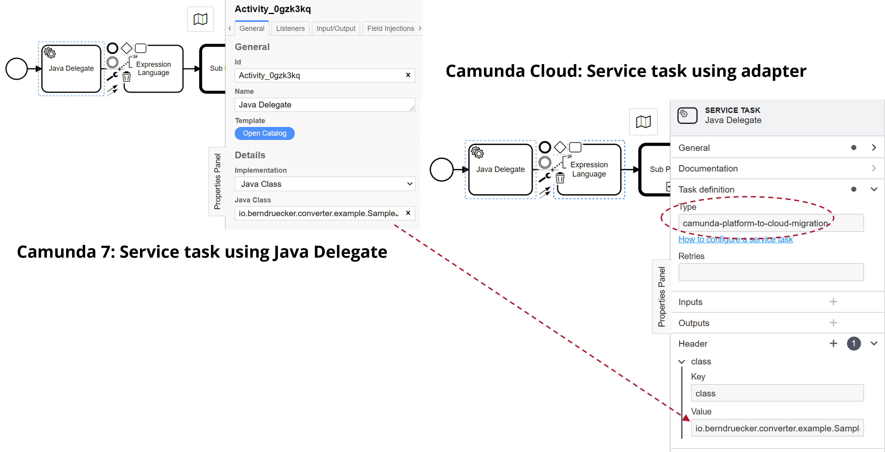

Camunda 8 has a different workflow engine than Camunda 7 - [Zeebe](/components/zeebe/zeebe-overview.md). As a result, you must migrate some of your code to work with the Zeebe API, especially code that does the following:

- Uses the Client API (e.g. to start process instances)
- Implements [service tasks](/components/modeler/bpmn/service-tasks/service-tasks.md), which can be:
  - [External tasks](/components/best-practices/development/invoking-services-from-the-process-c7.md#external-tasks), where workers subscribe to the engine.
  - [Java code attached to a service task](https://docs.camunda.org/manual/latest/user-guide/process-engine/delegation-code/) and called by the engine directly (in-VM).

For example, to migrate an existing Spring Boot application, take the following steps:

1. Adjust Maven dependencies:

- Remove Camunda 7 Spring Boot Starter and all other Camunda dependencies.
- Add the [Spring Zeebe SDK](../../apis-tools/spring-zeebe-sdk/getting-started.md).

2. Adjust config:

- Set [Camunda 8 credentials](../../apis-tools/spring-zeebe-sdk/configuration.md) (for example, in `src/main/resources/application.yaml`) and point it to an existing Zeebe cluster.
- Remove existing Camunda 7 settings.

3. Add `@ZeebeDeployment(resources = "classpath*:**/*.bpmn")` to automatically deploy all BPMN models.

4. Adjust your source code and process model as described in the sections below.

### Client API

The Zeebe API (e.g. the workflow engine API - start process instances, subscribe to tasks, or complete them) has been completely redesigned and is not compatible with Camunda 7. While conceptually similar, the API uses different method names, data structures, and protocols.

If this affects large parts of your code base, you could write a small abstraction layer implementing the Camunda 7 API delegating to Camunda 8, probably marking unavailable methods as deprecated. We welcome community extensions that facilitate this but have not yet started our own efforts.

### Service tasks as external tasks

[External task workers](https://docs.camunda.org/manual/latest/user-guide/process-engine/external-tasks/) in Camunda 7 are conceptually comparable to [job workers](/components/concepts/job-workers.md) in Camunda 8. This means they are generally easier to migrate.

The "external task topic" from Camunda 7 is directly translated in a "task type name" in Camunda 8, therefore `camunda:topic` gets `zeebe:taskDefinition type` in your BPMN model.

The [Camunda 7 Adapter](https://github.com/camunda-community-hub/camunda-7-to-8-migration/tree/main/camunda-7-adapter) picks up your `@ExternalTaskHandler` beans, wraps them into a JobWorker, and subscribes to the `camunda:topic` you defined as `zeebe:taskDefinition type`.

### Service tasks with attached Java code (Java delegates, expressions)

In Camunda 7, there are three ways to attach Java code to service tasks in the BPMN model using different attributes in the BPMN XML:

- Specify a class that implements a JavaDelegate or ActivityBehavior: `camunda:class`.
- Evaluate an expression that resolves to a delegation object: `camunda:delegateExpression`.
- Invoke a method or value expression: `camunda:expression`.

Camunda 8 cannot directly execute custom Java code. Instead, there must be a [job worker](/components/concepts/job-workers.md) executing code.

The [Camunda 7 Adapter](https://github.com/camunda-community-hub/camunda-7-to-8-migration/tree/main/camunda-7-adapter) implements such a job worker using the [Spring Zeebe SDK](../../apis-tools/spring-zeebe-sdk/getting-started.md). It subscribes to the task type `camunda-7-adapter`. [Task headers](/components/modeler/bpmn/service-tasks/service-tasks.md#task-headers) are used to configure a delegation class or expression for this worker.

You can use this worker directly, but more often it might serve as a starting point or simply be used for inspiration.

The [Camunda 7 to Camunda 8 Converter](https://github.com/camunda-community-hub/camunda-7-to-8-migration/tree/main/backend-diagram-converter) will adjust the service tasks in your BPMN model automatically for this adapter.

The topic `camunda-7-adapter` is set and the following attributes/elements are migrated and put into a task header:

- `camunda:class`
- `camunda:delegateExpression`
- `camunda:expression` and `camunda:resultVariable`
