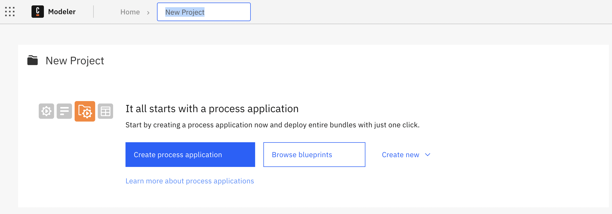
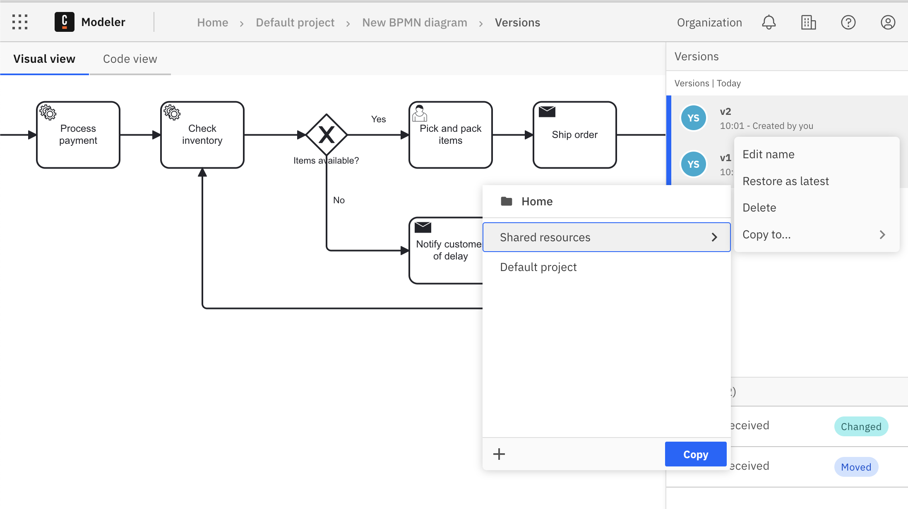

import AddUserImg from './img/invite-collaborators.png';
import BulkAddUserImg from './img/invite-all-organization-members.png';

Camunda 8 only

Organizations often manage process documentation across multiple layers, from high-level strategic models to detailed operational workflows. [Process landscape visualization](/docs/components/modeler/web-modeler/process-landscape-visualization.md) streamlines this complexity by supporting different levels of abstraction, enabling seamless collaboration across teams, and providing tailored insights for various stakeholders.

## About this guide

This guide shows how you can consolidate these perspectives into a single shared project, ensuring clarity, reusability, and governance within your organization’s efforts.

Teams can use shared projects to:

- Prevent duplicate work.
- Maintain a single source of truth.
- Enable cross-project navigation and transparency.
- Govern access to organization resources effectively.

## Create a shared project

To create a shared project as a repository for your organization's resources:

Open Modeler, and select **Create new project** to create a new project to store resources in.

## Invite collaborators to a shared project

If you want to invite collaborators to your shared project, you must also ensure you assign them the correct permissions and roles.

### Add user to organization

First, you must add your colleague as a user to the organization:

1. Click your account name, and select **Organization Management**.
1. Select **Users > Add New User**.
   - Add your colleague's email and assign an appropriate role.
   - For example, the **Developer** role is typically a good default option to provide the user with full access to Console, Operate, and Tasklist without deletion privileges.
1. Click **Add**.
   - An email is sent to the email you provided.
   - Your colleague must click **Join** to join the organization.

:::info
To learn more about available roles and associated permissions, see [roles and permissions](/components/console/manage-organization/manage-users.md#roles-and-permissions).
:::

### Add a user to a shared project

Once your colleague has joined the organization, you can add them to a shared project:

1. Open **Modeler**, navigate to your project, and open the **Collaborators** panel.
1. Click **Add user** and find the colleague you added to your organization.
    
   You can also use the **All users in the organization** option to send a bulk invitation to all colleagues.
   
1. Assign a role, and click **Send invites** to send an invitation to the selected user(s).
1. Once your colleague clicks **Accept invitation**, they can access the shared project with the assigned role and permissions.

## Add resources to a shared project

You can share a specific version of a file or process application within the shared project.

1. In the versions list, hover over the version you want to add to the shared project.
1. Select the three vertical dots to open the actions menu, and select **Copy to...**.
1. Choose the shared project to store the shared resource in and select **Copy here** to make it available to all project members.
   

## Browse the process landscape of shared organization resources

The [process landscape view](/components/modeler/web-modeler/process-landscape-visualization.md) offers a visual map of BPMN files and their interfile connections (e.g., call activities).

You can open the process landscape view by clicking **View landscape** from any of the following views:

- Project view
- Folder view
- [Process application](/docs/components/modeler/web-modeler/process-applications.md) view

### Landscape view interaction

1. **Select a BPMN File:** Click on any node to see the BPMN file’s information including the latest version of the process on the sidebar.

   :::note
   For process applications, version tags represent a unified "versioned" snapshot of all process application files rather than separate versions for each file as with simple BPMN files.
   :::
   

1. **Search**: Press `Ctrl+F` or `⌘+F` to search. Enter the name or identifier of a BPMN file to quickly find, highlight, and jump to the corresponding node.
   
1. **Highlight Paths:** Click on a node or connection to highlight the entire chain of related connections.
   

### README Documentation

To access the associated README file for a process within the shared project:

1. Open the process landscape view.
1. Click on a node in the landscape.
1. The README file (if one is associated) is displayed in the sidebar, providing a high-level overview of the process.

## Reuse resources from a shared project

You can reuse published resources by copying them into your own projects:

1. Open the shared project and navigate to the file.
1. In the versions list, choose the version to reuse, select the three vertical dots to open the actions menu and select **Copy to...**.
1. Select the target project and click **Copy**.
