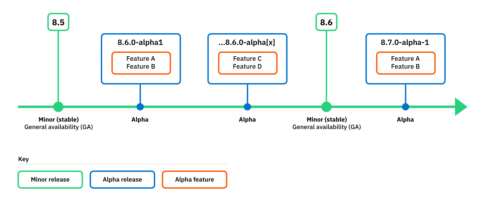
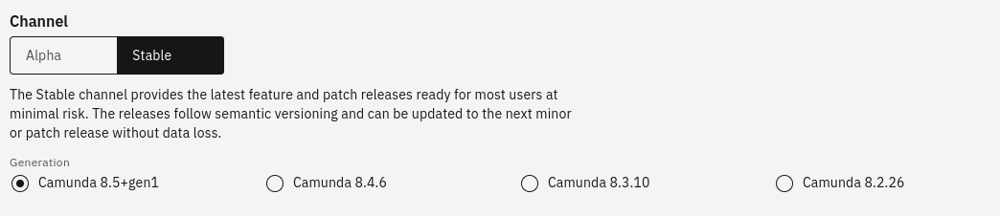
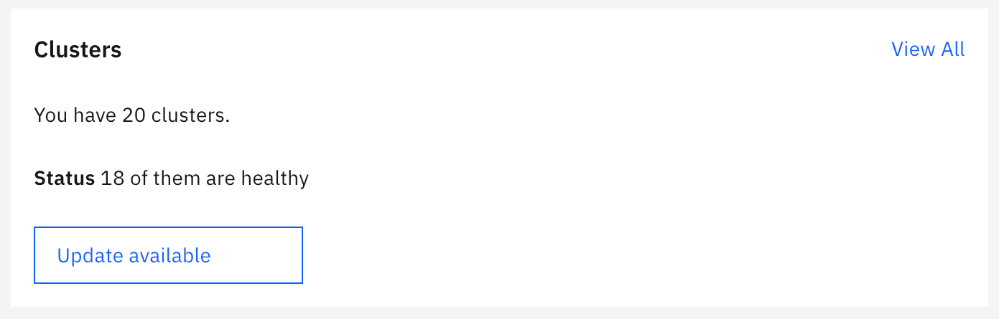

Camunda 8 follows the [Camunda release policy](https://camunda.com/release-policy/) with the following specific clarifications.

:::info
You can find deprecation and support announcements on the [announcements](/reference/announcements-release-notes/overview.md#announcements) page.
:::

## Alpha features and releases

It is important to understand the different ways the term "alpha" is used in the context of Camunda releases and features.

### Alpha feature

Refers to a feature or component released as an alpha version, in an early state for you to test and participate in development by sharing your feedback before the feature reaches [general availability](#general-availability-ga). Some alpha features require turning on for your cluster before you can use them. See [alpha features](/components/early-access/alpha/alpha-features.md).

### Alpha release

Refers to a release made available between minor versions that allows you to preview an upcoming minor version and the alpha features included (for example, `8.6.0-alpha1`, `8.6.0-alpha2`, and so on). Camunda strives to release this type of release on a monthly basis. To learn more about the alpha features included in each alpha release, see [release notes](/reference/announcements-release-notes/overview.md#release-notes).

:::note

- An alpha release can also be made available where the entire version is an alpha with [alpha limitations](/components/early-access/alpha/alpha-features.md#alpha).
- Additionally, "Alpha channel" refers to the channel you can use when provisioning a SaaS cluster. See [alpha channel](#alpha-channel).

:::

## General availability (GA)

Once features and components are released and considered stable, they become generally available.

Stable features and components are:

- Ready for production use for most users with minimal risk.
- Supported by [L1 Priority-level support](https://camunda.com/services/enterprise-support-guide/) for production use.
- Fully documented.

A release or component is considered stable if it has passed all verification and test stages and can be released to production.

## SaaS provisioning

In Camunda 8 SaaS we differentiate between components that are part of a Camunda 8 cluster (cluster components), and components outside the cluster (non-cluster components).

### Cluster components

A cluster typically consists of the following components:

- [Zeebe](/components/zeebe/zeebe-overview.md)
- [Operate](/components/operate/operate-introduction.md)
- [Tasklist](/components/tasklist/introduction-to-tasklist.md)
- [Optimize]($optimize$/components/what-is-optimize)

You can provision cluster components using one of two channels, following the [Camunda release policy](https://camunda.com/release-policy/).

#### Stable channel

You can use the **Stable** channel to access [general availability](#general-availability-ga) features for cluster components.

- Provides the latest feature and patch releases ready for most users at minimal risk.
- Releases follow semantic versioning and can be updated to the next minor or patch release without data loss.
- On the stable channel, all supported minor versions are made available for provisioning.

#### Alpha channel

You can use the **Alpha** channel to access [alpha features](/components/early-access/alpha/alpha-features.md) and patch releases for cluster components.

- Provides alpha releases to preview and prepare for the next stable release.
- Alpha releases provide a short-term stability point to test new features and give feedback before they are released to the stable channel. Use an alpha release to test the upcoming minor release with your infrastructure.
- Alpha releases cannot be updated to a newer release, and so are not suitable for use in production.

### Non-cluster components

Non-cluster components include:

- [Modeler (Web)](/components/modeler/web-modeler/launch-web-modeler.md)
- [Connectors](/components/console/introduction-to-console.md)
- [Console](/components/console/introduction-to-console.md)

Non-cluster component versions are released continuously.

- Customers are automatically updated to the latest component version when it is ready for release.
- Admins can [enable alpha features](/components/console/manage-organization/enable-alpha-features.md) for non-cluster components in organization settings.

### New Camunda 8 versions

When a new Camunda 8 version is released, we try to provide the new version on our managed service at the same time.

An **Update available** notification is shown in Console, recommending that you update to the latest version.

#### Generation names

As of Camunda 8.5.0, the generation naming scheme in Camunda 8 SaaS changed to no longer include the patch version.

- The naming scheme used for the Camunda 8.5 generations is `Camunda <Major>.<Minor>+gen<N>`, where `N` is incremented with every atomic change to the component version set.

- This decouples the generation name from the particular patch level of the components it contains, as some component versions such as Connectors are decoupled from other components.

- You can learn about the particular component patch version changes in the update dialogue to the latest generation available.

#### Update or restart for critical issues

In our managed service, Camunda reserves the right to force update or restart a cluster immediately and without notice in advance if there is a critical security or stability issue.

## Self-Managed

When a new Camunda 8 version is released, Camunda 8 Self-Managed enterprise customers are notified via email.

:::info
Non-enterprise customers can stay up to date via [release blogs](https://camunda.com/blog/category/releases/), [announcements](/reference/announcements-release-notes/overview.md#announcements), or releases on [GitHub](https://github.com/camunda) and [Docker Hub](https://hub.docker.com/u/camunda).
:::

### Helm chart

Since the 8.4 release, the [Camunda 8 Self-Managed Helm chart](https://artifacthub.io/packages/helm/camunda/camunda-platform) version is decoupled from the version of the application. For example, the chart version is 9.0.0 and the application version is 8.4.x.

To learn more about the applications version included in the Helm chart, see the [Camunda 8 Helm chart version matrix](https://helm.camunda.io/camunda-platform/version-matrix/).

### New Camunda 8 versions

If you are running Camunda 8 Self-Managed, see the [update guide](/self-managed/operational-guides/update-guide/introduction.md) to learn how to update your Camunda 8 application or server installation to a newer version of Camunda 8.
