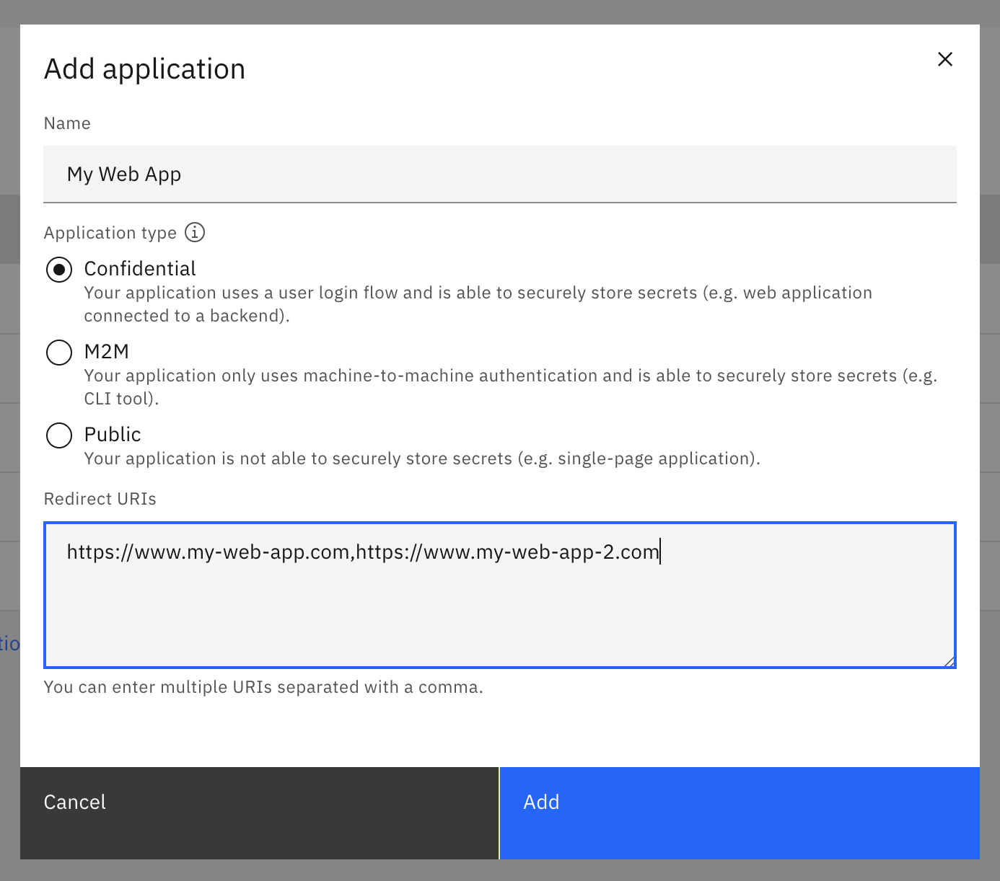
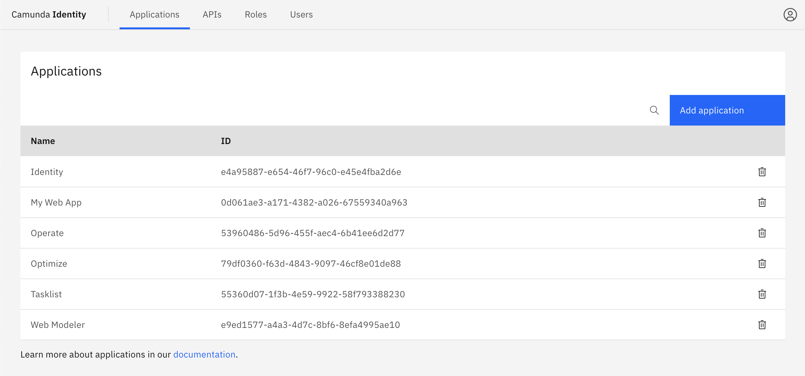
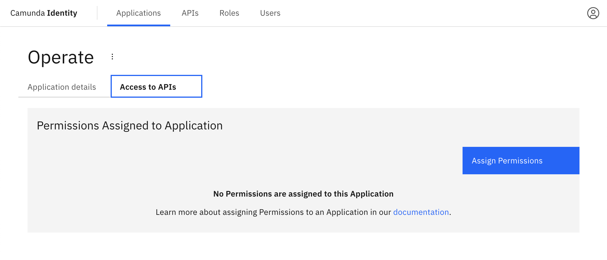
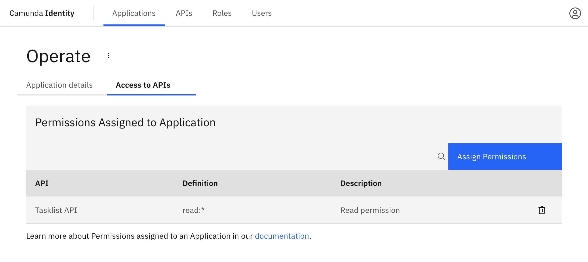

In Identity, an Application represents an entity that can request Identity to authenticate a user or a service.

For Camunda 8 to work, a set of Applications are preconfigured. These preconfigured applications are:

- Connectors
- Identity
- Operate
- Optimize
- Tasklist
- Web Modeler
- Zeebe

As a user of Identity, you can add own Applications.

## Types of applications

There are three types of applications in Identity:

- Confidential
- Machine-to-machine
- Public

A type is selected when [creating the application](#add-an-application) based on
its ability to securely store and use secrets, as well as the mode of authentication it uses.

| Type         | Secret | User login flow | M2M authentication |
| ------------ | ------ | --------------- | ------------------ |
| Confidential | Yes    | Yes             | Yes                |
| M2M          | Yes    | No              | Yes                |
| Public       | No     | Yes             | No                 |

:::note
See more details on OAuth client types [here](https://oauth.net/2/client-types/), and more information specifically on confidential and public applications [here](https://auth0.com/docs/get-started/applications/confidential-and-public-applications).
:::

## Managing applications

### Add an application

1. Log in to the Identity UI and navigate to the **Applications** tab:

2. Click the **Add application** button located on the top right of the table and a modal will open.

3. Fill in a name for your application. For this guide we will use a set of example values.
   Select the type of your application based on our [guide](/self-managed/concepts/access-control/applications.md#types-of-applications).
   Depending on the selected type, you might need to enter at least one redirect URI. When you have inserted the required
   details, click **Add**:

On confirmation, the modal will close, the list will update, and your new application will be shown. Click on your new application to view the details. This includes your generated client ID
and client secret depending on the selected [type](/self-managed/concepts/access-control/applications.md#types-of-applications).

### Assigning a permission an application

To assign a permission to an application using Identity, take the following steps:

1. Log in to the Identity UI and navigate to the **Applications** page and click on an application. Then, select the **Access to APIs** tab and click **Assign Permissions**:

2. Select the API which contains the permission you want to assign.

3. Select the permissions you would like to assign and click **Add**.

On confirmation, the modal will close, the table will update, and your assigned permissions will be shown:

## Permissions

You can control the access an application has by assigning [permissions](/self-managed/identity/access-management/access-management-overview.md) to an application.
